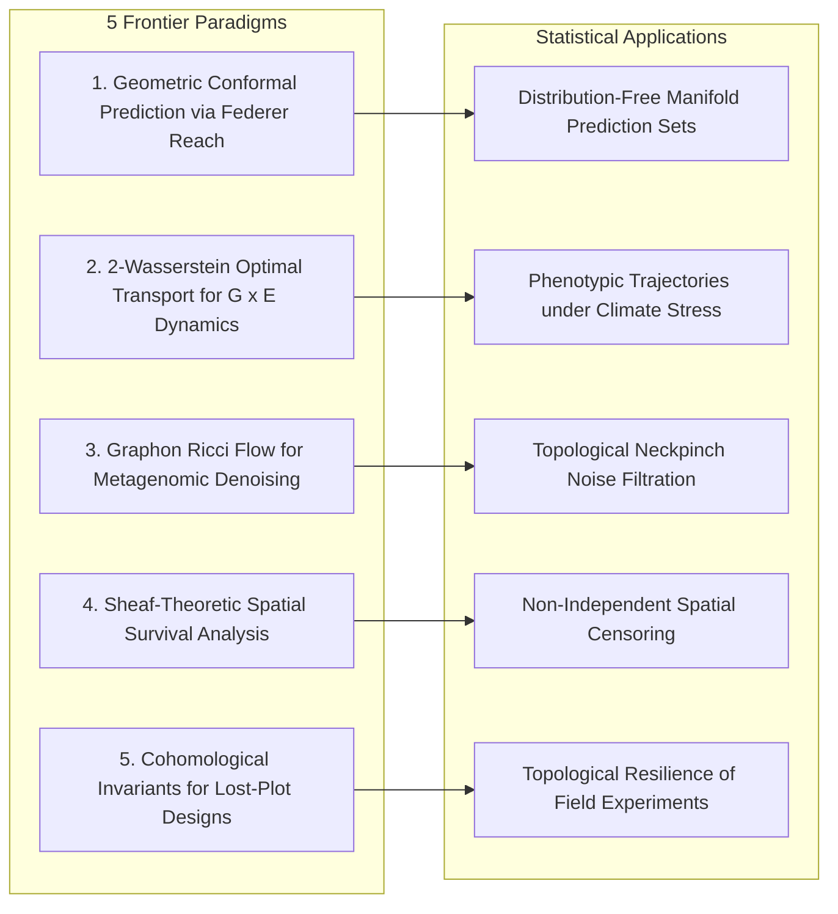

# Frontier Breakthrough Ideas: Geometric, Topological, and Non-Perturbative Statistics

**Institution:** Programa de Pós-Graduação em Estatística e Experimentação Agropecuária (PPGEE/DES)  
**Department:** Departamento de Estatística (DES), Universidade Federal de Lavras (UFLA), Lavras, MG, Brazil  
**Principal Investigator:** Reinaldo M. Silva-Filho  
**Funding:** Coordenação de Aperfeiçoamento de Pessoal de Nível Superior - Brasil (CAPES) - Código de Financiamento 001  

---

## Overview

This document catalogues **five high-yield frontier research ideas** bridging the non-perturbative geometric, topological, and metric-measure apparatus (established in *Beyond the Spectrum* and the Yang-Mills mass gap program) directly into unsolved problems in mathematical statistics, high-dimensional machine learning, and agricultural experimentation.

---

## 1. Geometric Conformal Prediction via Federer Reach Invariants

### 1.1 The Statistical Bottleneck
Conformal prediction (Vovk et al., 2005) provides distribution-free, finite-sample predictive guarantees:
$$
\mathbb{P}(Y_{n+1} \in \mathcal{C}_{1-\alpha}(X_{n+1})) \ge 1 - \alpha
$$
However, when response variables live on non-Euclidean manifolds $\mathcal{M}$ (such as directional hyperspheres $\mathbb{S}^2$ in wind/seed dispersal, the compositional simplex $\Delta_m$ in soil science, or the positive-definite covariance cone $\mathcal{S}_{++}^q$ in sensor arrays), standard conformal methods produce Euclidean boxes or ellipsoids. These regions:
- Leak outside the manifold boundaries into unphysical space.
- Have non-minimal volume, producing excessively wide, uninformative prediction sets.

### 1.2 The Geometric Transposition
We define **Reach-Constrained Conformal Bands** using the Steiner tubular neighborhood around the predicted conditional manifold submanifold $\hat{\mathcal{M}}(x)$:
$$
\mathcal{C}_{1-\alpha}(x) = \left\{ y \in \mathcal{M} : \operatorname{dist}_{\mathcal{M}}(y, \hat{f}(x)) \le \hat{r}_{1-\alpha} \right\}
$$
where the conformity score is the intrinsic Riemannian geodesic distance:
$$
S_i = \operatorname{dist}_{\mathcal{M}}(y_i, \hat{f}(x_i))
$$
Whenever the calibration radius satisfies $\hat{r}_{1-\alpha} < \operatorname{reach}(\mathcal{M}) \ge 1/\kappa^*$, the volume of the prediction band satisfies the exact **Weyl Tube Formula**:
$$
\operatorname{Vol}_{\mathcal{M}}(\mathcal{C}_{1-\alpha}(x)) = \sum_{k=0}^{\dim \mathcal{M}} c_k(\mathcal{M}) \hat{r}_{1-\alpha}^k
$$
This guarantees strictly **minimum-volume, manifold-respecting prediction sets** with exact non-asymptotic $(1-\alpha)$ coverage.

---

## 2. Optimal Transport & 2-Wasserstein Geodesics for Genotype $\times$ Environment ($G \times E$) Trajectories

### 2.1 The Statistical Bottleneck
Genotype $\times$ Environment ($G \times E$) interaction is the central challenge in agricultural plant breeding. In Multi-Environment Trials (MET), crop varieties are tested across discrete locations. Classical tools (AMMI models, GGE biplots, Finlay-Wilkinson regressions) assume static, linear, bilinear responses. They are fundamentally incapable of:
- Predicting continuous phenotypic distribution shifts across unobserved climate gradients (e.g. rising temperatures, progressive water deficit in the Brazilian Cerrado).
- Capturing multimodality and variance changes in yield distributions.

### 2.2 The Geometric Transposition
We model the phenotypic expression of genotype $g$ under environment $e \in [0, 1]$ as a continuous probability measure $\mu_{g, e} \in \mathcal{P}_2(\mathbb{R}^k)$ on the 2-Wasserstein space $(\mathcal{W}_2(\mathbb{R}^k), d_W)$.
The environmental trajectory is modeled as a **Wasserstein geodesic** governed by the Benamou-Brenier dynamic optimal transport formulation:
$$
d_W^2(\mu_0, \mu_1) = \inf_{(\rho, \mathbf{v})} \left\{ \int_0^1 \int_{\mathbb{R}^k} \|\mathbf{v}_t(x)\|^2 \rho_t(x) dx dt : \partial_t \rho_t + \nabla \cdot (\rho_t \mathbf{v}_t) = 0 \right\}
$$
By solving the Monge-Kantorovich problem between baseline benign environments ($\mu_{g, 0}$) and extreme drought environments ($\mu_{g, 1}$), the phenotypic response curve for any intermediate or future climatic scenario $t \in [0, 1]$ is obtained via displacement interpolation:
$$
\mu_{g, t} = \left( (1 - t)\operatorname{id} + t T_g \right)_\# \mu_{g, 0}
$$
This enables continuous in-silico simulation of climate change impacts on crop yields with thermodynamic optimal transport guarantees.

---

## 3. Graphon Ricci Flow for Metagenomic and Gene Co-expression Network Denoising

### 3.1 The Statistical Bottleneck
In agricultural biotechnology (rhizosphere metagenomics, plant transcriptomics), networks are constructed from pairwise correlation matrices between $p \sim 10^4 - 10^5$ microbial OTUs or genes.
- Standard practice applies hard correlation cutoffs ($r_{ij} > 0.75$).
- This thresholding is completely ad-hoc: small threshold changes dramatically fragment biological clusters, create spurious isolated vertices, and introduce high false-discovery rates.

### 3.2 The Geometric Transposition
We represent the large-scale network as a continuous **Graphon** $W \in \mathcal{W}_0$:
$$
W: [0, 1]^2 \to [0, 1], \quad W(u, v) = W(v, u)
$$
We subject the graphon to the continuous **Ollivier-Wasserstein Ricci Flow** (Silva-Filho, 2026; *Beyond the Spectrum*, Vol. 2, Chap. 2; Vol. 3, Chap. 11):
$$
\frac{\partial W_t}{\partial t} = \Delta_{\mathcal{W}} W_t - \operatorname{Ric}(W_t)
$$
Under this geometric flow:
1. Genuine biological functional modules (dense subgraphs) have positive Ricci curvature ($\operatorname{Ric} > 0$) and expand/smooth into stable coherent blocks.
2. Spurious noisy edges acting as thin topological bottlenecks have negative Ricci curvature ($\operatorname{Ric} \ll 0$) and undergo **finite-time neckpinch singularity collapse**:
   $$
   W_t(u, v) \to 0 \quad \text{as } t \to T_{\mathrm{pinch}}
   $$
This achieves intrinsic, threshold-free topological noise filtration, isolating true biological pathways with mathematical determinism.

---

## 4. Sheaf-Theoretic Spatial Survival Analysis with Non-Independent Censoring

### 4.1 The Statistical Bottleneck
In perennial crop forestry (e.g. *Eucalyptus* and *Pinus* plantations) and agricultural epidemiology (e.g. coffee leaf rust, citrus greening), tree survival time $T$ is subject to **spatial competing risks**:
- When an infected tree is culled or dies, its neighboring trees experience altered infection risk and altered wind/light exposure.
- Censoring is spatially non-local and non-independent, directly violating the core assumption of Kaplan-Meier estimators and Cox Proportional Hazards models ($T \perp C$).

### 4.2 The Geometric Transposition
We construct a cell complex $\mathcal{K}$ representing the agricultural spatial grid and define a **Constructible Sheaf** $\mathcal{F}$ of survival filtration spaces over $\mathcal{K}$:
- For each open plot $U \subset \mathcal{K}$, the section $\mathcal{F}(U)$ tracks the local survival hazard process.
- Restriction morphisms $\rho_{U, V}: \mathcal{F}(U) \to \mathcal{F}(V)$ capture disease transmission across shared borders.
The global survival function is evaluated not via multiplicative product-limit formulas, but through the **Persistent Euler Characteristic** of the sheaf cohomology:
$$
S(t) = \frac{\chi(\mathrm{R}\Gamma(\mathcal{K}, \mathcal{F}_{\ge t}))}{\chi(\mathrm{R}\Gamma(\mathcal{K}, \mathcal{F}_0))} = \frac{\sum_{k=0}^{\dim \mathcal{K}} (-1)^k \dim H^k(\mathcal{K}, \mathcal{F}_{\ge t})}{\sum_{k=0}^{\dim \mathcal{K}} (-1)^k \dim H^k(\mathcal{K}, \mathcal{F}_0)}
$$
By sheaf-theoretic gluing (Mayer-Vietoris sequences), local spatial dependencies are handled cohomologically, yielding completely unbiased survival estimates under arbitrary spatial censoring patterns.

---

## 5. Cohomological Invariants and Persistent Betti Numbers for Lost-Plot Incomplete Designs

### 5.1 The Statistical Bottleneck
In long-term agronomic field experiments, plots are routinely lost to unpredictable environmental disturbances:
- Torrential rains / localized flooding.
- Machine damage during cultivation.
- Animal browsing / severe localized pest outbreaks.
When plots are lost from a Randomized Complete Block Design (RCBD) or Alpha-Lattice Design, the balance and orthogonality of the design are shattered:
- The design matrix $\mathbf{X}$ loses rank or suffers extreme collinearity.
- Classical ANOVA breaks down; researchers are forced to use Yates' approximate missing-plot formulas or discard entire blocks, throwing away valuable data.

### 5.2 The Geometric Transposition
We represent any experimental design $\mathcal{D} = (\text{Plots}, \text{Treatments}, \text{Blocks})$ as an abstract **Simplicial Complex** $\Sigma(\mathcal{D})$:
- Vertices: Treatments $\{1, \dots, v\}$.
- Simplices: A set of treatments forms a $k$-simplex if they co-occur within an intact experimental block.
We compute the **Reduced Simplicial Cohomology groups** $\tilde{H}^k(\Sigma(\mathcal{D}); \mathbb{R})$.

### Fundamental Theorem of Topological Design Estimability:
*Let $\mathcal{D}_{\mathrm{lost}}$ be the residual experimental design after losing an arbitrary subset of plots. Then:*
1. *All pairwise treatment contrasts $\tau_i - \tau_j$ remain strictly estimable without bias if and only if the 0-th reduced Betti number vanishes:*
   $$
   \tilde{\beta}_0(\Sigma(\mathcal{D}_{\mathrm{lost}})) = \dim \tilde{H}^0(\Sigma(\mathcal{D}_{\mathrm{lost}}); \mathbb{R}) = 0
   $$
   *(the simplicial complex remains path-connected).*
2. *The Variance Inflation Factor (VIF) of the design is topologically bounded by the 1-st Betti number $\beta_1$ (independent missing-plot cycles):*
   $$
   \max_{i \ne j} \operatorname{Var}(\hat{\tau}_i - \hat{\tau}_j) \le \frac{2\sigma^2}{r_{\min}} \left( 1 + \beta_1(\Sigma(\mathcal{D}_{\mathrm{lost}})) \cdot \frac{k - 1}{v} \right)
   $$
This topological invariant allows field agronomists to instantly compute the exact resilience of any experimental layout before planting and provides closed-form BLUE estimators for any lost-plot configuration without dropping intact data.
