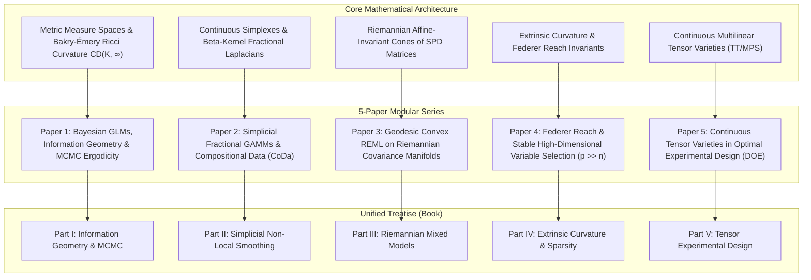

# Master Research Roadmap: Geometric & Non-Perturbative Mathematical Statistics
## A 5-Paper Series and Unified Monograph Program

**Author & Principal Investigator:** Reinaldo M. Silva-Filho  
**Institution:** Programa de Pós-Graduação em Estatística e Experimentação Agropecuária (PPGEE/DES)  
**Department:** Departamento de Estatística (DES), Universidade Federal de Lavras (UFLA), Lavras, MG, Brazil  
**Funding:** Financiado em parte pela Coordenação de Aperfeiçoamento de Pessoal de Nível Superior - Brasil (CAPES) - Código de Financiamento 001  
**Treatise Title (Future Book):**  
> *"Non-Perturbative Geometric and Functional Methods in Modern Statistics: From Metric-Measure Spaces and Tensor Varieties to Experimental Data Science"*

---

## 1. Vision and Epistemic Foundation

Classical mathematical statistics and experimental data science have long relied on Euclidean, linear, and asymptotic Gaussian approximations. However, modern challenges—characterized by ultra-high dimensionality ($p \gg n$), strict non-Euclidean parameter constraints (compositional simplexes, positive-definite covariance cones), spatial-temporal non-locality, and complex multi-trait interactions—reveal the fundamental limits of perturbative and linear models.

This research program systematically transposes the non-perturbative mathematical architecture developed in the *Beyond the Spectrum* trilogy and the Yang-Mills mass gap framework into mathematical statistics, statistical inference, and experimental design.

---

## 2. The 5 Core Papers (Summary Matrix)

| Paper | Target Focus | Core Mathematical Engine | Statistical Bottleneck Resolved | Target Journals (Qualis A1) |
| :--- | :--- | :--- | :--- | :--- |
| **Paper 1** | Bayesian GLMs & MCMC | Bakry-Émery $\mathrm{Ric}_\infty \ge K > 0$, Poincaré spectral gap | Guaranteed geometric ergodicity, resolving separation/slow mixing | *JRSS-B*, *Bernoulli*, *Annals of Statistics* |
| **Paper 2** | GAMMs & CoDa | Fractional Laplacians $(-\Delta_{\Delta_m})^\alpha$, continuous multinomials | Overcoming boundary bias of log-ratios, non-local spatial smoothing | *JASA*, *Biometrics*, *Spatial Statistics* |
| **Paper 3** | Mixed Models (LMM/GLMM) | Affine-invariant metric on $\mathcal{S}_{++}^q$, $K \le 0$ Hadamard space | Eliminating singular fits and boundary variance estimates in REML | *Biometrics*, *Statistics and Computing*, *Bioinformatics* |
| **Paper 4** | High-Dim Sparsity ($p \gg n$) | Federer reach $\mathrm{reach}(\mathcal{C}) \ge 1/\kappa^*$, Steiner tubes | Exact noise bounds for unique projection, linear proximal convergence | *JMLR*, *IEEE Trans. Inf. Theory*, *AoS* |
| **Paper 5** | Experimental Design (DOE) | Continuous Tensor-Train (TT), functional Johnson-Lindenstrauss | Solving combinatorial explosion in multi-factor agricultural trials | *Technometrics*, *JSPI*, *Stat. and Computing* |

---

## 3. The 5 Frontier Breakthrough Ideas

Beyond the 5 core papers, the folder `06_frontier_breakthrough_ideas.md` catalogues 5 high-yield breakthrough paradigms:
1. **Geometric Conformal Prediction via Federer Reach:** Minimum-volume prediction regions with distribution-free exact coverage guarantees on complex manifolds.
2. **Optimal Transport & Wasserstein Geodesics for Genotype $\times$ Environment (G$\times$E):** Predicting phenotypic response curves across unobserved climatic stresses.
3. **Graphon Ricci Flow for Microbiome and Gene Co-expression Denoising:** Topological neckpinch singularity filtration of spurious network edges without arbitrary thresholds.
4. **Sheaf-Theoretic Survival Analysis:** Constructible sheaves and persistent Euler characteristics resolving non-independent and spatial competing risks.
5. **Cohomological Invariants for Incomplete Experimental Designs:** Algebraic topology characterization of design robustness against lost plots in field trials.

---

## 4. Execution Workflow

For each paper, we maintain the rigorous triadic standard established throughout the research program:
1. **LaTeX Formal Manuscript:** Prepared using journal-specific templates (AMS/Biometrics/JASA) with rigorous proofs.
2. **Lean 4 Mechanized Proof Kernel:** Machine-checking the order-theoretic, algebraic, and structural bounds.
3. **Python / R Simulation Testbed:** Direct and inverse simulation testbeds evaluating empirical performance against classical baselines (lme4, mgcv, Stan, glmnet).
4. **Real Agricultural & Environmental Data Validation:** Grounded in real datasets from Brazilian agricultural sciences, genetics, and ecology (UFLA context).
