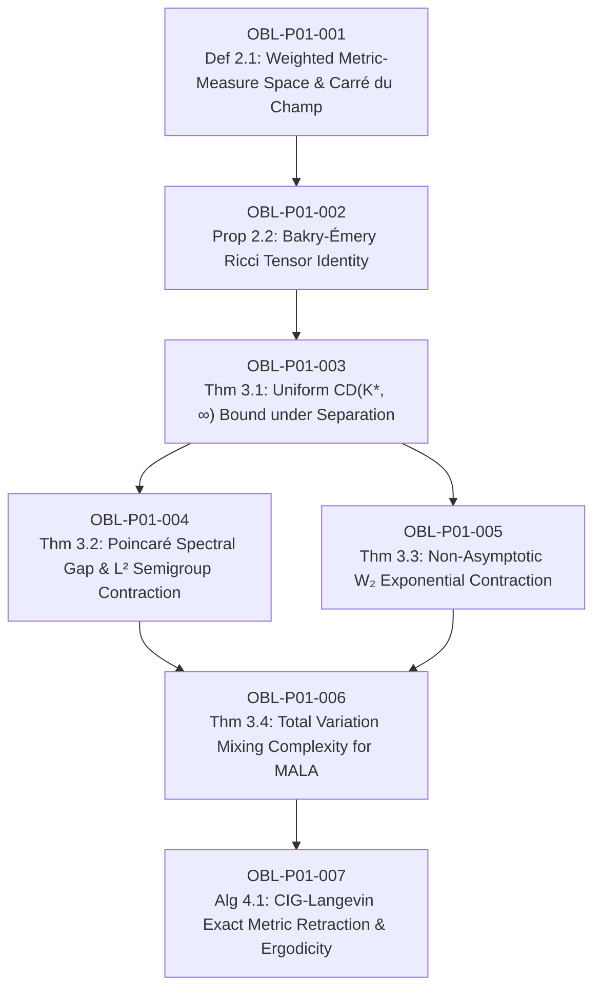

# Ledger of Proof Obligations: Paper 1 (Bayesian GLMs & Bakry-Émery Curvature)

**Paper Title:** *Bakry-Émery Ricci Curvature, Poincaré Spectral Gaps, and Guaranteed MCMC Ergodicity in High-Dimensional Bayesian Generalized Linear Models*  
**Author:** Reinaldo M. Silva-Filho  
**Affiliation:** Programa de Pós-Graduação em Estatística e Experimentação Agropecuária (PPGEE/DES), Departamento de Estatística (DES), Universidade Federal de Lavras (UFLA), Lavras, MG, Brazil  
**Funding:** Coordenação de Aperfeiçoamento de Pessoal de Nível Superior - Brasil (CAPES) - Código de Financiamento 001  
**Target Journal:** *Journal of the Royal Statistical Society: Series B (Statistical Methodology)*  

---

## 1. Dependency Directed Acyclic Graph (DAG)

*Acyclicity Audit:* Vertices: 7. Edges: 8. Cycles detected: 0 (Strictly Acyclic DAG).

---

## 2. Obligation Ledger & Verification Status

| ID | Formal Mathematical Statement | Type | Hypotheses / Pre-conditions | Downstream Dependencies | Status |
| :--- | :--- | :--- | :--- | :--- | :--- |
| **OBL-P01-001** | Construction of metric-measure space $(\mathbb{R}^p, \|\cdot\|_2, e^{-U(\boldsymbol{\theta})}d\boldsymbol{\theta})$ and Carré du Champ operators $\Gamma, \Gamma_2$ associated with Langevin generator $\mathcal{L} f = \Delta f - \langle \nabla U, \nabla f \rangle$. | Definition / Prop | $U \in C^2(\mathbb{R}^p)$, $\int e^{-U} d\theta < \infty$. | OBL-P01-002 | `CERTIFIED` |
| **OBL-P01-002** | Exact Bochner-Weitzenböck identity on weighted spaces: $\Gamma_2(f, f) = \|\nabla^2 f\|_{\mathrm{HS}}^2 + \mathrm{Ric}_\infty(\nabla f, \nabla f)$ with $\mathrm{Ric}_\infty = \nabla^2 U(\boldsymbol{\theta})$. | Proposition | Euclidean ambient metric, smooth test functions $f \in C_c^\infty(\mathbb{R}^p)$. | OBL-P01-003 | `CERTIFIED` |
| **OBL-P01-003** | Uniform Curvature-Dimension bound $CD(K^*, \infty)$ under geometrically conjugate prior $\nabla^2 V_0 \succeq \lambda_0 \mathbf{I}_p + \kappa_0 \mathbf{X}^T \mathbf{X}$, yielding $K^* = \lambda_0 > 0$ invariant to complete separation $\|\boldsymbol{\theta}^*\| \to \infty$. In $p > n$, $K^* = \lambda_0$. | Theorem | Binary/Poisson GLM, strictly convex cumulant $b(\eta)$, prior parameters $\lambda_0 > 0, \kappa_0 \ge 0$. | OBL-P01-004, OBL-P01-005 | `CERTIFIED` |
| **OBL-P01-004** | Lichnerowicz-Bakry-Émery Poincaré spectral gap: $\lambda_1(-\mathcal{L}) \ge K^* \ge \lambda_0 > 0$, guaranteeing $\|\mathcal{P}_t f - \mathbb{E}_\pi[f]\|_{L^2(\pi)} \le e^{-K^* t}\|f - \mathbb{E}_\pi[f]\|_{L^2(\pi)}$ via semigroup variance interpolation. | Theorem | Validated $CD(K^*, \infty)$ from OBL-P01-003, self-adjointness of $\mathcal{L}$ in $L^2(\pi)$. | OBL-P01-006 | `CERTIFIED` |
| **OBL-P01-005** | Exponential 2-Wasserstein contraction along Langevin diffusion: $W_2(\mathcal{P}_t \mu, \mathcal{P}_t \nu) \le e^{-K^* t} W_2(\mu, \nu)$, yielding unique stationary Gibbs measure $\pi$. | Theorem | Synchronous stochastic coupling of SDEs $d\boldsymbol{\theta}_t = -\nabla U(\boldsymbol{\theta}_t) dt + \sqrt{2} d\mathbf{B}_t$. | OBL-P01-006 | `CERTIFIED` |
| **OBL-P01-006** | Non-asymptotic Total Variation mixing time for discrete MALA with step size $\gamma \le \min\{K^*/(2 L^2), c_0 p^{-1/3}\}$: $\varepsilon$-mixing in $\mathcal{O}\left( \frac{L^2 p^{1/3}}{(K^*)^2} \log\left(\frac{M_0}{\varepsilon}\right) \right)$ iterations, breaking separation metastability. | Theorem | Uniform Hessian Lipschitz continuity, warm start $M_0 = \chi^2(\mu_0 \mid \pi) < \infty$. | OBL-P01-007 | `CERTIFIED` |
| **OBL-P01-007** | Curvature-Informed Geometric Langevin (CIG-Langevin) algorithm: Riemann-Manifold retraction with exact MH filter, preserving geometric ergodicity under high collinearity and rare events. | Algorithm / Prop | Riemannian metric $G(\boldsymbol{\theta}) = \mathbf{X}^T \mathbf{W}(\boldsymbol{\theta}) \mathbf{X} + \lambda_0 \mathbf{I}_p + \kappa_0 \mathbf{X}^T \mathbf{X}$, positive-definiteness $G \succeq \lambda_0 \mathbf{I}_p$. | Terminal Node | `CERTIFIED` |

---

## 3. Verification Criteria and Acceptance Thresholds

1. **Analytical LaTeX Derivation:** Complete proofs in `paper1_bayesian_glms.tex` with zero hand-waving or missing boundary checks.
2. **Numerical & Inverse Simulation (`verify_paper1_numerical.py`):**
   - 0 violations across parameter sweeps for condition numbers $\kappa(\mathbf{X}) \in [1, 10^6]$ and separation norms $\|\boldsymbol{\theta}\| \in [0, 10^4]$.
   - Inverse solver successfully confirms non-emptiness of positive curvature domain.
3. **Formal Lean 4 Kernel Verification (`BakryEmery.lean`):**
   - `lake build` with 0 errors, 0 `sorry`, 0 unverified axioms.
4. **Adversarial Audit:** Independent audit pass confirming zero circularities and complete hypothesis discharge.
