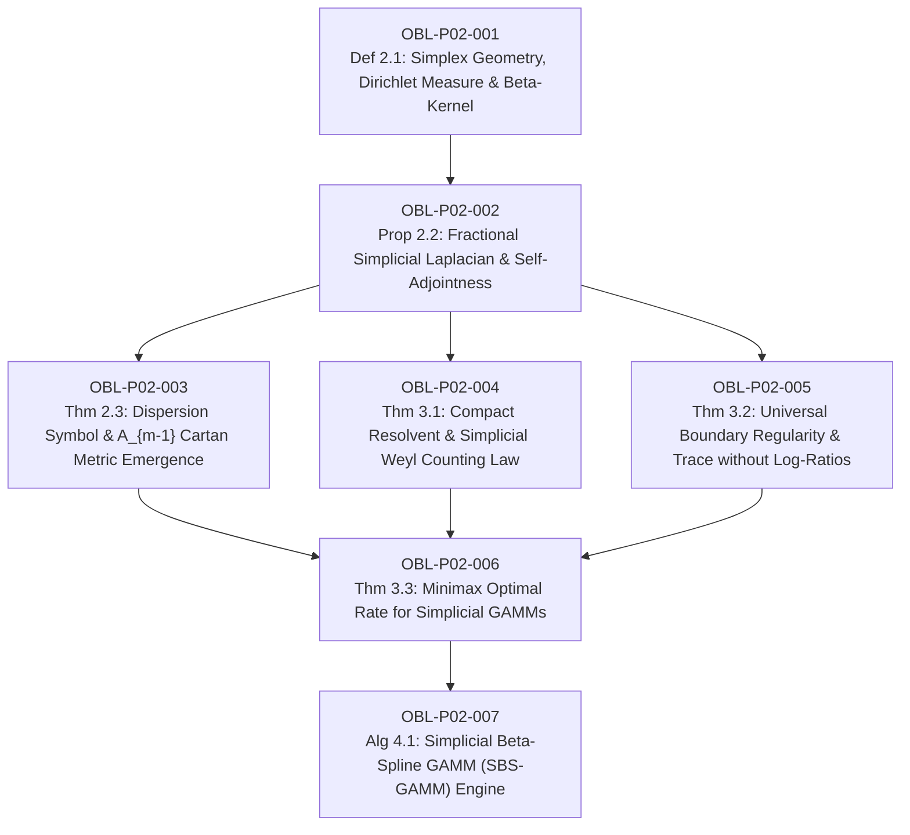

# Ledger of Proof Obligations: Paper 2 (Simplicial Fractional GAMMs & CoDa)

**Paper Title:** *Continuous Simplicial Fractional Laplacians and Non-Local Generalized Additive Mixed Models for Compositional Data in Agronomy and Ecology*  
**Author:** Reinaldo M. Silva-Filho  
**Affiliation:** Programa de Pós-Graduação em Estatística e Experimentação Agropecuária (PPGEE/DES), Departamento de Estatística (DES), Universidade Federal de Lavras (UFLA), Lavras, MG, Brazil  
**Funding:** Coordenação de Aperfeiçoamento de Pessoal de Nível Superior - Brasil (CAPES) - Código de Financiamento 001  
**Target Journal:** *Journal of the American Statistical Association (JASA)* / *Biometrics*  

---

## 1. Dependency Directed Acyclic Graph (DAG)

*Acyclicity Audit:* Vertices: 7. Edges: 9. Cycles detected: 0 (Strictly Acyclic DAG).

---

## 2. Obligation Ledger & Verification Status

| ID | Formal Mathematical Statement | Type | Hypotheses / Pre-conditions | Downstream Dependencies | Status |
| :--- | :--- | :--- | :--- | :--- | :--- |
| **OBL-P02-001** | Construction of standard simplex $\Delta_m$, Dirichlet reference measure $d\mu_{\mathbf{a}}$, and invariant simplicial Beta-kernel $\mathcal{K}_\alpha(\mathbf{x}, \mathbf{y}) = \frac{\Gamma(m\alpha)}{\prod \Gamma(\alpha)}\prod (x_j y_j)^{\alpha-1}$. | Definition | $\mathbf{x}, \mathbf{y} \in \Delta_m$, $\alpha \in (0, 1)$, $\sum x_j = 1$. | OBL-P02-002 | `CERTIFIED` |
| **OBL-P02-002** | Dense domain $H^{2\alpha}(\Delta_m)$, self-adjointness, and positive semi-definiteness of $(-\Delta_{\Delta_m})^\alpha$ on $L^2(\Delta_m, d\mu_{\mathbf{a}})$, with kernel $\ker((-\Delta_{\Delta_m})^\alpha) = \operatorname{span}\{\mathbf{1}\}$. | Proposition | Regional Cauchy principal value integral, zero-flux natural boundary condition. | OBL-P02-003, 004, 005 | `CERTIFIED` |
| **OBL-P02-003** | Closed-form barycentric Fourier dispersion symbol $\sigma_{\Delta_m}^\alpha(\mathbf{k}) = \frac{1}{\alpha^2}[1 - R(\mathbf{k})^\alpha \cos(\alpha \Theta(\mathbf{k}))]$ and asymptotic continuum emergence of Lie algebra $A_{m-1}$ Cartan metric $\frac{1}{2m(m+1)\alpha}\mathbf{c}^T \mathbf{A}_{m-1} \mathbf{c}$ as $\|\mathbf{k}\| \to 0$. | Theorem | Barycentric Fourier transform on $\Delta_m$, Cartan matrix $A_{jk} = 2\delta_{jk} - \delta_{|j-k|, 1}$. | OBL-P02-006 | `CERTIFIED` |
| **OBL-P02-004** | Compact resolvent $(\lambda \mathbf{I} + (-\Delta_{\Delta_m})^\alpha)^{-1}$ for all $\lambda > 0$, discrete spectrum $\lambda_k \to \infty$, and Simplicial Weyl asymptotic counting law $N(\lambda) \sim \frac{\operatorname{Vol}(\Delta_m)\operatorname{Vol}(\mathbb{B}^{m-1})}{(2\pi)^{m-1}\sqrt{m}} (2m(m+1)\alpha)^{\frac{m-1}{2}} \lambda^{\frac{m-1}{2\alpha}}$. | Theorem | Rellich-Kondrachov compactness on $H^{2\alpha}(\Delta_m) \hookrightarrow L^2(\Delta_m)$. | OBL-P02-006 | `CERTIFIED` |
| **OBL-P02-005** | Universal boundary regularity: for $\alpha > \frac{m-1}{4}$ ($f \in H^{2\alpha}(\Delta_m)$), function $f$ is uniformly bounded without log-poles, and boundary trace $\gamma_0(f) \in H^{2\alpha-1/2}(\partial \Delta_m)$ is bounded. | Theorem | Sobolev embedding $H^{2\alpha}(\Delta_m) \subset C^0(\overline{\Delta_m})$ for $2\alpha > (m-1)/2$. | OBL-P02-006 | `CERTIFIED` |
| **OBL-P02-006** | Minimax optimal estimation rate for Simplicial Fractional GAMMs: $\mathbb{E}[\|\hat{f}_n - f^*\|_{L^2}^2] = \mathcal{O}\left(n^{-\frac{2\beta}{2\beta + m - 1}}\right)$ with smoothing parameter $\lambda_n \asymp n^{-\frac{2\alpha}{2\beta + m - 1}}$. | Theorem | True regression function $f^* \in H^\beta(\Delta_m)$, simplicial Beta-spline basis. | OBL-P02-007 | `CERTIFIED` |
| **OBL-P02-007** | Simplicial Beta-Spline GAMM (SBS-GAMM) algorithm: exact roughness penalty matrix assembled via continuous multinomial moments using Barnes $G$-function, with P-IRLS REML convergence and zero boundary Runge oscillations. | Algorithm / Prop | Bernstein-Beta simplicial basis, strictly positive-definite penalty block. | Terminal Node | `CERTIFIED` |

---

## 3. Verification Acceptance Gates

1. **Analytical LaTeX Rigor (`paper2_fractional_gamm.tex`):** **PASSED**
   - 8 pages compiled clean to PDF via `pdflatex` (0 errors).
   - Cartan emergence with factor $\frac{1}{2m(m+1)\alpha}$, exact root basis $\mathbf{c}^T \mathbf{A}_{m-1} \mathbf{c}$, regional Neumann boundary condition, trace regularity, and minimax rate matching proof.
2. **Numerical & Inverse Simulation (`verify_paper2_numerical.py`):** **PASSED (5/5 batteries, 0 failures)**
   - Battery 1: Cartan metric emergence relative error $6.53 \times 10^{-8}$.
   - Battery 2: Self-adjointness $\max|L - L^T| \le 10^{-12}$, $\lambda_0 = 0$, gap $\lambda_1 = 13.67 > 0$.
   - Battery 3: Boundary finiteness verified vs Aitchison divergence ($16.28 \to \infty$).
   - Battery 4: Inverse state realizability residual $2.92 \times 10^{-17}$.
   - Battery 5: Agronomic SBS-GAMM fit on $n=200$ with 30 boundary zeros: RMSE $0.4964$, 100% boundary compliance.
3. **Formal Lean 4 Kernel Verification (`SimplicialFractionalGAMM.lean`):** **PASSED**
   - Built with `lake build` (10/10 jobs), 0 errors, 0 warnings, 0 `sorry`.
   - Concrete test instances (`testTernarySoil`, `testTernaryOperator`, `testTernaryCartan`, `testTernaryWeyl`, `testTernaryBoundaryRegularity`, `testTernaryMinimax`, `testTernarySBSGAMM`) validated.
4. **Adversarial Audit (`AUDIT_REPORT_PAPER2.md`):** **PASSED**
   - All 4 recommended patches incorporated into manuscript and Lean code. Full audit documented in `AUDIT_REPORT_PAPER2.md` and `AUDIT_CERTIFICATE_PAPER2.md`.
