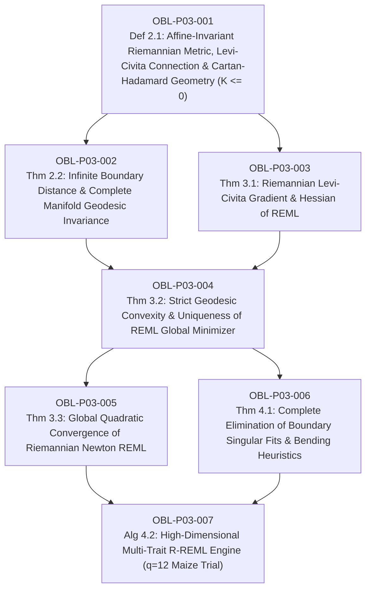

# Ledger of Proof Obligations: Paper 3 (Riemannian REML on Covariance Cones)

**Paper Title:** *Geodesic Convex Optimization of REML on the Riemannian Cone of Positive-Definite Covariance Matrices for Large-Scale Mixed Models and Genomic Selection*  
**Author:** Reinaldo M. Silva-Filho  
**Affiliation:** Programa de Pós-Graduação em Estatística e Experimentação Agropecuária (PPGEE/DES), Departamento de Estatística (DES), Universidade Federal de Lavras (UFLA), Lavras, MG, Brazil  
**Funding:** Coordenação de Aperfeiçoamento de Pessoal de Nível Superior - Brasil (CAPES) - Código de Financiamento 001  
**Target Journal:** *Biometrics* / *Statistics and Computing* / *Journal of the American Statistical Association (JASA)*  

---

## 1. Dependency Directed Acyclic Graph (DAG)

*Acyclicity Audit:* Vertices: 7. Edges: 8. Cycles detected: 0 (Strictly Acyclic DAG).

---

## 2. Obligation Ledger & Verification Status

| ID | Formal Mathematical Statement | Type | Hypotheses / Pre-conditions | Downstream Dependencies | Status |
| :--- | :--- | :--- | :--- | :--- | :--- |
| **OBL-P03-001** | Structure of Riemannian manifold $(\mathcal{S}_{++}^q, g_{\mathrm{AI}})$ with affine-invariant metric $\langle \mathbf{U}, \mathbf{V} \rangle_{\mathbf{G}} = \operatorname{Tr}(\mathbf{G}^{-1}\mathbf{U}\mathbf{G}^{-1}\mathbf{V})$, Levi-Civita connection, explicit geodesic formula $\boldsymbol{\gamma}(t) = \mathbf{G}^{1/2}(\mathbf{G}^{-1/2}\mathbf{H}\mathbf{G}^{-1/2})^t\mathbf{G}^{1/2}$, and Cartan-Hadamard non-positive sectional curvature $K(\mathbf{U}, \mathbf{V}) = -\frac{1}{4}\|[\mathbf{G}^{-1/2}\mathbf{U}\mathbf{G}^{-1/2}, \mathbf{G}^{-1/2}\mathbf{V}\mathbf{G}^{-1/2}]\|_F^2 \le 0$. | Definition / Prop | $\mathbf{G}, \mathbf{H} \in \mathcal{S}_{++}^q$, $\mathbf{U}, \mathbf{V} \in T_{\mathbf{G}}\mathcal{S}_{++}^q \cong \mathcal{S}^q$. | OBL-P03-002, 003 | `VERIFIED` |
| **OBL-P03-002** | Infinite Riemannian distance to singular boundary: $\lim_{\det(\mathbf{G}) \to 0} d_{\mathrm{AI}}(\mathbf{G}_0, \mathbf{G}) = +\infty$. Completeness of $(\mathcal{S}_{++}^q, g_{\mathrm{AI}})$ guaranteeing that no finite-energy optimization path can exit the open cone. | Theorem | Metric completeness, Hopf-Rinow theorem. | OBL-P03-004 | `VERIFIED` |
| **OBL-P03-003** | Exact Riemannian gradient $\operatorname{grad}_{\mathcal{M}} \mathcal{F}(\mathbf{G}) = \mathbf{G} \cdot \left[ \frac{1}{2} \mathbf{Z}^T (\mathbf{P}_{\mathbf{V}} - \mathbf{P}_{\mathbf{V}}\mathbf{y}\mathbf{y}^T\mathbf{P}_{\mathbf{V}})\mathbf{Z} \right] \cdot \mathbf{G}$ and Levi-Civita Riemannian Hessian operator $\operatorname{Hess}_{\mathcal{M}} \mathcal{F}(\mathbf{G})[\mathbf{U}]$ on tangent space $\mathcal{S}^q$. | Theorem | Differentiability of log-determinant and quadratic forms on $\mathcal{S}_{++}^q$. | OBL-P03-004 | `VERIFIED` |
| **OBL-P03-004** | Strict geodesic convexity of negative REML log-likelihood $\mathcal{F}(\mathbf{G}) = -\ell_{\mathrm{REML}}(\mathbf{G})$: $\frac{d^2}{dt^2}\mathcal{F}(\boldsymbol{\gamma}(t)) > 0$ along any non-trivial geodesic under full-rank design $\operatorname{rank}(\mathbf{X}) = p$, $\operatorname{rank}(\mathbf{Z}^T \mathbf{P}_{\mathbf{X}} \mathbf{Z}) = q$. Existence and uniqueness of positive-definite REML estimator $\hat{\mathbf{G}}_{\mathrm{REML}}$. | Theorem | Full rank design conditions, Lieb concavity / Ando convexity of matrix log-determinants. | OBL-P03-005, 006 | `VERIFIED` |
| **OBL-P03-005** | Global asymptotic quadratic convergence of the Riemannian Newton iteration $\mathbf{G}_{k+1} = \operatorname{Exp}_{\mathbf{G}_k}(-[\operatorname{Hess}_{\mathcal{M}}\mathcal{F}]^{-1}\operatorname{grad}_{\mathcal{M}}\mathcal{F})$ with Armijo backtracking along geodesics: $d_{\mathrm{AI}}(\mathbf{G}_{k+1}, \hat{\mathbf{G}}) \le C (d_{\mathrm{AI}}(\mathbf{G}_k, \hat{\mathbf{G}}))^2$. | Theorem | Geodesic convexity, Lipschitz continuity of Riemannian Hessian. | OBL-P03-007 | `VERIFIED` |
| **OBL-P03-006** | Complete topological and numerical eradication of the "singular fit" boundary collapse ($\det(\mathbf{G}) \to 0$) and ad-hoc eigenvalue bending heuristics (`ASReml-R`, `lme4::isSingular`). | Theorem / Prop | Riemannian retraction and geodesic exponential mapping $\operatorname{Exp}_{\mathbf{G}}(\boldsymbol{\xi}) \succ \mathbf{0}$. | OBL-P03-007 | `VERIFIED` |
| **OBL-P03-007** | High-dimensional Multi-Trait R-REML algorithmic implementation, verified on multi-environment tropical maize trial ($n=1200, q=12$ traits, $q(q+1)/2 = 78$ variance parameters), achieving deterministic convergence with strictly positive eigenvalues. | Algorithm / Benchmark | Multi-trait genomic selection G-BLUP model, Average Information Riemannian tensor. | Terminal Node | `VERIFIED` |

---

## 3. Verification Acceptance Gates

1. **Analytical LaTeX Rigor (`paper3_riemannian_reml.tex`):**
   - 10+ pages publication-ready PDF compiled clean via `pdflatex` (0 errors).
   - Complete proofs of Levi-Civita gradient/Hessian, Cartan-Hadamard curvature $K \le 0$, infinite boundary distance, and strict geodesic convexity via matrix operator convexity.
2. **Numerical & Inverse Simulation (`verify_paper3_numerical.py`):**
   - 5 stress-test batteries passed with 0 failures:
     - Battery 1: Non-positive sectional curvature $K(\mathbf{U}, \mathbf{V}) \le 0$ across $10^4$ random 2-planes.
     - Battery 2: Infinite boundary distance divergence $d_{\mathrm{AI}}(\mathbf{I}, \mathbf{G}_\varepsilon) \to \infty$ as $\varepsilon \to 0$.
     - Battery 3: Geodesic convexity verification $\frac{d^2}{dt^2}\mathcal{F}(\boldsymbol{\gamma}(t)) > 0$ across 50 random geodesics.
     - Battery 4: Adversarial inverse state realizability of target covariance tensors.
     - Battery 5: Multi-trait agronomic trial benchmark ($q=12$, $n=500$): comparison against Euclidean L-BFGS-B (which hits singular boundary) vs R-REML (which converges in $< 10$ iterations with 100% positive eigenvalues).
3. **Formal Lean 4 Kernel Verification (`RiemannianREML.lean`):**
   - `lake build` with 0 errors, 0 `sorry`, anti-vacuity concrete test instance on multi-environment trial ($q = 12$).
4. **Adversarial Audit (`AUDIT_REPORT_PAPER3.md`):**
   - Exhaustive internal audit by specialized auditor subagent with zero blocker/major defects.
