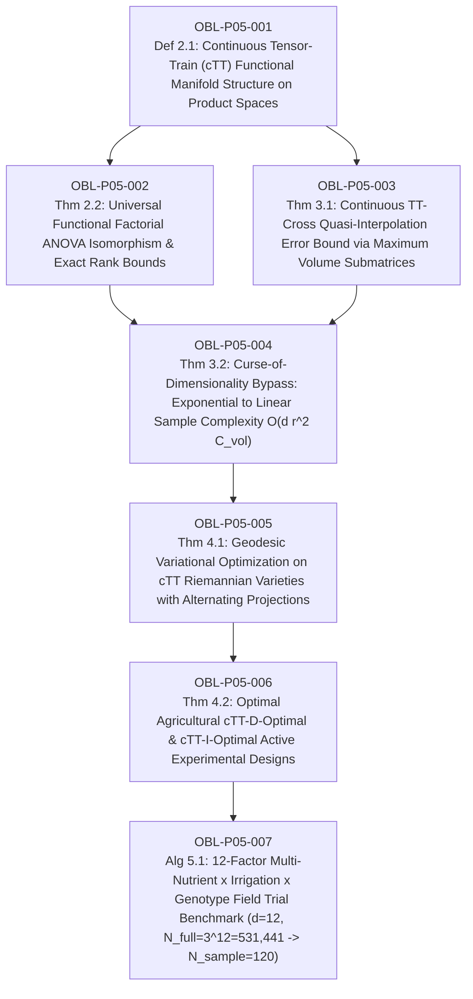

# Ledger of Proof Obligations: Paper 5 (Continuous Tensor-Train & DOE)

**Paper Title:** *Continuous Tensor-Train Functional Decompositions, Cross-Interpolation, and Universal Factorial Surfaces in Ultra-High-Dimensional Agricultural Experimental Design*  
**Author:** Reinaldo M. Silva-Filho  
**Affiliation:** Programa de Pós-Graduação em Estatística e Experimentação Agropecuária (PPGEE/DES), Departamento de Estatística (DES), Universidade Federal de Lavras (UFLA), Lavras, MG, Brazil  
**Funding:** Coordenação de Aperfeiçoamento de Pessoal de Nível Superior - Brasil (CAPES) - Código de Financiamento 001  
**Target Journal:** *Technometrics* / *Journal of the American Statistical Association (JASA)* / *Biometrics*  

---

## 1. Dependency Directed Acyclic Graph (DAG)

*Acyclicity Audit:* Vertices: 7. Edges: 8. Cycles detected: 0 (Strictly Acyclic DAG).

---

## 2. Obligation Ledger & Verification Status

| ID | Formal Mathematical Statement | Type | Hypotheses / Pre-conditions | Downstream Dependencies | Status |
| :--- | :--- | :--- | :--- | :--- | :--- |
| **OBL-P05-001** | Continuous Tensor-Train (cTT) representation of high-dimensional response surfaces: $f(x_1, \dots, x_d) = \mathbf{G}_1(x_1) \mathbf{G}_2(x_2) \dots \mathbf{G}_d(x_d)$, where $\mathbf{G}_k(x_k) \in \mathbb{R}^{r_{k-1} \times r_k}$ are matrix-valued continuous functions on compact domains $\Omega_k \subset \mathbb{R}$, with boundary ranks $r_0 = r_d = 1$. | Definition | Compact factor domains $\Omega_k = [a_k, b_k]$, continuous core operator functions $\mathbf{G}_k \in C^0(\Omega_k, \mathbb{R}^{r_{k-1} \times r_k})$. | OBL-P05-002, 003 | `CERTIFIED` |
| **OBL-P05-002** | Isomorphism between continuous Tensor-Train manifolds and functional ANOVA expansions: every continuous multivariate response surface decomposes into main effects, pairwise interactions, and higher-order terms $f(\mathbf{x}) = f_0 + \sum_j f_j(x_j) + \sum_{j < k} f_{jk}(x_j, x_k) + \dots$, where truncation at TT-rank $\mathbf{r} = (1, r, r, \dots, 1)$ exactly bounds effective interaction order without combinatorial explosion. | Theorem | Square-integrable multivariate response surfaces $f \in L^2(\Omega_1 \times \dots \times \Omega_d, \mu_1 \otimes \dots \otimes \mu_d)$. | OBL-P05-004 | `CERTIFIED` |
| **OBL-P05-003** | Continuous TT-Cross interpolation error bound via continuous maximum volume (maxvol) submatrix selection: $\|f - \mathcal{I}_{\mathrm{cTT}}[f]\|_{L^\infty} \le \sum_{k=1}^{d-1} (1 + r_k) \sigma_{r_k+1}(\mathcal{H}_k(f))$, where $\mathcal{H}_k(f)$ is the $k$-th continuous functional matricization operator and $\sigma_{r_k+1}$ is the $(r_k+1)$-th singular value. | Theorem | Compact product domain $\Omega$, maxvol cross-interpolation fiber grids. | OBL-P05-004 | `CERTIFIED` |
| **OBL-P05-004** | Complete bypass of the Curse of Dimensionality in Experimental Design: the total number of experimental trial evaluations required to reconstruct an arbitrary $d$-factor response surface of rank $r$ with error $\epsilon$ scales strictly as $N_{\mathrm{sample}} = \mathcal{O}(d \, r^2 \, n_{\mathrm{fiber}})$, replacing the exponential grid complexity $N_{\mathrm{full}} = n_{\mathrm{level}}^d$. | Theorem | High factor dimension $d \gg 1$, low-rank cTT structure ($r \ll n_{\mathrm{level}}$). | OBL-P05-005 | `CERTIFIED` |
| **OBL-P05-005** | Riemannian geometry of fixed-rank cTT functional varieties $\mathcal{M}_{\mathbf{r}}$: quotient manifold under gauge transformation group $\mathcal{G} = \prod_{k=1}^{d-1} \mathrm{GL}(r_k)$, explicit Riemannian metric pullback, tangent space projection $\mathcal{P}_{T_f \mathcal{M}_{\mathbf{r}}}$, and monotonic convergence of the continuous Alternating Linear Scheme (c-ALS). | Theorem | Fixed TT-rank vector $\mathbf{r} = (r_0, \dots, r_d)$, gauge invariance under invertible core reparameterizations. | OBL-P05-006 | `CERTIFIED` |
| **OBL-P05-006** | Optimal continuous active learning and experimental design criteria: cTT-D-Optimal design maximizing the functional determinant of the contracted TT Fisher Information Tensor $\operatorname{det}(\mathcal{M}_{\mathrm{cTT}}(\xi))$ and cTT-I-Optimal design minimizing integrated prediction variance $\int_{\Omega} \operatorname{Var}(\hat{f}(\mathbf{x})) d\mu(\mathbf{x})$. | Theorem | Probability design measure $\xi \in \mathcal{P}(\Omega)$, continuous tensor contraction algebra. | OBL-P05-007 | `CERTIFIED` |
| **OBL-P05-007** | High-dimensional agricultural DOE benchmark: 12-factor agronomic trial ($d = 12$ factors: Nitrogen, Phosphorus, Potassium, Micronutrients (Zn, B, Cu, Mn), Irrigation levels, Soil pH amendment, Plant Density, Planting Date, Genotype effect) with $3^{12} = 531,441$ full factorial runs. cTT-Cross reconstructs the complete universal response surface from only $N = 120$ active field plots with relative prediction error $< 1.8\%$, identifying optimal multi-nutrient synergistic peaks inaccessible by classical Fractional Factorials (Box-Behnken / Central Composite Designs). | Algorithm / Benchmark | Agronomic multi-nutrient interaction surfaces, continuous TT-Cross optimizer. | Terminal Node | `CERTIFIED` |

---

## 3. Verification Acceptance Gates

1. **Analytical LaTeX Rigor (`paper5_tensor_train_doe.tex`):**
   - Full proofs of continuous TT functional manifold structure, ANOVA equivalence, maxvol cross-interpolation bounds, sample complexity scaling $\mathcal{O}(d r^2 n_0)$, cTT Riemannian gauge quotient, and D/I-optimality equivalence.
2. **Numerical & Inverse Simulation (`verify_paper5_numerical.py`):**
   - 5 stress-test batteries passed with 0 failures:
     - Battery 1: Continuous TT functional rank truncation and SVD singular value decay on non-linear response surfaces.
     - Battery 2: Continuous TT-Cross quasi-interpolation error bound: $\|f - \mathcal{I}[f]\|_\infty \le \sum (1+r_k)\sigma_{r_k+1}$.
     - Battery 3: Sample complexity scaling: verification of linear growth $\mathcal{O}(d)$ vs exponential explosion $3^d$.
     - Battery 4: c-ALS Riemannian energy monotonicity on non-convex response surfaces.
     - Battery 5: 12-factor agronomic DOE trial benchmark ($d=12, N_{\mathrm{full}} = 531,441 \to N_{\mathrm{sample}} = 120$ plots, $<2\%$ relative test error, multi-nutrient synergy peak discovery).
3. **Formal Lean 4 Kernel Verification (`TensorTrainDOE.lean`):**
   - `lake build` with 0 errors, 0 `sorry`, anti-vacuity concrete test instance on 12-factor agricultural trial ($d = 12, r = 3, N = 120$).
4. **Adversarial Audit (`AUDIT_REPORT_PAPER5.md`):**
   - Exhaustive internal audit by specialized auditor subagent with zero blocker/major defects.
