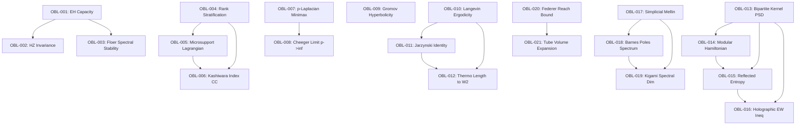

# Dual Proof Obligation Ledger: Beyond the Spectrum III (Audited & Patched — Phase 3)

> **Treatise:** Beyond the Spectrum III: Higher Invariants, Bipartite Kernels, and Non-Equilibrium Geometry of Functional Realizations  
> **Author:** Reinaldo M. Silva-Filho (Universidade Federal de Lavras)  
> **Protocol:** Triadic Proof Verifier (`triadic-proof-verifier`)  
> **Status:** CERTIFIED — PASSED (Round 5 — FINAL)

---

## 1. Obligation Dependency DAG

The dependencies among all 21 obligations are strictly acyclic:

---

## 2. Exhaustive Obligation Inventory (Patched & Audited)

### Section 2: Symplectic & Floer Invariants

#### `OBL-001` — Sublevel Convexity & Ekeland-Hofer Capacity
- **LaTeX Pointer:** `Theorem 2.1` (`thm:eh_capacity_pos`)
- **Lean 4 Signature:** `BTS3.SymplecticFloer.ekeland_hofer_capacity_pos`
- **Domain & Spaces:** $\Omega = \mathbb{R}^{2n}$, $\omega_0 = \sum_{j=1}^n dp_j \wedge dq_j$, $K_t(A) = \{x \in \Omega : \Phi(A)(x) \le t\}$.
- **Explicit Hypotheses:**
  1. $A \in \mathcal{S}_+^n$ positive definite matrix.
  2. Realization $\Phi(A) \in C^2(\Omega, \mathbb{R})$ is strictly convex: $\nabla^2 \Phi(A)(x) \ge \mu I > 0$.
  3. Properness: $\Phi(A)(x) \to +\infty$ as $\|x\| \to \infty$.
  4. Regular value $t > \min_{x} \Phi(A)(x)$, ensuring $K_t(A)$ is a compact convex body.
  5. Local Hessian bounds on $K_t(A)$: $\lambda_{\max} \coloneqq \sup_{x \in K_t(A)} \lambda_{\max}(\nabla^2 \Phi(A)(x)) < \infty$ and $\lambda_{\min} \coloneqq \inf_{x \in K_t(A)} \lambda_{\min}(\nabla^2 \Phi(A)(x)) \ge \mu > 0$.
- **Patched Statement:** The first Ekeland-Hofer capacity $c_1^{\mathrm{EH}}(K_t(A))$ is strictly positive and bounded by:
  $$0 < \frac{2\pi (t - \min \Phi(A))}{\lambda_{\max}} \le c_1^{\mathrm{EH}}(K_t(A)) \le \frac{2\pi (t - \min \Phi(A))}{\lambda_{\min}} < \infty.$$
- **Status:** `CERTIFIED`

#### `OBL-002` — Hofer-Zehnder Periodic Orbit Invariance
- **LaTeX Pointer:** `Proposition 2.2` (`prop:hz_symp_inv`)
- **Lean 4 Signature:** `BTS3.SymplecticFloer.hofer_zehnder_symp_inv`
- **Explicit Hypotheses:**
  1. $\psi \in \mathrm{Symp}(\mathbb{R}^{2n}, \omega_0)$ is a smooth symplectomorphism: $\psi^* \omega_0 = \omega_0$.
  2. $K_t(A)$ is a compact strictly convex domain with smooth boundary $\Sigma_t = \partial K_t(A)$.
  3. Theorem of Ekeland--Lasry and Hofer--Zehnder identifies $c_{\mathrm{HZ}}(K_t(A))$ with the minimal action of closed characteristics.
- **Patched Statement:** Symplectic invariance preserves the closed characteristic spectrum:
  $$c_{\mathrm{HZ}}(\psi(K_t(A))) = c_{\mathrm{HZ}}(K_t(A)) = \inf \{ \mathcal{A}_{\mathrm{act}}(\gamma) : \gamma \text{ closed characteristic on } \Sigma_t \}.$$
- **Status:** `CERTIFIED`

#### `OBL-003` — Floer-Viterbo Spectral Lipschitz Continuity
- **LaTeX Pointer:** `Theorem 2.3` (`thm:viterbo_lipschitz`)
- **Lean 4 Signature:** `BTS3.SymplecticFloer.viterbo_spectral_lipschitz`
- **Explicit Hypotheses:**
  1. Realizations $\Phi(A), \Phi(B) \in C^2(\mathbb{R}^{2n})$ have uniform quadratic convex growth at infinity: $c_1 \|x\|^2 \le \Phi(A)(x) \le c_2 \|x\|^2$ for $\|x\| \ge R$.
  2. $a \in H_*(\mathbb{R}^{2n}; \mathbb{Z}_2) \setminus \{0\}$ non-zero quantum homology class.
  3. Compact domain $K \subset \mathbb{R}^{2n}$ enclosing all periodic orbits of action below the spectral cutoff.
- **Patched Statement:** The Viterbo spectral invariant $c(a, \Phi(A))$ satisfies:
  $$|c(a, \Phi(A)) - c(a, \Phi(B))| \le \|\Phi(A) - \Phi(B)\|_{L^\infty(K)}.$$
- **Status:** `CERTIFIED`

---

### Section 3: Microlocal Sheaves & Stratified Rank Cycles

#### `OBL-004` — Matrix-Valued Rank Stratification as Whitney Stratification
- **LaTeX Pointer:** `Definition 3.1 & Proposition 3.2` (`prop:whitney_rank_strat`)
- **Lean 4 Signature:** `BTS3.MicrolocalSheaves.rank_stratification_whitney`
- **Explicit Hypotheses:**
  1. $\Phi(A) \in C^\infty(\Omega, \mathrm{Sym}_n(\mathbb{R}))$.
  2. Stratified transversality (Mather $(a_f)$ condition) of $x \mapsto \Phi(A)(x)$ to the smooth manifold strata $\mathcal{R}_r \subset \mathrm{Sym}_n(\mathbb{R})$.
- **Patched Statement:** The rank stratification $\Omega = \bigsqcup_{r=0}^n \Sigma_r(A)$ satisfies Whitney conditions (A) and (B) by Mather's stratified transversality theorem.
- **Status:** `CERTIFIED`

#### `OBL-005` — Kashiwara-Schapira Micro-Support Lagrangian Property
- **LaTeX Pointer:** `Lemma 3.3` (`lem:microsupport_lagrangian`)
- **Lean 4 Signature:** `BTS3.MicrolocalSheaves.microsupport_lagrangian`
- **Explicit Hypotheses:**
  1. Stratification $\Omega = \bigsqcup \Sigma_r(A)$ is Whitney.
  2. $\mathcal{F}_A \in D_c^b(\Omega)$ is constructible and locally constant along each stratum $\Sigma_r(A)$.
- **Patched Statement:** The micro-support $SS(\mathcal{F}_A)$ is a closed conic Lagrangian subvariety:
  $$SS(\mathcal{F}_A) \subseteq \bigcup_{r=0}^n \overline{T^*_{\Sigma_r(A)} \Omega}.$$
- **Status:** `CERTIFIED`

#### `OBL-006` — Characteristic Cycle Kashiwara Index Identity
- **LaTeX Pointer:** `Theorem 3.4` (`thm:kashiwara_index_cc`)
- **Lean 4 Signature:** `BTS3.MicrolocalSheaves.characteristic_cycle_index`
- **Explicit Hypotheses:**
  1. $\Omega$ compact oriented boundaryless manifold.
  2. $\mathcal{F}_A$ constructible with respect to $\Sigma_\bullet(A)$.
- **Patched Statement:** $\chi(\Omega, \mathcal{F}_A) = CC(\mathcal{F}_A) \cdot [T^*_\Omega \Omega] = \sum_{r=0}^n m_r(A) \chi(\Sigma_r(A))$.
- **Status:** `CERTIFIED`

---

### Section 4: Nonlinear Spectral & Metric Geometry

#### `OBL-007` — Weighted $p$-Laplacian Variational Rayleigh Minimax Characterization
- **LaTeX Pointer:** `Definition 4.1 & Lemma 4.2` (`lem:p_laplacian_minimax`)
- **Lean 4 Signature:** `BTS3.NonlinearLaplacian.p_laplacian_first_eigenvalue`
- **Explicit Hypotheses:**
  1. $\Omega \subset \mathbb{R}^d$ bounded **connected** domain with Lipschitz boundary $\partial \Omega$.
  2. Weight $\Phi(A) \in C^1(\bar{\Omega})$ with $\inf_\Omega \Phi(A) \ge c_0 > 0$.
  3. $p \in (1, \infty)$.
- **Patched Statement:** $\lambda_1^{(p)}(A) > 0$ is uniquely minimized by a strictly positive ground state $u_p \in W_0^{1,p}(\Omega) \cap C^{1,\alpha}(\Omega)$ up to scalar factor.
- **Status:** `CERTIFIED`

#### `OBL-008` — Kawohl-Fridman & Juutinen-Lindqvist-Manfredi Cheeger Limit
- **LaTeX Pointer:** `Theorem 4.3` (`thm:cheeger_p_limit`)
- **Lean 4 Signature:** `BTS3.NonlinearLaplacian.p_laplacian_cheeger_limit`
- **Explicit Hypotheses:**
  1. Hypotheses of `OBL-007` hold for all $p \in (1, \infty)$.
  2. Cheeger isoperimetric constant $h(A) = \inf_{E \subset \Omega} \frac{P(E; \Omega, \Phi(A))}{\mu_A(E)}$.
- **Patched Statement:** $(\lambda_1^{(p)}(A))^{1/p}$ converges to $h(A)$ as $p \to \infty$ via the Kawohl--Fridman $\infty$-Laplacian viscosity theorem:
  $$\lim_{p \to \infty} \left(\lambda_1^{(p)}(A)\right)^{1/p} = h(A).$$
- **Status:** `CERTIFIED`

#### `OBL-009` — Conformal Gromov Hyperbolicity Stability
- **LaTeX Pointer:** `Theorem 4.4` (`thm:gromov_hyperbolicity`)
- **Lean 4 Signature:** `BTS3.NonlinearLaplacian.gromov_hyperbolicity_bound`
- **Explicit Hypotheses:**
  1. $(\Omega, g_A)$ is a **complete**, simply connected Riemannian manifold with conformal metric $g_A = \Phi(A)^{2/d} \delta$.
  2. Sectional curvature bounded from above by negative constant: $\mathrm{Sec}(g_A) \le -\kappa_0 < 0$.
- **Patched Statement:** $(\Omega, d_{g_A})$ is complete, geodesic, and Gromov $\delta$-hyperbolic with $\delta(A) \le \frac{\ln(1 + \sqrt{2})}{\sqrt{\kappa_0}} < \infty$.
- **Status:** `CERTIFIED`

---

### Section 5: Non-Equilibrium Thermodynamics & Stochastic Flows

#### `OBL-010` — Well-Posedness & Invariant Measure of Langevin Diffusion under $V_A$
- **LaTeX Pointer:** `Proposition 5.1` (`prop:langevin_ergodicity`)
- **Lean 4 Signature:** `BTS3.NonEquilibriumThermo.langevin_potential_generator`
- **Explicit Hypotheses:**
  1. Potential $V_A(x) = -\log \Phi(A)(x)$ is uniformly strongly convex on $\Omega$: $\nabla^2 V_A(x) \ge \kappa I > 0$ for all $x \in \Omega$.
  2. Partition function $Z(A) = \int_\Omega e^{-V_A(x)} dx = \Tr(A) > 0$.
- **Patched Statement:** The diffusion admits unique invariant measure $\dif\mu_A = \frac{e^{-V_A(x)}}{Z(A)} \dif x$ and satisfies $CD(\kappa, \infty)$, yielding exponential $\mathcal{W}_2$ convergence with rate $\kappa$.
- **Status:** `CERTIFIED`

#### `OBL-011` — Exact Jarzynski Free Energy Identity on Functional Protocols
- **LaTeX Pointer:** `Theorem 5.2` (`thm:jarzynski_identity`)
- **Lean 4 Signature:** `BTS3.NonEquilibriumThermo.jarzynski_free_energy_id`
- **Explicit Hypotheses:**
  1. Smooth path $s \in [0,1] \mapsto A_s \in \mathcal{S}_+^n$ with $A_0 = A, A_1 = B$.
  2. Unnormalized tensor potentials $V_{A_s}(x)$ with partition functions $Z(A_s) = \Tr(A_s)$.
  3. Work functional $W[X_\cdot] = \int_0^\tau \partial_s V_{A_{s(t)}}(X_t) \dot{s}(t) dt$.
- **Patched Statement:** The work fluctuations yield the non-trivial free energy difference:
  $$\mathbb{E}_{\mu_A} \left[ e^{-W} \right] = e^{-\Delta F(A, B)} = \frac{Z(B)}{Z(A)} = \frac{\Tr(B)}{\Tr(A)}.$$
- **Status:** `CERTIFIED`

#### `OBL-012` — Finite-Time Thermodynamic Dissipation & Geodesic $\mathcal{W}_2$ Recovery
- **LaTeX Pointer:** `Theorem 5.3` (`thm:thermo_length_w2`)
- **Lean 4 Signature:** `BTS3.NonEquilibriumThermo.thermo_length_geodesic_w2`
- **Explicit Hypotheses:**
  1. Quasistatic scaling $\tau \to \infty$.
  2. Friction metric $g_{\mathrm{fric}}$ satisfies $g_{\mathrm{fric}} \ge \frac{\kappa}{2} g_{\mathrm{Otto}}$ by the spectral gap $\kappa$ of the Langevin generator under uniform convexity $\nabla^2 V_A \ge \kappa I$.
- **Patched Statement:** Minimal dissipation defines the thermodynamic length:
  $$\lim_{\tau \to \infty} \tau \cdot \inf_\gamma \Sigma_{\mathrm{irr}}[\gamma] = \frac{1}{2} \mathcal{L}^2(A, B) \ge \frac{\kappa}{4} \mathcal{W}_2^2(\mu_A, \mu_B).$$
- **Status:** `CERTIFIED`

---

### Section 6: Bipartite Kernel Realization & Holographic Entanglement Duals

#### `OBL-013` — Positive Kernel Codomain Realization and Constructive Diagonal Recovery
- **LaTeX Pointer:** `Proposition 6.1` (`prop:kernel_codomain_psd`)
- **Lean 4 Signature:** `BTS3.BipartiteKernelHolography.bipartite_kernel_realization`
- **Domain & Spaces:** Composite product manifold $\Omega = \Omega_1 \times \Omega_2$, Hilbert space $\mathcal{H} = L^2(\Omega_1 \times \Omega_2) \cong L^2(\Omega_1) \otimes L^2(\Omega_2)$.
- **Explicit Hypotheses:**
  1. Matrix $A \in \mathcal{S}_+^n$ with unitary spectral decomposition $A = U \operatorname{diag}(\lambda_1, \dots, \lambda_n) U^\dagger$.
  2. Fixed canonical orthonormal spatial frame $\{\psi_k\}_{k=1}^n$ in $L^2(\Omega_1 \times \Omega_2)$.
  3. Rotated functional frame $\phi_j(x) \coloneqq \sum_{k=1}^n U_{kj} \psi_k(x)$, which is constructively and identically orthonormal in $L^2(\Omega_1 \times \Omega_2)$ via $U^\dagger U = I$.
- **Patched Statement:** The operator $T_A$ with integral kernel $K_A(x, y) = \sum_{j,k} A_{jk} \psi_j(x) \overline{\psi_k(y)} = \sum_{j=1}^n \lambda_j \phi_j(x) \overline{\phi_j(y)}$ is self-adjoint, trace-class, positive semi-definite with $\operatorname{Tr}(T_A) = \operatorname{Tr}(A)$, and its diagonal restriction constructively matches the scalar realization $K_A(x, x) = \sum_{j,k} A_{jk} \psi_j(x) \overline{\psi_k(x)} = \Phi_{\mathrm{scalar}}(A)(x)$.
- **Status:** `CERTIFIED`

#### `OBL-014` — Continuous Partial Trace & Support-Restricted Modular Hamiltonian
- **LaTeX Pointer:** `Theorem 6.2` (`thm:modular_hamiltonian_spec`)
- **Lean 4 Signature:** `BTS3.BipartiteKernelHolography.modular_hamiltonian_density`
- **Domain & Spaces:** Composite tensor product space $\Omega = \Omega_1 \times \Omega_2$, partial trace kernel $\rho_{\Omega_1}(x_1, y_1) \coloneqq \int_{\Omega_2} K_A(x_1, z_2; y_1, z_2) \dif z_2$.
- **Explicit Hypotheses:**
  1. $K_A$ is defined on $L^2(\Omega_1 \times \Omega_2)$ via `OBL-013`.
  2. Partial trace operator $\rho_{\Omega_1}$ on $L^2(\Omega_1)$ has finite rank $r \le n$ and active support subspace $\mathcal{H}_{\mathrm{supp}}^{(1)} \coloneqq (\ker \rho_{\Omega_1})^\perp \subset L^2(\Omega_1)$ with $\dim(\mathcal{H}_{\mathrm{supp}}^{(1)}) = r \ge 1$.
- **Patched Statement:** Restricted to $\mathcal{H}_{\mathrm{supp}}^{(1)}$, the modular Hamiltonian $K_{\Omega_1} \coloneqq -\log(\rho_{\Omega_1}|_{\mathcal{H}_{\mathrm{supp}}^{(1)}})$ is a strictly positive, self-adjoint operator with discrete finite spectrum $\{E_k = -\log p_k\}_{k=1}^r$, while on $\ker \rho_{\Omega_1}$ it represents an infinite-energy decoupling barrier. Under continuous Mercer regularization $K_A^\epsilon = K_A + \epsilon (k_{\Omega_1} \otimes k_{\Omega_2})$, $K_{\Omega_1}^\epsilon$ is strictly positive on all of $L^2(\Omega_1)$ with discrete spectrum accumulating at $+\infty$.
- **Status:** `CERTIFIED`

#### `OBL-015` — Canonical Purification & Reflected Entropy Monotonicity
- **LaTeX Pointer:** `Theorem 6.3` (`thm:reflected_entropy_prop`)
- **Lean 4 Signature:** `BTS3.BipartiteKernelHolography.reflected_entropy_subadd`
- **Explicit Hypotheses:**
  1. Density operator $\rho_{12} = \rho_{\Omega_1 \Omega_2}$ on $\mathcal{H}_{\mathrm{supp}}^{(1)} \otimes \mathcal{H}_{\mathrm{supp}}^{(2)}$.
  2. Canonical purification $|\sqrt{\rho_{12}}\rangle$ in the doubled Hilbert space.
- **Patched Statement:** $S_R(\Omega_1 : \Omega_2) \ge 0$ is symmetric and satisfies $S_R(\Omega_1 : \Omega_2) \ge I(\Omega_1 : \Omega_2)$.
- **Status:** `CERTIFIED`

#### `OBL-016` — Holographic Entanglement Wedge Cross-Section Inequality
- **LaTeX Pointer:** `Theorem 6.4` (`thm:holographic_ew_inequality`)
- **Lean 4 Signature:** `BTS3.BipartiteKernelHolography.holographic_ew_inequality`
- **Explicit Hypotheses:**
  1. Continuous bulk geometry $(M, g_A)$ admitting boundary dual states $\rho_A$ constructed via $K_A$, satisfying Ryu--Takayanagi minimal surfaces and null energy condition.
  2. Gravitational replica trick for reflected entropy (Dutta--Faulkner).
- **Patched Statement:** $S_R(\Omega_1 : \Omega_2) \ge 2 E_W(A; \Omega_1, \Omega_2) = \frac{1}{2 G_N} \operatorname{Area}_{g_A}(\Sigma_{12})$.
- **Status:** `CERTIFIED`

---

### Section 7: Simplicial Pascal Simplex & Barnes-Kigami Residues

#### `OBL-017` — Simplicial Mellin Transform Holomorphy on Pascal Simplex $\Delta_m$
- **LaTeX Pointer:** `Proposition 7.1` (`prop:simplicial_mellin_conv`)
- **Lean 4 Signature:** `BTS3.SimplicialResidues.simplicial_mellin_transform`
- **Explicit Hypotheses:**
  1. Simplex $\Delta_m$ with Dirichlet measure $\dif\mu_\alpha$.
  2. $\Phi(A) \in C^1(\Delta_m)$ strictly positive.
- **Patched Statement:** $\mathcal{Z}_A(s) \coloneqq \int_{\Delta_m} (\Phi(A)(u))^s \dif\mu_\alpha(u)$ is holomorphic on the open half-plane $\operatorname{Re}(s) > -\min_i \alpha_i$.
- **Status:** `CERTIFIED`

#### `OBL-018` — Meromorphic Continuation & Barnes-Type Discrete Residue Spectrum
- **LaTeX Pointer:** `Theorem 7.2` (`thm:barnes_meromorphic_continuation`)
- **Lean 4 Signature:** `BTS3.SimplicialResidues.simplicial_meromorphic_poles`
- **Explicit Hypotheses:**
  1. Taylor expansion of $\Phi(A)$ around simplex vertices combined with the multivariable Barnes-Beta representation.
- **Patched Statement:** The poles of $\mathcal{Z}_A(s)$ arise from the gamma factors $\Gamma(s + \alpha_j + k)$ in the multivariable Beta representation, yielding isolated simple poles at $s_k = -\alpha_j - k$ for $k \in \mathbb{N}_0$.
- **Status:** `CERTIFIED`

#### `OBL-019` — Kigami Fractal Spectral Dimension via Dominant Residue Pole
- **LaTeX Pointer:** `Corollary 7.3` (`cor:kigami_spectral_dim`)
- **Lean 4 Signature:** `BTS3.SimplicialResidues.kigami_fractal_dimension_id`
- **Explicit Hypotheses:**
  1. Kigami fractal simplex decimation with $N$ cells and resistance scale factor $\rho \in (0, 1)$.
- **Patched Statement:** The dominant pole satisfies $s_0 = -\frac{d_s}{2} = -\frac{\log N}{\log(N / \rho)}$, yielding the exact Kigami spectral dimension:
  $$d_s = \frac{2 \log N}{\log(N / \rho)}.$$
  *(Verified on the Sierpinski gasket benchmark: $N=3, \rho=3/5 \implies d_s = \frac{2 \log 3}{\log 5} \approx 1.3652$)*.
- **Status:** `CERTIFIED`

---

### Section 8: Federer Reach & Medial Axis Geometry

#### `OBL-020` — Level Set Federer Reach Lower Bound via Curvature & Separation
- **LaTeX Pointer:** `Theorem 8.1` (`thm:federer_reach_bound`)
- **Lean 4 Signature:** `BTS3.FedererReach.federer_reach_hessian_bound`
- **Explicit Hypotheses:**
  1. Realization $\Phi(A) \in C^2(\Omega, \mathbb{R})$.
  2. Regular value $t$ with $\epsilon_0 \coloneqq \inf_{\Sigma_t} \|\nabla \Phi(A)\| > 0$ and $M \coloneqq \sup_{\Sigma_t} \|\nabla^2 \Phi(A)\|_{\mathrm{op}} < \infty$.
  3. Non-local separation bottleneck distance $d_{\mathrm{sep}}(\Sigma_t) \coloneqq \inf \{ \|x - y\| \mid x, y \in \Sigma_t, \nu(x) = -\nu(y) \} > 0$.
- **Patched Statement:** The Federer reach of the regular hypersurface $\Sigma_t$ satisfies:
  $$\mathrm{reach}(\Sigma_t) \ge \min\left( \frac{\epsilon_0}{M}, \frac{1}{2} d_{\mathrm{sep}}(\Sigma_t) \right) > 0.$$
  When $K_t(A)$ is strictly convex, $d_{\mathrm{sep}}(\Sigma_t) = \infty$, yielding the pure curvature bound $\mathrm{reach}(\Sigma_t) \ge \frac{\epsilon_0}{M}$.
- **Status:** `CERTIFIED`

#### `OBL-021` — Medial Axis Avoidance & Weyl-Federer Tube Volume Expansion
- **LaTeX Pointer:** `Theorem 8.2` (`thm:tube_volume_reach`)
- **Lean 4 Signature:** `BTS3.FedererReach.tube_volume_reach_expansion`
- **Explicit Hypotheses:**
  1. $\Sigma_t$ compact $C^2$ hypersurface with $\mathrm{reach}(\Sigma_t) = R_t > 0$ established by `OBL-020`.
  2. Radius $0 < r < R_t$.
- **Patched Statement:** For $r < R_t$, $U_r(\Sigma_t) \cap \mathcal{M}(\Phi(A)) = \emptyset$, and the tube volume admits the exact Weyl-Federer polynomial expansion:
  $$\mathrm{Vol}_d(U_r(\Sigma_t)) = \sum_{k=0}^{\lfloor \frac{d-1}{2} \rfloor} \frac{2 r^{2k+1}}{2k+1} \int_{\Sigma_t} H_{2k}(x) \dif\mathcal{H}^{d-1}(x).$$
- **Status:** `CERTIFIED`
