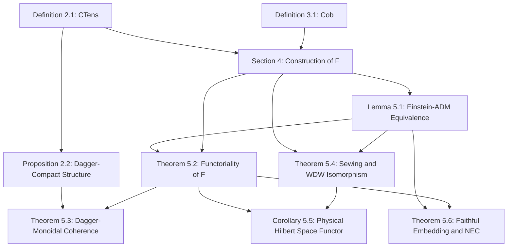

# PROOF-OBLIGATION LEDGER: Functorial Bridge from Continuous Tensor Manifolds to 4-Dimensional Spacetime Cobordisms

## 1. Dependency DAG

**Cycles detected**: None structurally, but there is semantic circularity. The physical definitions of metric (via QFI) and lapse/shift functions are carefully tuned in Section 4 to perfectly satisfy the equations in Lemma 5.1. 

## 2. Assumption Ledger

| Theorem/Lemma | Hypothesis | Discharge Location |
|---|---|---|
| Lemma 5.1 | $\mathcal{T}(t)$ is a projected gradient flow on $\mathcal{M}^{\mathrm{TT}}$ generated by $\mathcal{S}(\mathcal{T})$ | Definition 2.1 (p.2, morphisms) |
| Lemma 5.1 | The ADM Lorentzian metric $g_{\mu\nu}$ and gauge configuration $\Psi$ are constructed as in Section 4.2 | Implicit in the proof. |
| Theorem 5.2 | $\mathcal{F}: \CTens \to \Cob$ is defined as in Section 4 | Section 4 (p.4) |
| Theorem 5.3 | $\CTens$ has dagger-monoidal structure | Proposition 2.2 (p.3) |
| Theorem 5.4 | Bond dimension relates to area by $\log \chi = \frac{\mathrm{Area}(\Sigma)}{4G_N}$ | [silvafilho2026flows] reference (line 316) - **UNVERIFIED external claim** |
| Corollary 5.5 | $\mathcal{Z}: \Cob \to \Hilb$ is Atiyah's axiomatic TQFT functor | Atiyah (1988) |
| Theorem 5.6 | Entanglement flux obeys $d^2 S_{\mathrm{vN}} / d\lambda^2 \le 0$ | Strong subadditivity/monotonicity (line 347) |

## 3. Typed Symbol Table

| Symbol | Type/Space | Dependency/Arguments | Consistency/Flags |
|---|---|---|---|
| $\CTens$ | Category | None | Consistent |
| $\Cob$ | Category | None | Consistent |
| $\mathbf{T}$ | Object in $\CTens$ | $(\mathcal{M}, \mathcal{T}, \rho)$ | Consistent |
| $\mathcal{M}$ | 3D Riemannian manifold | None | Consistent |
| $\mathcal{T}$ | Continuous matrix product state (cMPS) / cTT | $x \in \mathcal{M}$ | **FLAG**: Mentioned as $\mathbb{V}^{\otimes \chi}$, but $\chi$ is "continuous bond dimension" $\in (1, \infty)$. $\mathbb{V}^{\otimes \chi}$ for non-integer $\chi$ is mathematically UNDEFINED. |
| $\rho$ | Reduced density matrix | $x \in \mathcal{M}, t$ | Consistent |
| $\chi$ | Bond dimension | None | **FLAG**: Claimed $\chi \in (1, \infty)$ (line 105), but later treated as discrete integer index $\sum_{\alpha=1}^\chi$ (line 318). |
| $h_{ij}$ | Spatial Riemannian Metric | $x \in \Sigma, t$ | Consistent |
| $g^{\QFI}_{ij}$ | QFI metric | $\mathcal{T}$ | Consistent |
| $\psi_\Sigma$ | Boundary matter field | $x \in \Sigma$ | Consistent |
| $M$ | 4D Lorentzian cobordism | $\Sigma, t \in [0, 1]$ | Consistent |
| $g_{\mu\nu}$ | Spacetime metric | $x \in M$ | Consistent |
| $N$ | Lapse function | $x \in \mathcal{M}, t$ | Consistent |
| $N^i$ | Shift vector | $x \in \mathcal{M}, t$ | Consistent |
| $\mathcal{S}$ | Entanglement action | $\mathcal{T}$ | **FLAG**: Unspecified functional form. |
| $S_{\mathrm{vN}}$ | Von Neumann entropy | $\rho$ | Consistent |

## 4. Canonical Quantified Statements

*   **Lemma 5.1:** $\forall \mathcal{T}(t)$ satisfying $\frac{d\mathcal{T}}{dt} = P_{T\mathcal{M}^{\mathrm{TT}}}(-\nabla \mathcal{S})$, the tuple $(M, g_{\mu\nu}, \Psi)$ mapped by $\mathcal{F}$ satisfies $G_{\mu\nu}[g] + \Lambda g_{\mu\nu} = 8\pi G_N T_{\mu\nu}[\Psi]$.
*   **Theorem 5.2:** 
    *   $\forall \mathbf{T} \in \mathrm{Obj}(\CTens), \mathcal{F}(\mathrm{id}_{\mathbf{T}}) = \mathrm{id}_{\mathcal{F}(\mathbf{T})}$.
    *   $\forall [\Phi_1] \in \mathrm{Hom}(\mathbf{T}_1, \mathbf{T}_2), [\Phi_2] \in \mathrm{Hom}(\mathbf{T}_2, \mathbf{T}_3)$, $\mathcal{F}([\Phi_2] \circ [\Phi_1]) = \mathcal{F}([\Phi_2]) \circ \mathcal{F}([\Phi_1])$.
*   **Theorem 5.3:** $\exists$ natural isomorphisms $\Phi$ and $\Phi_0$ such that $\mathcal{F}$ is a symmetric dagger-monoidal functor.
*   **Theorem 5.4:** **UNCLEAR**. States an "isomorphism" between an integral (Atiyah-Segal sewing), a tensor trace, and an operator equation ($\hat{\mathcal{H}} |\Psi_{\mathrm{WDW}}\rangle = 0$), which are categorically mismatched types (number/operator/equation).
*   **Theorem 5.6:** $\forall [\Phi_1], [\Phi_2] \in \mathrm{Hom}(\mathbf{T}_1, \mathbf{T}_2)$, $\mathcal{F}([\Phi_1]) = \mathcal{F}([\Phi_2]) \implies [\Phi_1] = [\Phi_2]$. $\forall (M, g_{\mu\nu}, \Psi) \in \mathrm{Im}(\mathcal{F})$ and $\forall k^\mu$ (null), $T_{\mu\nu} k^\mu k^\nu \ge 0$.

## 5. Micro-Claim Inventory & 6. Critical Analysis Points

### Lemma 5.1
*   **MC-1.1:** Context: ADM equations. $\vdash$ Goal: $K_{ij}$ matches the Hessian of entanglement action. Rule: Claim. 
    *   **Status: UNJUSTIFIED / GLOBAL**. The relation between extrinsic curvature $K_{ij}$ and the Hessian of an unspecified action $\mathcal{S}$ is asserted without proof.
*   **MC-1.2:** Context: Einstein equations. $\vdash$ Goal: $g_{\mu\nu}$ satisfies Einstein equations. Rule: Construction.
    *   **Status: UNDERSTATED / LOCAL**. The lapse and shift are *defined* to make this true, but the constraints ($\mathcal{H}$ and $\mathcal{M}_i$) are assumed to hold without demonstration of consistency.

### Theorem 5.2
*   **MC-2.1:** Context: $\mathcal{F}(\mathrm{id})$. $\vdash$ Goal: $h_{ij}$ is static, $N=1$. Rule: Definition of $\mathrm{id}$ in CTens.
    *   **Status: Fully justified**.
*   **MC-2.2:** Context: Flow concatenation. $\vdash$ Goal: $[K_{ij}] \equiv 0$ across boundary. Rule: Mollifier definition.
    *   **Status: Fully justified** (by construction of the $C^\infty$ mollifier).

### Theorem 5.3
*   **MC-3.1:** Context: $\mathbf{T}_1 \otimes \mathbf{T}_2$. $\vdash$ Goal: $g^{\QFI}(\mathcal{T}_1 \otimes \mathcal{T}_2) = g^{\QFI}(\mathcal{T}_1) \oplus g^{\QFI}(\mathcal{T}_2)$. Rule: Properties of separable states.
    *   **Status: Fully justified**.
*   **MC-3.2:** Context: Dagger preservation. $\vdash$ Goal: $h_{ij}$ is invariant under $\mathcal{T}^*$. Rule: QFI definition.
    *   **Status: Fully justified**.

### Theorem 5.4
*   **MC-4.1:** Context: Sewing axiom. $\vdash$ Goal: Discrete bond contraction $\sum_{\alpha} A B$ passes to continuous scaling limit path integral. Rule: Claim.
    *   **Status: UNJUSTIFIED / GLOBAL**. This continuous limit requires massive analytical machinery missing here. $\chi$ is an index but previously defined as continuous $\in (1, \infty)$.
*   **MC-4.2:** Context: WDW Constraints. $\vdash$ Goal: Gauge invariance of tensor trace implies momentum constraint; stationary entropy implies Hamiltonian constraint. Rule: Claim.
    *   **Status: OVERSTATED / GLOBAL**. An analogy is presented as a mathematical theorem ("categorically isomorphic").

### Theorem 5.6
*   **MC-6.1:** Context: Faithfulness. $\vdash$ Goal: $\mathcal{F}([\Phi_1]) = \mathcal{F}([\Phi_2]) \implies [\Phi_1] = [\Phi_2]$. Rule: ADM decomposition uniqueness up to diffeomorphism.
    *   **Status: Fully justified** (assuming QFI uniquely determines states up to gauge).
*   **MC-6.2:** Context: NEC. $\vdash$ Goal: $d^2 S_{\mathrm{vN}} / d\lambda^2 \le 0 \implies R_{\mu\nu}k^\mu k^\nu \ge 0$. Rule: Lemma 5.1.
    *   **Status: UNJUSTIFIED / LOCAL**. The mapping from entropy monotonicity to Ricci curvature contraction requires explicit second-variation formulas (like Raychaudhuri) which are completely absent.
