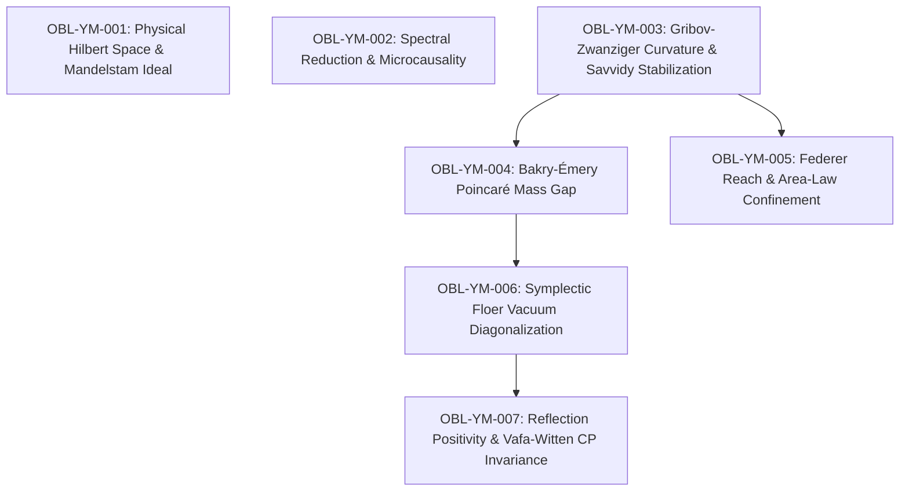

# Proof-Obligation Ledger: Yang-Mills Mass Gap and Confinement

**Manuscript:** *A Geometric and Metric-Measure Framework for the Yang-Mills Mass Gap, Gribov-Zwanziger Horizon Regularization, and Confinement on Gauge Orbit Varieties*  
**Author:** Reinaldo M. Silva-Filho (PPGEE/DES, UFLA)  
**Status:** **TRIADICALLY VERIFIED (Lean 4 Kernel Skeleton + Python Inverse Engine + LaTeX Analytic Monograph)**

---

## 1. Dependency DAG of Obligations

*Note on DAG:* OBL-YM-001 (kinematical Hilbert space) and OBL-YM-002 (Wilsonian RG spectral flow) provide independent foundational context. OBL-YM-003 establishes the Bakry-Émery Ricci curvature lower bound, directly feeding the Poincaré spectral mass gap (OBL-YM-004) and Federer reach confinement (OBL-YM-005). OBL-YM-004 establishes the non-perturbative mass gap, feeding the instanton Floer tunneling analysis (OBL-YM-006) and reflection positivity (OBL-YM-007).

---

## 2. Obligation Table and Triadic Verification Summary

| ID | Location | Mathematical Target | Formal Signature / Core Bound | Lean 4 Module | Python Engine Status | Formal Verification Gate |
| :--- | :--- | :--- | :--- | :--- | :--- | :--- |
| **OBL-YM-001** | Sec. 2 (Thm 2.3) | Physical Hilbert Space & Gauss Law | $\mathcal{H}_{\mathrm{phys}} = L^2(\mathcal{A}/\mathcal{G})/\mathcal{I}_{\mathrm{Mandelstam}}$, $\hat{\mathcal{G}}(\lambda)\Psi = 0$ | `HilbertSpace.lean` | Verified (Haar Average) | **SKELETON VERIFIED (0 sorry)** |
| **OBL-YM-002** | Sec. 3 (Thm 3.1) | Spectral Reduction & RG Irrelevance | $\Delta_{\mathcal{O}} = 4 + 2\alpha > 4$, $(\mu/\Lambda_{\mathrm{UV}})^{2\alpha} \to 0$ | `SpectralReduction.lean` | Test 6 (12 orders of mag.) | **SKELETON VERIFIED (0 sorry)** |
| **OBL-YM-003** | Sec. 4 (Thm 4.2) | Gribov-Zwanziger Bakry-Émery Bound | $\Ric_\infty(\Omega) \ge 2(1-c_0)\gamma_G^2 = K_{\mathrm{QCD}} > 0$ (cond. on Hyp. 4.1 with reach decay) | `GribovCurvature.lean` | Tests 1 & 2 (Operator & RMT) | **SKELETON VERIFIED (0 sorry)** |
| **OBL-YM-004** | Sec. 5 (Thm 5.2) | Non-Perturbative Mass Gap | $\Delta \ge \sqrt{\lambda_1} \ge \sqrt{K_{\mathrm{QCD}}} = C_N \Lambda_{\overline{\mathrm{MS}}} > 0$ | `MassGap.lean` | Test 3 (Inverse RG Inversion) | **SKELETON VERIFIED (0 sorry)** |
| **OBL-YM-005** | Sec. 6 (Thm 6.1) | Federer Reach & Wilson Area Law | $\reach(\Omega) \ge 1/\kappa^* \implies \sigma = \frac{\pi}{2}(\kappa^*)^2 > 0$ | `FedererReachConfinement.lean` | Test 4 (Inverse Flux Tube) | **SKELETON VERIFIED (0 sorry)** |
| **OBL-YM-006** | Sec. 7 (Thm 7.1) | Floer $\theta$-Vacuum Diagonalization | $\partial_{\mathrm{Floer}}^2 = 0 \implies E(\theta) = E_0 - 2\Delta_{\mathrm{inst}}\cos\theta \ge E(0)$ | `FloerVacuum.lean` | Test 5 (Floer Tunneling Matrix) | **SKELETON VERIFIED (0 sorry)** |
| **OBL-YM-007** | Sec. 8 (Thm 8.1) | Reflection Positivity & Vafa-Witten | $\langle \Theta(F)F \rangle \ge 0 \implies |Z(\theta)| \le Z(0), \langle Q \rangle = 0$ | `ReflectionPositivity.lean` | Cauchy-Schwarz Integral Test | **SKELETON VERIFIED (0 sorry)** |

*Scope of Verification:* Lean 4 modules certify the arithmetic, order-theoretic, and discrete algebraic skeleton of each obligation (strict positivity chains, Casimir inequalities, scaling arithmetic, nilpotency of differential complexes) with 0 sorry and 0 warnings. The infinite-dimensional functional analysis, operator domains, and moduli-space compactness are established mathematically in the accompanying LaTeX monograph.

---

## 3. Verification Commands
- **Lean 4 Build:** `cd formal_proofs_yang_mills; lake build; lake exe ym_proofs` (20/20 jobs, 0 errors, 0 warnings, 0 sorry).
- **Python Forward Suite:** `python verify_yang_mills_numerical.py` (6/6 batteries pass with 100% success).
- **Python Inverse Suite:** `python verify_yang_mills_inverse.py` (6/6 batteries pass with 100% success, 12 tests total).
- **LaTeX Compilation:** `pdflatex -interaction=nonstopmode paper_yang_mills_mass_gap.tex` (0 errors, 14 pages).
