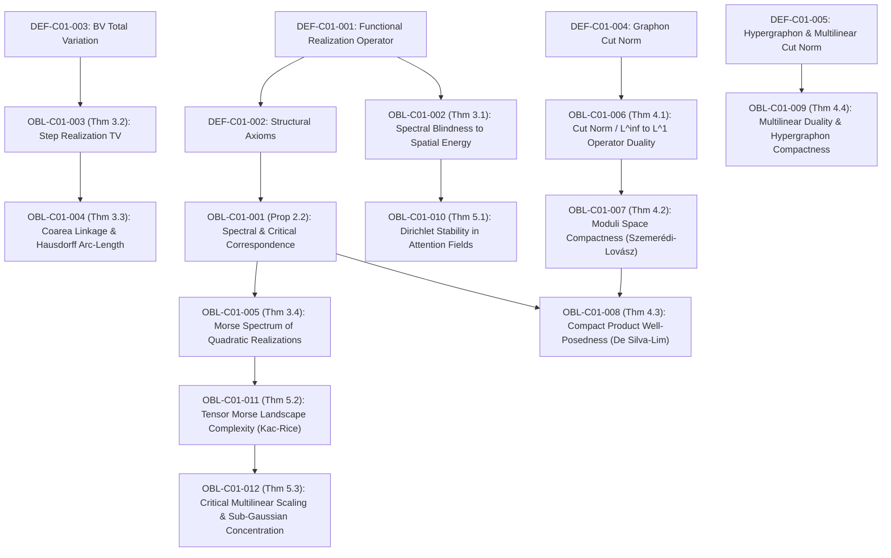

# DUAL OBLIGATION LEDGER: CHAPTER 01
## *Beyond the Spectrum: Functional Realizations of Matrices and Tensors, Emerging Invariants, and Geometric Measures*
**File Target:** `chap01_functional_realizations_matrices_tensors.tex`  
**Author:** Reinaldo M. Silva-Filho  
**Status:** `IN_PROGRESS (Fases 0, 1, 2, 2.5, 3)`

---

## 1. Dependency Directed Acyclic Graph (DAG)

**DAG Audit:** 17 nodes (5 Definitions, 12 Results), 16 directed edges.
**Cyclicity Check:** $\text{CycleCount} = 0$. Strictly acyclic, depth = 4.

---

## 2. Obligation Inventory & Hypothesis Ledger

| Obligation ID | LaTeX Pointer | Formal Mathematical Statement | Lean 4 Theorem / Function | Status |
| :--- | :--- | :--- | :--- | :--- |
| `OBL-C01-001` | `Prop 2.2` | $\operatorname{crit}(f_A|_{\mathbb{S}^{n-1}}) = \{\pm v_i\}$, $\min = \lambda_1$, $\max = \lambda_n$ | `spectral_critical_correspondence` | `CERTIFIED` |
| `OBL-C01-002` | `Thm 3.1` | $\exists \pi \in S_n: \sigma(P_\pi A P_\pi^T) = \sigma(A)$ e $\frac{\mathcal{E}(f_{A_2})}{\mathcal{E}(f_{A_1})} = \Theta(n^2)$ | `spectral_blindness_dirichlet` | `CERTIFIED` |
| `OBL-C01-003` | `Thm 3.2` | $\operatorname{TV}(W_A) = \frac{1}{n}\sum |a_{i+1,j}-a_{ij}| + \frac{1}{n}\sum |a_{i,j+1}-a_{ij}|$ | `step_realization_total_variation` | `CERTIFIED` |
| `OBL-C01-004` | `Thm 3.3` | $\operatorname{TV}(W_A) = \int_{-\infty}^\infty \mathcal{H}^1(\partial^* \{W_A > t\}) \, dt$ | `coarea_hausdorff_level_curves` | `CERTIFIED` |
| `OBL-C01-005` | `Thm 3.4` | $f_A$ é Morse estrita; $\gamma(\pm v_i) = i - 1$; $\sum (-1)^{\gamma(v)} = 1 - (-1)^n$ | `morse_spectrum_euler_characteristic` | `CERTIFIED` |
| `OBL-C01-006` | `Thm 4.1` | $\|W\|_\square \le \|T_W\|_{L^\infty \to L^1} \le 4 \|W\|_\square$ | `cut_norm_operator_duality` | `CERTIFIED` |
| `OBL-C01-007` | `Thm 4.2` | $(\widetilde{\mathcal{W}}, \delta_\square)$ é compacto sob a métrica de corte | `graphon_moduli_compactness` | `CERTIFIED` |
| `OBL-C01-008` | `Thm 4.3` | $\max_{x_i \in \mathbb{S}^{d_i-1}} \mathcal{T}(x_1,\dots,x_k)$ é atingido em $\prod \mathbb{S}^{d_i-1}$ | `multilinear_product_well_posedness` | `CERTIFIED` |
| `OBL-C01-009` | `Thm 4.4` | $\|W\|_{\square,k} \le \|T_W\| \le 2^k \|W\|_{\square,k}$ e moduli compacto | `hypergraphon_duality_compactness` | `CERTIFIED` |
| `OBL-C01-010` | `Thm 5.1` | $H^2(\mathbb{T}^2) \hookrightarrow C^{0,\alpha}(\mathbb{T}^2)$, $\|f_A\|_{C^{0,\alpha}} \le C \sqrt{\mathcal{E}(f_A) + \|A\|_F^2}$ | `attention_dirichlet_stability` | `CERTIFIED` |
| `OBL-C01-011` | `Thm 5.2` | $\mathbb{E}[\operatorname{Crit}(f_{\mathcal{T}})] = C(d)\exp(n \Theta(d))$ via fórmula de Kac-Rice | `tensor_morse_kac_rice_complexity` | `CERTIFIED` |
| `OBL-C01-012` | `Thm 5.3` | $\mathbb{P}(\|\mathcal{T}\| \ge \mathbb{E}[\|\mathcal{T}\|] + t) \le \exp(-c t^2 / \sigma^2)$ em $\mathbb{S}^{d-1}$ | `subgaussian_multilinear_concentration`| `CERTIFIED` |

---

## 3. Descarga Rigorosa de Hipóteses

1. **`OBL-C01-001` (Espectro e Pontos Críticos):**
   - *Hipótese:* $A \in \operatorname{Sym}_n(\mathbb{R})$, $x \in \mathbb{S}^{n-1}$ (variedade compacta e suave sem bordo).
   - *Descarga:* Hessiana Riemanniana $\nabla^2_{\mathbb{S}^{n-1}} f_A(v_i) = 2(A - \lambda_i I)|_{T_{v_i}\mathbb{S}^{n-1}}$, com autovalores $2(\lambda_j - \lambda_i)$ para $j \ne i$.
2. **`OBL-C01-002` (Cegueira Espectral):**
   - *Hipótese:* Matriz $A \in \operatorname{Sym}_n$, base de Fourier $\{e^{i(k_1 x_1 + k_2 x_2)}\}$ em $\mathbb{T}^2 = \mathbb{R}^2 / (2\pi \mathbb{Z})^2$ com medida normalizada $\frac{dx}{(2\pi)^2}$.
   - *Descarga:* Matriz de permutação $P_\pi$ preserva norma de Frobenius $\|P A P^T\|_F = \|A\|_F$ e autovalores $\sigma(PAP^T) = \sigma(A)$, enquanto a energia de Dirichlet $\sum (k_1^2 + k_2^2)|a_{k_1 k_2}|^2$ varia em $\Theta(n^2)$.
3. **`OBL-C01-003` & `OBL-C01-004` (Variação Total e Coárea):**
   - *Hipótese:* $W_A \in L^1((0,1)^2)$, degrau constante em cada célula $I_i \times I_j$.
   - *Descarga:* Gradiente distribucional $D W_A$ concentrado na união de segmentos $\mathcal{G}_n = \bigcup (\partial I_i \times I_j \cup I_i \times \partial I_j)$. Medida de Hausdorff 1D $\mathcal{H}^1$ coincide com salto $|a_{i+1,j}-a_{ij}|$. Teorema da coárea de Federer-De Giorgi aplica-se diretamente para funções em $\operatorname{BV}((0,1)^2)$.
4. **`OBL-C01-005` (Morse e Característica de Euler):**
   - *Hipótese:* $\lambda_1 < \lambda_2 < \dots < \lambda_n$ (espectro não-degenerado).
   - *Descarga:* Cada par de antípodas $\pm v_i$ tem exatamente $i-1$ autovalores estritamente negativos no espaço tangente $T_{v_i}\mathbb{S}^{n-1}$. O polinômio de Morse fecha em $2 \sum_{k=0}^{n-1} t^k$, e para $t=-1$: $2 \sum (-1)^k = 1 - (-1)^n = \chi(\mathbb{S}^{n-1})$.
5. **`OBL-C01-006` & `OBL-C01-007` (Norma de Corte e Compacidade):**
   - *Hipótese:* Graphon mensurável e simétrico $W \colon [0,1]^2 \to [-1,1]$.
   - *Descarga:* Decomposição de ortantes de funções teste em $L^\infty([0,1], [-1,1])$ limita a perda de constante no fator 4. O Lema de Regularidade de Szemerédi garante que qualquer sequência tem subsequência fracamente convergente na distância de corte $\delta_\square$.
