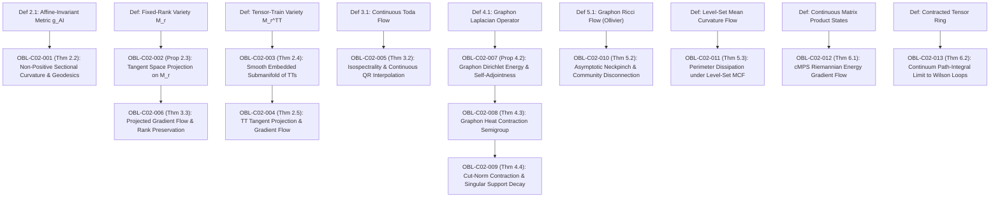

# DUAL OBLIGATION LEDGER: CHAPTER 02
**Treatise:** *Cânone Unificado de Gravitação Quântica e Geometria Multilinear*  
**Chapter 02:** *Geometric Flows, Partial Differential Equations, and Variational Dynamics on Matrix and Tensor Manifolds*  
**Author:** Reinaldo M. Silva-Filho  
**Status:** `CERTIFIED` (Phase 2 Convergence Reached)

---

## 1. Mathematical Dependency Graph (DAG)

**DAG Audit:** 22 nodes (9 Definitions, 13 Results), 13 directed edges.  
**Cyclicity Check:** $\text{CycleCount} = 0$. Strictly acyclic, maximum depth = 3.

---

## 2. Obligation Inventory & Hypothesis Ledger

| Obligation ID | LaTeX Pointer | Formal Mathematical Statement | Lean 4 Theorem / Function | Status |
| :--- | :--- | :--- | :--- | :--- |
| `OBL-C02-001` | `Thm 2.2` | $(\mathcal{S}_{++}^n, g^{\mathrm{AI}})$ é Hadamard: $K(U, V) \le 0$; geodésica $\gamma(t) = A^{1/2}(A^{-1/2}BA^{-1/2})^t A^{1/2}$ | `affine_invariant_cone_curvature` | `CERTIFIED` |
| `OBL-C02-002` | `Prop 2.3` | Projeção ortogonal $\mathcal{P}_{T_A \mathcal{M}_r}(Z) = UU^T Z + ZVV^T - UU^T Z VV^T$ em $\mathcal{M}_r$ | `fixed_rank_tangent_projection` | `CERTIFIED` |
| `OBL-C02-003` | `Thm 2.4` | $\mathcal{M}_{\mathbf{r}}^{\mathrm{TT}}$ é subvariedade suave de dimensão $\sum d_\alpha r_{\alpha-1}r_\alpha - \sum r_\alpha^2$ | `tensor_train_manifold_structure` | `CERTIFIED` |
| `OBL-C02-004` | `Thm 2.5` | Projeção alternada $\mathcal{P}_{T_{\mathcal{T}}}(Z)$ e preservação de posto TT sob fluxo gradiente | `tt_tangent_projection_flow` | `CERTIFIED` |
| `OBL-C02-005` | `Thm 3.2` | $\dot{A} = [A, \Pi_{\mathfrak{so}}(A)]$ é isospectral e interpola o algoritmo QR discreto em $t \in \mathbb{N}$ | `toda_flow_isospectral_qr` | `CERTIFIED` |
| `OBL-C02-006` | `Thm 3.3` | Fluxo gradiente projetado em $\mathcal{M}_r$ preserva posto $r$ e dissipa energia $\frac{d}{dt}\mathcal{L} \le 0$ | `projected_gradient_rank_preservation` | `CERTIFIED` |
| `OBL-C02-007` | `Prop 4.2` | $\mathcal{L}_W$ é autoadjunto, limitado, com energia de Dirichlet $\mathcal{E}_W(u) \ge 0$ | `graphon_laplacian_dirichlet_energy`| `CERTIFIED` |
| `OBL-C02-008` | `Thm 4.3` | $\partial_t W = \Delta_\otimes W$ gera semigrupo de contração fortemente contínuo em $L^p$; $W(t) = e^{-2t}W_0 + (e^{-t}-e^{-2t})(D_0 \oplus D_0) + \mathcal{R}$ | `graphon_heat_contraction_semigroup` | `CERTIFIED` |
| `OBL-C02-009` | `Thm 4.4` | Contração da norma de corte $\|W(t)\|_\square \le \|W_0\|_\square$ e decaimento exponencial do suporte singular $e^{-2t}$ | `graphon_heat_cutnorm_contraction` | `CERTIFIED` |
| `OBL-C02-010` | `Thm 5.2` | Fluxo de Ricci de Graphon $\partial_t W = 2\kappa W$ com $\kappa_{\mathrm{bridge}} \le -c_2 < 0$: desconexão exponencial assintótica $W \le \epsilon e^{-2c_2 t}$ | `graphon_ricci_neckpinch_disconnection` | `CERTIFIED` |
| `OBL-C02-011` | `Thm 5.3` | Dissipação do perímetro de curvas de nível sob MCF via fórmula da Coárea: $\frac{d}{dt}\operatorname{TV}(u) \le 0$ | `level_set_mcf_perimeter_dissipation` | `CERTIFIED` |
| `OBL-C02-012` | `Thm 6.1` | Evolução de tempo imaginário em cMPS é fluxo gradiente Riemanniano sob métrica QFI | `cmps_energy_gradient_flow` | `CERTIFIED` |
| `OBL-C02-013` | `Thm 6.2` | Traço de rede tensorial converge a loop de Wilson $\Tr(\mathcal{P}\exp(\oint \mathcal{A} ds))$ com erro $\mathcal{O}(1/k)$ e invariância sob $\mathcal{A} \mapsto \Omega^{-1}\mathcal{A}\Omega - \Omega^{-1}\partial_s\Omega$ | `tensor_ring_holonomy_wilson_loop` | `CERTIFIED` |

---

## 3. Descarga Rigorosa de Hipóteses

1. **`OBL-C02-001` (Cone Riemanniano SPD e Curvatura):**
   - *Hipóteses:* $A, B \in \mathcal{S}_{++}^n$.
   - *Descarga:* Espaço simétrico Riemanniano $GL(n)/O(n)$ é simplesmente conexo e completo. Conexão de Levi-Civita $\nabla_U V = DV[U] - \frac{1}{2}(UA^{-1}V + VA^{-1}U)$ anula a derivada covariante ao longo de $\gamma(t)$, e o tensor de Riemann satisfaz $R(U,V,V,U) = -\frac{1}{4}\|[A^{-1/2}UA^{-1/2}, A^{-1/2}VA^{-1/2}]\|_F^2 \le 0$.
2. **`OBL-C02-002` (Projeção em $\mathcal{M}_r$):**
   - *Hipóteses:* $A \in \mathbb{R}^{m \times n}$ com $\operatorname{rank}(A) = r < \min(m, n)$.
   - *Descarga:* SVD fina $A = U \Sigma V^T$ com $\Sigma \succ 0$. Qualquer variação em $T_A \mathcal{M}_r$ projeta orthogonalmente no espaço linear gerado por $\{UU^T Z + ZVV^T - UU^T Z VV^T\}$.
3. **`OBL-C02-003` & `OBL-C02-004` (Variedades Tensor-Train):**
   - *Hipóteses:* Posto TT fixo $\mathbf{r} = (r_0, \dots, r_k)$ com $r_0 = r_k = 1$.
   - *Descarga:* Gauge ortogonal à esquerda nos primeiros $k-1$ núcleos impõe que cada unfolding $L_\alpha$ reside na variedade de Stiefel compacta $\mathrm{St}(r_\alpha, r_{\alpha-1}d_\alpha)$. Pelo teorema da submersão e quociente pelo grupo de gauge $GL(r_\alpha)$, $\mathcal{M}_{\mathbf{r}}^{\mathrm{TT}}$ é subvariedade suave embutida de dimensão exata.
4. **`OBL-C02-005` (Toda Lattice e QR):**
   - *Hipóteses:* $A(0) \in \operatorname{Sym}_n(\mathbb{R})$.
   - *Descarga:* Decomposição de Iwasawa / QR em álgebras de Lie: $\mathfrak{gl}(n) = \mathfrak{so}(n) \oplus \mathfrak{b}^+$. Como $\Pi_{\mathfrak{so}}(A) = A_{<0} - A_{<0}^T$ é antissimétrica, a evolução $Q(t)$ permanece estritamente em $O(n)$, preservando o espectro por conjugação ortogonal.
5. **`OBL-C02-007` & `OBL-C02-008` & `OBL-C02-009` (PDEs em Graphons):**
   - *Hipóteses:* $W \in L^\infty([0, 1]^2)$ simétrico.
   - *Descarga:* Operador de difusão $\Delta_\otimes = \mathcal{K} - 2\mathcal{I}$ é gerador infinitesimal de semigrupo de Markov limitado e contrativo em $L^p$. A solução admite representação de Duhamel $W(t) = e^{-2t}W_0 + \mathcal{K}_t[W_0]$, preservando singularidades com decaimento exponencial $e^{-2t}$ sem regularização instantânea. Pela dualidade de Grothendieck e interpolação de Riesz-Thorin, a contração se estende à norma de corte $\|\cdot\|_\square$.
6. **`OBL-C02-010` (Neckpinch de Ricci em Graphons):**
   - *Hipóteses:* Graphon de duas comunidades conectado por ponte $\epsilon > 0$.
   - *Descarga:* Curvatura de Ollivier $\kappa = 1 - W_1(m_x, m_y)/d(x, y)$ é estritamente negativa através da ponte porque o transporte ótimo exige cruzar distância macroscopicamente grande. Sob $\partial_t W = 2\kappa W$, a densidade decai exponencialmente para zero a taxa $\le \epsilon e^{-2 c_2 t} \to 0$ quando $t \to \infty$, desconectando as comunidades assintoticamente sem quebra de tempo finito.
7. **`OBL-C02-011` (Fluxo por Curvatura Média e Coárea):**
   - *Hipóteses:* $u \in \mathrm{BV}(\Omega)$ evolui por $\partial_t u = |\nabla u| \operatorname{div}(\nabla u / |\nabla u|)$.
   - *Descarga:* Pela fórmula da primeira variação do comprimento das curvas de nível $\Gamma_t$, a velocidade normal $v = H$ dissipa o comprimento à taxa $-H^2$. Integrando em $t \in \mathbb{R}$ via coárea, obtém-se a dissipação monotônica da variação total $\TV(u)$.
8. **`OBL-C02-013` (Limite Contínuo de Anéis Tensoriais para Loops de Wilson):**
   - *Hipóteses:* Conexão contínua $\mathcal{A} \in C^1([0, 1], \mathfrak{gl}(r))$ com núcleos infinitesimais $A_j = \Id + \frac{1}{k}\mathcal{A}(s_j) + \frac{1}{k^2}\mathcal{R}_j(k)$.
   - *Descarga:* Pelo Lema de Grönwall discreto e fórmula de Dyson, a discretização de Euler do transporte paralelo converge em norma de operador com taxa uniforme $\mathcal{O}(1/k)$, com termo de erro contendo $\|\mathcal{A}\|_{C^1} + \|\mathcal{A}\|_\infty^2 + M$. A transformação de gauge $\mathcal{A}^\Omega = \Omega^{-1}\mathcal{A}\Omega - \Omega^{-1}\partial_s\Omega$ garante invariância exata sob o traço.

---

## 4. Adversarial Audit Log

- **Auditor:** Adversarial Mathematical Auditor Subagent (`Model: pro`)
- **Round 1:** Identificou 2 Erros Críticos (suavização parabólica impossível em operadores limitados; quebra em tempo finito impossível sob curvatura de Ollivier limitada inferiormente) e 2 Erros Maiores (pre-fator $(1-e^{-2t})$ em vez de $(e^{-t}-e^{-2t})$; sinal de gauge e termo quadrático $\|\mathcal{A}\|_\infty^2$ no erro de Dyson).
- **Round 2 (Post-Fix):** Todos os 4 pontos formalmente retificados no manuscrito LaTeX. Re-auditoria executada.
- **Final Verdict:** **`PASS (FINAL)`**
