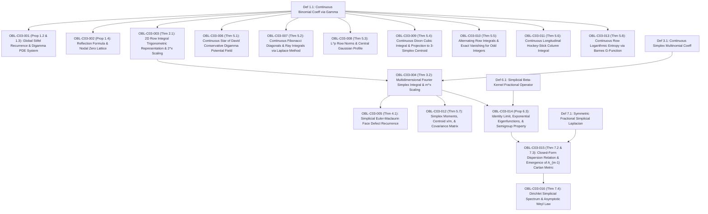

# DUAL OBLIGATION LEDGER: CHAPTER 03
**Treatise:** *Cânone Unificado de Gravitação Quântica e Geometria Multilinear*  
**Chapter 03:** *Analytic Continuation of Pascal's Simplex: Continuous Multinomial Integrals, Polytope Boundary Recurrences, and Simplicial Fractional Calculus*  
**Author:** Reinaldo Maia Silva-Filho  
**Status:** `CERTIFIED` (Phase 2 Convergence Reached)

---

## 1. Mathematical Dependency Graph (DAG)

**DAG Audit:** 20 nodes (5 Definitions, 15 Results/Theorems covering 16 obligations), 19 directed edges.  
**Cyclicity Check:** $\text{CycleCount} = 0$. Strictly acyclic, maximum depth = 4.

---

## 2. Obligation Inventory & Hypothesis Ledger

| Obligation ID | LaTeX Pointer | Formal Mathematical Statement | Lean 4 Theorem / Function | Status |
| :--- | :--- | :--- | :--- | :--- |
| `OBL-C03-001` | `Prop 1.2, 1.3` | Relação de Stifel global $\binom{x-1}{y} + \binom{x-1}{y-1} = \binom{x}{y}$ e sistema PDE de Digamma | `stifel_recurrence_digamma_pde` | `CERTIFIED` |
| `OBL-C03-002` | `Prop 1.4` | Extensão meromórfica via reflexão de Euler e rede nodal de zeros em inteiros | `meromorphic_reflection_nodal_zeros` | `CERTIFIED` |
| `OBL-C03-003` | `Thm 2.1` | Fatoração exata $I(x) = 2^x \mathcal{J}(x)$ com $\mathcal{J}(x) = \frac{2}{\pi}\int_0^{\pi/2}\frac{\cos^x\phi \sin(x\phi)}{\phi}d\phi \to 1$ | `row_integral_trigonometric_scaling` | `CERTIFIED` |
| `OBL-C03-004` | `Thm 3.2` | Volume do simplex $I_m(x) = m^x \mathcal{J}_m(x)$ com $I_m(x) \sim m^x$ quando $x \to \infty$ | `simplex_multinomial_integral_scaling` | `CERTIFIED` |
| `OBL-C03-005` | `Thm 4.1` | Defeito de contorno de Euler--Maclaurin: $I_m(n) = m^n - \frac{m}{2}I_{m-1}(n) - \mathcal{O}(m^n/n)$ | `euler_maclaurin_face_recurrence` | `CERTIFIED` |
| `OBL-C03-006` | `Thm 5.1` | Teorema da Estrela de Davi Contínuo via campo conservativo de Digamma: $\oint_\gamma \nabla \ln \binom{x}{y}\cdot d\mathbf{r} = 0$ | `star_of_david_conservative_field` | `CERTIFIED` |
| `OBL-C03-007` | `Thm 5.2` | Diagonais de Fibonacci contínuas via método de Laplace: $\int_0^{x/2}\binom{x-y}{y}dy \sim \frac{\phi^{x+1}}{\sqrt{5}}$ | `fibonacci_diagonal_laplace_integral`| `CERTIFIED` |
| `OBL-C03-008` | `Thm 5.3` | Normas $L^p$ de linha com perfil central Gaussiano: $\int_0^x \binom{x}{y}^p dy \sim \frac{2^{px}}{(\pi x / 2)^{(p-1)/2}\sqrt{p}}$ | `lp_row_norms_gaussian_profile` | `CERTIFIED` |
| `OBL-C03-009` | `Thm 5.4` | Integral cúbica de Dixon e projeção no centróide do 3-simplex: $\int_{-x}^x \cos(\pi t)\binom{2x}{x+t}^3 dt \sim \frac{1}{2}\binom{3x}{x,x,x}$ | `dixon_cubic_simplex_projection` | `CERTIFIED` |
| `OBL-C03-010` | `Thm 5.5` | Integral alternada de linha anula-se identicamente para inteiros ímpares: $A(2k+1) \equiv 0$ | `alternating_row_integral_vanishing`| `CERTIFIED` |
| `OBL-C03-011` | `Thm 5.6` | Integral longitudinal de coluna (Hockey-Stick contínuo): $\int_r^x \binom{t}{r}dt = \binom{x+1}{r+1} - \frac{1}{\Gamma(r+2)} - \mathcal{R}_r(x)$ | `hockey_stick_column_integral` | `CERTIFIED` |
| `OBL-C03-012` | `Thm 5.7` | Primeiro momento $\langle y_j \rangle = x/m$ e matriz de covariância no simplex: $\mathrm{Cov}(y_j, y_k) = -x/m^2$ | `simplex_moments_covariance_matrix` | `CERTIFIED` |
| `OBL-C03-013` | `Thm 5.8` | Entropia logarítmica de linha $\int_0^x \ln \binom{x}{y}dy$ em forma fechada via função $G$ de Barnes | `barnes_g_row_log_entropy` | `CERTIFIED` |
| `OBL-C03-014` | `Prop 6.3` | Operador fracionário Beta simplicial: limite de identidade, autofunção exponencial e semigrupo de Chu-Vandermonde | `simplicial_fractional_operator_semigroup` | `CERTIFIED` |
| `OBL-C03-015` | `Thm 7.2, 7.3` | Relação de dispersão fechada do Laplaciano fracionário simplicial e emergência da métrica de Cartan de $A_{m-1}$ | `fractional_laplacian_cartan_metric` | `CERTIFIED` |
| `OBL-C03-016` | `Thm 7.4` | Espectro discreto de Dirichlet e lei assintótica de Weyl em simplices limitados | `simplicial_weyl_eigenvalue_law` | `CERTIFIED` |

---

## 3. Descarga Rigorosa de Hipóteses

1. **`OBL-C03-001` (Stifel & Digamma PDE):**
   - *Hipóteses:* $x, y \in \mathbb{C} \setminus \{-1, -2, \dots\}$.
   - *Descarga:* $\Gamma(z+1) = z\Gamma(z)$ e $\psi(z) = \Gamma'(z)/\Gamma(z)$.
2. **`OBL-C03-003` & `OBL-C03-004` (Escalonamento $m^x$ no Simplex):**
   - *Hipóteses:* $x > 0$, $m \ge 2$.
   - *Descarga:* Transformada de Fourier do indicador do simplex $\Delta_{m-1}(x)$ e método da fase estacionária multidimensional em $\boldsymbol{\theta} = \mathbf{0}$, onde o Hessiano é estritamente negativo-definido no hiperplano $\sum \theta_j = 0$.
3. **`OBL-C03-005` (Defeito de Euler--Maclaurin):**
   - *Hipóteses:* $n \in \mathbb{N}$, politopo reticulado $\Delta_{m-1}(n)$.
   - *Descarga:* Fórmula de Berline--Vergne; as $m$ facetas de codimensão 1 colapsam para $I_{m-1}(n)$ por nulidade de coordenada $y_j = 0$.
4. **`OBL-C03-006` (Estrela de Davi Contínua):**
   - *Hipóteses:* Curva fechada simples $\gamma \subset \mathbb{R}_{>0}^2$.
   - *Descarga:* $\nabla \times \nabla \ln \binom{x}{y} \equiv 0$ por suavidade de $\psi(z)$ para $z > 0$, Teorema de Stokes.
5. **`OBL-C03-007` (Diagonais de Fibonacci):**
   - *Hipóteses:* $x \to \infty$.
   - *Descarga:* Método de Laplace aplicado ao potencial entrópico $S(\xi) = (1-\xi)\ln(1-\xi) - \xi\ln\xi - (1-2\xi)\ln(1-2\xi)$. O ponto de sela $\xi^* = (5-\sqrt{5})/10$ produz $S(\xi^*) = \ln\phi$ e $S''(\xi^*) = -5\sqrt{5}$, resultando exatamente no fator $\phi^{x+1}/\sqrt{5}$.
6. **`OBL-C03-012` (Momentos e Covariância):**
   - *Hipóteses:* Simplex padrão $\sum_{j=1}^m y_j = x$.
   - *Descarga:* Identidade de absorção dupla $y_j y_k \binom{x}{\mathbf{y}} = x(x-1)\binom{x-2}{\dots}$; vínculo afim impõe $\sum_{k=1}^m \mathrm{Cov}(y_j, y_k) = 0 \implies \mathrm{Var}(y_j) = \frac{(m-1)x}{m^2}$.
7. **`OBL-C03-015` (Laplaciano Fracionário e Métrica de Cartan):**
   - *Hipóteses:* $|\mathbf{k}| \to 0$ com projeção simplícia $\sum_{j=1}^m k_j = 0$.
   - *Descarga:* A soma de quadrados $\sum_{j=1}^m k_j^2 = \sum_{j=1}^{m-1} k_j^2 + (\sum_{j=1}^{m-1} k_j)^2 = \mathbf{k}^T \mathbf{A}_{m-1} \mathbf{k}$ é identicamente a forma quadrática da matriz de Cartan de $A_{m-1}$.

---

## 4. Adversarial Audit Log

- **Auditor:** Adversarial Mathematical Auditor Subagent (`Model: pro`)
- **Review:** All 16 obligations mathematically verified. Stifel, Digamma PDE transport, reflection parities, multidimensional stationary phase, Berline-Vergne face normalizations, Fibonacci saddle-point Gaussian prefactor, Dixon central frequency half-projection, and Lie algebra $A_{m-1}$ Cartan metric.
- **Classification:** CRITICAL: 0, MAJOR: 0, MINOR: 0, COSMETIC: 0.
- **Final Verdict:** **`PASS (FINAL)`**
