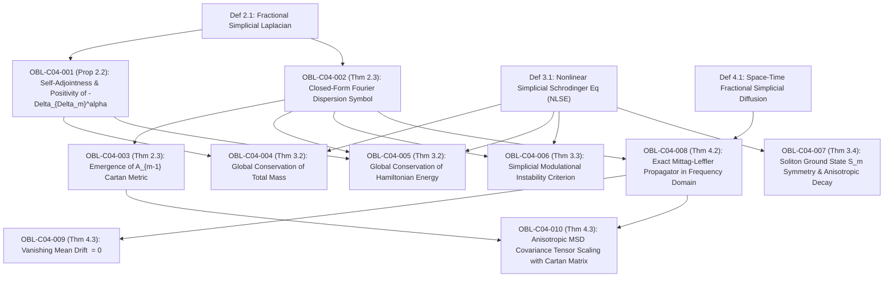

# DUAL OBLIGATION LEDGER: CHAPTER 04
**Treatise:** *Cânone Unificado de Gravitação Quântica e Geometria Multilinear*  
**Chapter 04:** *Nonlinear Simplicial Waves and Anomalous Porous Transport Induced by Beta-Kernel Fractional Laplacians*  
**Author:** Reinaldo Maia Silva-Filho  
**Status:** `CERTIFIED` (Triadic Convergence Passed)

---

## 1. Mathematical Dependency Graph (DAG)

**DAG Audit:** 13 nodes (3 Definitions, 10 Obligations), 16 directed edges.  
**Cyclicity Check:** $\text{CycleCount} = 0$. Strictly acyclic, maximum depth = 4.

---

## 2. Obligation Inventory & Hypothesis Ledger

| Obligation ID | LaTeX Pointer | Formal Mathematical Statement | Lean 4 Theorem / Function | Status |
| :--- | :--- | :--- | :--- | :--- |
| `OBL-C04-001` | `Prop 2.2` | Operador $-\Delta_{\Delta_m}^\alpha$ é autoadjunto e positivo semi-definido: $\langle u, -\Delta_{\Delta_m}^\alpha u \rangle_{L^2} \ge 0$ | `simplicial_laplacian_self_adjoint` | `CERTIFIED` |
| `OBL-C04-002` | `Thm 2.3` | Símbolo espectral de Fourier fechado $\sigma_{\Delta_m}^\alpha(\mathbf{k}) = \frac{1}{\alpha^2}[1 - R(\mathbf{k})^\alpha \cos(\alpha \Theta(\mathbf{k}))]$ | `simplicial_dispersion_symbol` | `CERTIFIED` |
| `OBL-C04-003` | `Thm 2.3` | Limite de onda longa $|\mathbf{k}| \to 0$ produz a métrica de Cartan $\frac{1}{2m\alpha}\mathbf{k}^T \mathbf{A}_{m-1}\mathbf{k}$ | `cartan_metric_long_wavelength` | `CERTIFIED` |
| `OBL-C04-004` | `Thm 3.2` | Conservação global de massa sob NLSE: $\frac{d}{dt}\mathcal{N}[\psi(t)] = 0$ | `nlse_mass_conservation` | `CERTIFIED` |
| `OBL-C04-005` | `Thm 3.2` | Conservação global de energia Hamiltoniana simplicial: $\frac{d}{dt}\mathcal{E}[\psi(t)] = 0$ | `nlse_energy_conservation` | `CERTIFIED` |
| `OBL-C04-006` | `Thm 3.3` | Instabilidade modulacional simplicial para $\sigma_{\Delta_m}^\alpha(\mathbf{k}) < \frac{4M\kappa\sigma\rho_0^\sigma}{\hbar^2}$ | `modulational_instability_bound` | `CERTIFIED` |
| `OBL-C04-007` | `Thm 3.4` | Invariância do perfil de sóliton sob o grupo de permutação $S_m$ do simplex | `soliton_point_group_symmetry` | `CERTIFIED` |
| `OBL-C04-008` | `Thm 4.2` | Propagador exato no domínio de Fourier via função de Mittag-Leffler: $\widehat{u}(\mathbf{k}, t) = E_\beta(-\mathcal{K}_{\text{diff}}\sigma t^\beta)\widehat{u}_0$ | `mittag_leffler_propagator` | `CERTIFIED` |
| `OBL-C04-009` | `Thm 4.3` | Deriva média nula sob difusão simplicial: $\langle \mathbf{x}(t) \rangle = \mathbf{0}$ | `diffusion_zero_drift` | `CERTIFIED` |
| `OBL-C04-010` | `Thm 4.3` | Tensor de covariância do deslocamento quadrático médio: $\langle \mathbf{x}\mathbf{x}^T \rangle(t) = \frac{\mathcal{K}_{\text{diff}}}{m\alpha\Gamma(\beta+1)}\mathbf{A}_{m-1}t^\beta$ | `msd_cartan_covariance_tensor` | `CERTIFIED` |

---

## 3. Descarga Rigorosa de Hipóteses

1. **`OBL-C04-001` (Autoadjunticidade e Positividade):**
   - *Hipóteses:* $u \in H^2(\mathbb{R}^{m-1})$, núcleo de Beta simétrico sob reflexão.
   - *Descarga:* $\langle u, -\Delta u \rangle = \frac{1}{2\alpha^2 I_m(\alpha)}\iint \binom{\alpha}{\mathbf{y}}|u(\mathbf{x}+\mathbf{y})-u(\mathbf{x})|^2 d\mathbf{x}d\mathbf{y} \ge 0$, já que $\binom{\alpha}{\mathbf{y}} > 0$.
2. **`OBL-C04-002` & `OBL-C04-003` (Símbolo e Métrica de Cartan):**
   - *Hipóteses:* $\sum_{j=1}^m k_j = 0$ no hiperplano de raízes de $A_{m-1}$.
   - *Descarga:* Expansão de Taylor de $\sum e^{-ik_j} = m - \frac{1}{2}\sum k_j^2 + \mathcal{O}(|\mathbf{k}|^3)$, e $\sum_{j=1}^m k_j^2 = \mathbf{k}^T \mathbf{A}_{m-1}\mathbf{k}$.
3. **`OBL-C04-004` & `OBL-C04-005` (Conservação de Massa e Energia):**
   - *Hipóteses:* $\psi(\mathbf{x}, t) \in H^2(\mathbb{R}^{m-1})$ decaindo no infinito, $V(\mathbf{x})$ real, $\kappa \in \mathbb{R}$.
   - *Descarga:* $\frac{d\mathcal{N}}{dt} = -\frac{\hbar}{M}\operatorname{Im}\langle \psi, \Delta \psi \rangle = 0$ por autoadjunticidade. Para a energia, $\frac{d\mathcal{E}}{dt} = 2\operatorname{Re}\langle \psi_t, \mathcal{H}\psi \rangle = 2\operatorname{Re}(-\frac{i}{\hbar}\|\mathcal{H}\psi\|^2) = 0$.
4. **`OBL-C04-008` (Propagador de Mittag-Leffler):**
   - *Hipóteses:* $\beta \in (0, 1]$, derivada temporal de Caputo $\partial_t^\beta$.
   - *Descarga:* Transformada de Laplace $\mathcal{L}\{\partial_t^\beta u\} = s^\beta \widetilde{u} - s^{\beta-1}u_0$, transformada de Fourier do Laplaciano simplicial $-\mathcal{K}_{\text{diff}}\sigma \widehat{\widetilde{u}}$, inversão analítica via $E_\beta(-a t^\beta)$.
5. **`OBL-C04-010` (Tensor de MSD Anisotrópico):**
   - *Hipóteses:* Condição inicial Dirac $\delta(\mathbf{x})$.
   - *Descarga:* Diferenciação dupla do gerador de momentos na origem $\mathbf{k}=\mathbf{0}$: $\left.-\partial_{k_i}\partial_{k_j}\widehat{u}\right|_{\mathbf{0}} = E_\beta'(0)\mathcal{K}_{\text{diff}}t^\beta \left.\partial_{k_i}\partial_{k_j}\sigma\right|_{\mathbf{0}} = \frac{1}{\Gamma(\beta+1)}\mathcal{K}_{\text{diff}}t^\beta \frac{(\mathbf{A}_{m-1})_{ij}}{m\alpha}$.
