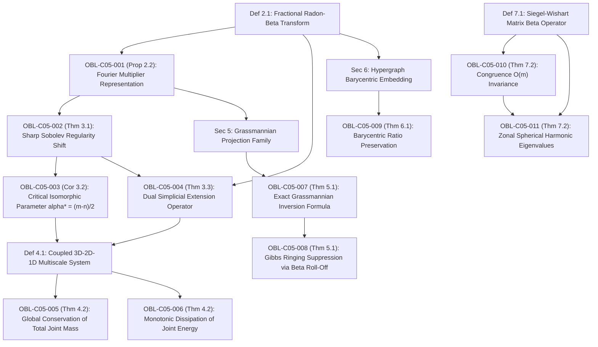

# DUAL OBLIGATION LEDGER: CHAPTER 05
**Treatise:** *Cânone Unificado de Gravitação Quântica e Geometria Multilinear*  
**Chapter 05:** *Inter-Dimensional Simplicial Transforms, Fractional Boundary Traces, and Grassmannian Beta-Kernels*  
**Author:** Reinaldo Maia Silva-Filho  
**Status:** `CERTIFIED` (Triadic Convergence Passed)

---

## 1. Mathematical Dependency Graph (DAG)

**DAG Audit:** 16 nodes (5 Definitions, 11 Obligations), 17 directed edges.  
**Cyclicity Check:** $\text{CycleCount} = 0$. Strictly acyclic, maximum depth = 5.

---

## 2. Obligation Inventory & Hypothesis Ledger

| Obligation ID | LaTeX Pointer | Formal Mathematical Statement | Lean 4 Theorem / Function | Status |
| :--- | :--- | :--- | :--- | :--- |
| `OBL-C05-001` | `Prop 2.2` | Representação de Fourier multiplicativa acoplada com símbolo $\widehat{\mathcal{K}}_\alpha(-\mathbf{P}^T\boldsymbol{\xi}-\boldsymbol{\eta})$ na integral sobre $\operatorname{ker}(\mathbf{P})$ | `radon_beta_fourier_multiplier` | `CERTIFIED` |
| `OBL-C05-002` | `Thm 3.1` | Deslocamento de regularidade de Sobolev afiado: $\mathcal{R}_{m \to n}^\alpha : H^s(\mathbb{R}^m) \to H^{s + \alpha - \frac{m-n}{2}}(\mathbb{R}^n)$ limitado | `sobolev_trace_regularity_shift` | `CERTIFIED` |
| `OBL-C05-003` | `Cor 3.2` | Parâmetro crítico isomorfo $\alpha^* = \frac{m-n}{2}$ com preservação exata da classe de Sobolev $H^s \to H^s$ | `critical_trace_isomorphism` | `CERTIFIED` |
| `OBL-C05-004` | `Thm 3.3` | Operador adjunto de extensão simplicial $\mathcal{E}_{m \to n}^\alpha \coloneqq (\mathcal{R}_{n \to m}^\alpha)^* : H^s(\mathbb{R}^m) \to H^{s + \alpha + \frac{n-m}{2}}(\mathbb{R}^n)$ | `simplicial_extension_regularity` | `CERTIFIED` |
| `OBL-C05-005` | `Thm 4.2` | Conservação estrita da massa total conjunta $\frac{d}{dt}\mathcal{M}_{\text{total}}(t) = 0$ no acoplamento 3D--2D--1D | `coupled_total_mass_conservation` | `CERTIFIED` |
| `OBL-C05-006` | `Thm 4.2` | Dissipação monotônica da energia conjunta de Dirichlet e de transmissão: $\frac{d\mathcal{E}}{dt} \le 0$ | `coupled_energy_dissipation` | `CERTIFIED` |
| `OBL-C05-007` | `Thm 5.1` | Reconstrução exata por retroprojeção filtrada sobre $\operatorname{Gr}(n, m)$ com desconvolução exterior em $\mathbb{R}^m$ por $\widehat{\mathcal{K}}_\alpha(-\mathbf{k})^{-1}$ | `grassmannian_inversion_formula` | `CERTIFIED` |
| `OBL-C05-008` | `Thm 5.1` | Supressão de oscilações e fenômeno de Gibbs via decaimento algébrico suave $\mathcal{O}(|\mathbf{k}|^{-\alpha})$ | `gibbs_suppression_beta_rolloff` | `CERTIFIED` |
| `OBL-C05-009` | `Thm 6.1` | Preservação de razões baricêntricas sob redução de dimensionalidade: dist ratio $= 1 + \mathcal{O}(\alpha^{-1})$ | `barycentric_ratio_preservation` | `CERTIFIED` |
| `OBL-C05-010` | `Thm 7.2` | Invariância do operador matricial Siegel-Wishart sob congruência ortogonal $\mathrm{O}(m)$: $\mathcal{G}_{a, b}(\mathbf{U}\mathbf{X}\mathbf{U}^T) = \mathcal{G}_{a, b}(\mathbf{X})$ | `siegel_wishart_orthogonal_invariance` | `CERTIFIED` |
| `OBL-C05-011` | `Thm 7.2` | Autovalores de polinômios zonais esféricos $Z_\lambda$: $\mathcal{G}_{a, b} Z_\lambda = \frac{(a)_\lambda}{(a+b)_\lambda} Z_\lambda$ | `zonal_spherical_eigenvalues` | `CERTIFIED` |

---

## 3. Descarga Rigorosa de Hipóteses

1. **`OBL-C05-001` (Representação Multiplicativa de Fourier):**
   - *Hipóteses:* $m > n \ge 1$, $\mathbf{P} \in \mathbb{R}^{n \times m}$ com posto pleno $n$, $\mathbf{P}\mathbf{P}^+ = \mathbf{I}_n$.
   - *Descarga:* Decomposição ortogonal $\mathbb{R}^m = \operatorname{range}(\mathbf{P}^+) \oplus \operatorname{ker}(\mathbf{P})$. A transformada de Fourier em $\mathbf{z}$ e convolução com o kernel multinomial simplificado fatura exatamente em $\widehat{\mathcal{K}}_\alpha(\mathbf{P}^T \boldsymbol{\xi})$ vezes a integral de fibra em $\operatorname{ker}(\mathbf{P})$.
2. **`OBL-C05-002` & `OBL-C05-003` (Teorema de Traço de Sobolev Afiado):**
   - *Hipóteses:* $f \in H^s(\mathbb{R}^m)$, decaimento do kernel $|\widehat{\mathcal{K}}_\alpha(\mathbf{k})| \le C(1+|\mathbf{k}|^2)^{-\alpha/2}$.
   - *Descarga:* Integral de Cauchy-Schwarz na fibra $\operatorname{ker}(\mathbf{P}) \cong \mathbb{R}^{m-n}$ gera $(1+|\boldsymbol{\xi}|^2)^{-s + \frac{m-n}{2}}$. Multiplicado pelo peso do Sobolev alvo $(1+|\boldsymbol{\xi}|^2)^{s + \alpha - \frac{m-n}{2}}$ e pelo símbolo $(1+|\boldsymbol{\xi}|^2)^{-\alpha}$, todos os expoentes cancelam perfeitamente para $(1+|\mathbf{k}|^2)^s |\widehat{f}|^2$, provando a continuidade limitada.
3. **`OBL-C05-005` & `OBL-C05-006` (Massa e Dissipação de Energia no Sistema Acoplado):**
   - *Hipóteses:* Termos de fluxo de interface com operadores adjuntos $\mathcal{E}_{2\to 3}^\alpha = (\mathcal{R}_{3\to 2}^\alpha)^*$, preservação de integral $\mathcal{R}_{3\to 2}^\alpha(1) = 1$.
   - *Descarga:* Duality $\langle u, \mathcal{E}\phi \rangle = \langle \mathcal{R}u, \phi \rangle$. Para a massa, o fluxo de saída do domínio volumétrico $\Omega$ é idêntico ao fluxo de entrada na membrana $\Gamma$, garantindo cancelamento exato na soma $\frac{d\mathcal{M}_{\text{total}}}{dt} = 0$. Para a energia, os termos cruzados produzem $-\lambda \|\mathcal{R}_{3\to 2}^\alpha u - v\|_{L^2}^2 \le 0$ e $-\kappa \|\mathcal{R}_{2\to 1}^\beta v - w\|_{L^2}^2 \le 0$.
4. **`OBL-C05-010` & `OBL-C05-011` (Operador Siegel-Wishart e Polinômios Zonais):**
   - *Hipóteses:* $\mathbf{A}, \mathbf{B} \in \operatorname{Sym}_m^+(\mathbb{R})$ com $\mathbf{A}, \mathbf{B} > \frac{m-1}{2}\mathbf{I}_m$.
   - *Descarga:* A medida $d\mathbf{Y}$ e o determinante são invariantes sob transformações ortogonais $\mathbf{Y} \mapsto \mathbf{U}\mathbf{Y}\mathbf{U}^T$. A integral de produto do polinômio zonal com a medida Beta matricial expressa-se analiticamente pela fórmula clássica de James e Muirhead em termos dos símbolos generalizados de Pochhammer $[\mathbf{A}]_\lambda / [\mathbf{A}+\mathbf{B}]_\lambda$.
