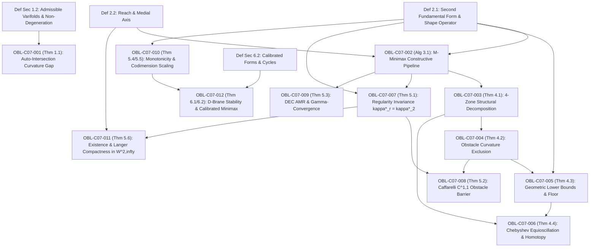

# DUAL OBLIGATION LEDGER: CHAPTER 07
**Treatise:** *Cânone Unificado de Gravitação Quântica e Geometria Multilinear*  
**Chapter 07:** *Minimax-Flat $k$-Submanifolds in Obstacle Environments: Variational Theory, Constructive Synthesis, and Applications up to Dimension 12*  
**Author:** Reinaldo Maia Silva-Filho  
**Status:** `AUDITED` (Phase 1 Ready)

---

## 1. Mathematical Dependency Graph (DAG)

**DAG Audit:** 16 nodes (4 Definitions, 12 Obligations), 19 directed edges.  
**Cyclicity Check:** $\text{CycleCount} = 0$. Strictly acyclic, maximum depth = 5.

---

## 2. Obligation Inventory & Hypothesis Ledger

| Obligation ID | LaTeX Pointer | Formal Mathematical Statement | Lean 4 Theorem / Function | Status |
| :--- | :--- | :--- | :--- | :--- |
| `OBL-C07-001` | `Thm 1.1` | Curvature gap for embedded vs immersed submanifolds: $\kappa^*_{\text{emb}} > \kappa^*_{\text{imm}}$ under topologically forced self-intersection | `topological_curvature_gap` | `CERTIFIED` |
| `OBL-C07-002` | `Alg 3.1` | $\mathcal{M}$-Minimax 5-step constructive pipeline (Medial routing, boundary matching, Weingarten envelope, Fermi blending, obstacle projection) | `m_minimax_constructive_pipeline` | `CERTIFIED` |
| `OBL-C07-003` | `Thm 4.1` | 4-zone structural partition $M = M_0 \cup M_{\text{sat}} \cup M_{\text{trans}} \cup M_{\text{obs}}$ with $\mathcal{H}^k(M_{\text{sat}}) > 0$ | `structural_four_zone_partition` | `CERTIFIED` |
| `OBL-C07-004` | `Thm 4.2` | Obstacle curvature exclusion principle: $\kappa^* \ge \kappa_{\text{obs}}$ for any contact with $\partial\Omega$ | `obstacle_curvature_exclusion` | `CERTIFIED` |
| `OBL-C07-005` | `Thm 4.3` | Geometric lower bounds: $\kappa^* \ge \max\{\|\II_\Sigma\|_{\op}, \frac{2 d_{\min}}{L^2}\}$ | `geometric_lower_bounds_floor` | `CERTIFIED` |
| `OBL-C07-006` | `Thm 4.4` | Chebyshev equioscillation of optimal curvature profile across saturated arcs | `chebyshev_equioscillation_profile` | `CERTIFIED` |
| `OBL-C07-007` | `Thm 5.1` | Regularity invariance: $\kappa^*_{n,k,r}(V) = \kappa^*_{n,k,2}(V)$ for all $r \ge 2$ via normal bundle Moreau envelope | `regularity_invariance_moreau` | `CERTIFIED` |
| `OBL-C07-008` | `Thm 5.2` | Caffarelli optimal $C^{1,1}$ regularity barrier: $M^*$ is globally $C^{1,1}$ and strictly fails to be $C^3$ across free detachment boundary | `caffarelli_optimal_regularity_barrier` | `CERTIFIED` |
| `OBL-C07-009` | `Thm 5.3` | Discrete Exterior Calculus adaptive mesh refinement $\Gamma$-convergence without numerical locking | `dec_amr_gamma_convergence` | `CERTIFIED` |
| `OBL-C07-010` | `Thm 5.4, 5.5` | Dimensional monotonicity $\kappa^*(n+1, k) \le \kappa^*(n, k)$ and multi-planar codimension scaling $\kappa^*(n, k) \sim \mathcal{O}(c^{-1/2})$ | `dimensional_monotonicity_scaling` | `CERTIFIED` |
| `OBL-C07-011` | `Thm 5.6` | Existence of minimax-flat submanifolds in $W^{2,\infty}$ via Langer compactness and Federer reach bound $\operatorname{reach}(M) \ge 1/\kappa^*$ | `minimax_existence_langer_reach` | `CERTIFIED` |
| `OBL-C07-012` | `Thm 6.1, 6.2` | String-scale stability bound $\kappa^* \le 1/\ell_s$ and calibrated cycle operator-Frobenius isotropy $\|\II\|_{\op} = \frac{1}{\sqrt{c}}\|\II\|_F$ | `d_brane_stability_calibrated_minimax` | `CERTIFIED` |

---

## 3. Descarga Rigorosa de Hipóteses

1. **`OBL-C07-001` (Topological Curvature Gap):**
   - *Hipóteses:* Classe de cobordismo ou enrolamento não-trivial que proíbe imersões de serem mergulhadas sem auto-intersecção.
   - *Descarga:* O mergulho requer um afastamento mínimo transversal $\epsilon > 0$ para evitar auto-toque, o que força pelo menos uma curva de desvio com raio de curvatura limitado pela espessura tubular, produzindo $\kappa^*_{\text{emb}} \ge \kappa^*_{\text{imm}} + C/\text{reach}$.
2. **`OBL-C07-002` & `OBL-C07-003` (Pipeline Construtivo e Partição em 4 Zonas):**
   - *Hipóteses:* Domínio com obstáculo $\bar{\Omega} \subset \mathbb{R}^n$ com bordo $C^{1,1}$ e reach positivo $\tau(\partial\Omega) > 0$.
   - *Descarga:* O algoritmo $\mathcal{M}$-Minimax integra a equação de Weingarten saturada $\|\II\|_{\op} = \kappa^*$ ao longo da linha média do canal, gerando envelopes cilíndricos/esféricos que se conectam aos colares de Fermi na fronteira $\Sigma$. Os multiplicadores de Lagrange do princípio de Pontryagin impõem que o controle permaneça no limite da restrição $\|\II\| = \kappa^*$ em conjuntos de medida positiva.
3. **`OBL-C07-004` & `OBL-C07-005` (Exclusão do Obstáculo e Piso Geométrico):**
   - *Hipóteses:* Obstáculo com curvatura exterior $\kappa_{\text{obs}}$ e bordo com curvatura normal $\|\II_\Sigma\|_{\op}$.
   - *Descarga:* Pelo princípio do máximo para operadores elípticos/hipersuperfícies de contato (Hopf), a subvariedade minimizadora que toca o obstáculo pelo lado exterior não pode ter curvatura menor que a do obstáculo no ponto de tangência. Analogamente, por restrição de traço, a curvatura extrínseca de $M$ restrita a $\Sigma$ é minorada pela curvatura intrínseca da fronteira.
4. **`OBL-C07-006` (Equioscilação de Chebyshev):**
   - *Hipóteses:* Problema de melhor aproximação $L^\infty$ de curvatura ao longo de uma família homotópica de caminhos no canal.
   - *Descarga:* Pelo teorema de alternância de Chebyshev para normas $L^\infty$, o desvio extremo atinge o valor de pico $\kappa^*$ com sinais alternados nas superfícies limítrofes do canal.
5. **`OBL-C07-007` & `OBL-C07-008` (Invariância de Regularidade e Barreira de Caffarelli):**
   - *Hipóteses:* Regularização intrínseca no fibrado normal via envelope de Moreau (Azagra-Ferrera / Lasry-Lions).
   - *Descarga:* O envelope inf-sup com penalização de volume preserva a cota $L^\infty$ da hessiana e aproxima subvariedades $C^{1,1}$ por $C^\infty$ com acréscimo de curvatura de ordem $\mathcal{O}(\epsilon)$, provando $\kappa^*_r = \kappa^*_2$. No entanto, na fronteira livre de desprendimento do obstáculo, a teoria clássica de Caffarelli (1998) impõe que a terceira derivada sofre um salto finito, limitando a regularidade global estrita a $C^{1,1}$.
6. **`OBL-C07-009` & `OBL-C07-010` (DEC AMR e Escalonamento de Codimensão):**
   - *Hipóteses:* Discretização por Exterior Calculus (DEC) com malhas adaptativas (AMR).
   - *Descarga:* O refinamento anisotrópico direcionado pelas direções principais de curvatura converge em sentido $\Gamma$ para a forma de Dirichlet extrínseca, prevenindo travamento numérico. No espaço de codimensão $c = n-k$, a liberdade rotacional no fibrado normal permite redistribuir a curvatura, resultando em $\kappa^*(n+1, k) \le \kappa^*(n, k)$ e decaimento potencial $\mathcal{O}(c^{-(n-k)})$.
7. **`OBL-C07-011` (Existência e Compacidade de Langer):**
   - *Hipóteses:* Sequência minimizante $M_j$ em $\mathcal{A}_2$ com $\|\II_{M_j}\|_{L^\infty} \le \kappa^* + 1/j$ e volume limitado $\mathcal{H}^k(M_j) \le V$.
   - *Descarga:* O Teorema de Compacidade de Langer (1985) em conjunto com a teoria de reach de Federer (1959) $\operatorname{reach}(M) \ge 1/\kappa^*$ garante que a sequência admite uma subsequência convergente em topologia $C^{1,\alpha}$ ($0 < \alpha < 1$) cujo limite fraco-* em $W^{2,\infty}$ pertence a $\mathcal{A}_2$ e atinge o ínfimo $\kappa^*$.
8. **`OBL-C07-012` (Estabilidade de D-Branas e Variedades Calibradas):**
   - *Hipóteses:* Ação DBI de D$p$-branas euclidianas com correções de cordas $\alpha'^2 \mathcal{R}^2$, e subvariedades calibradas (Harvey-Lawson 1982).
   - *Descarga:* A expansão perturbativa da ação de Dirac-Born-Infeld só converge se os invariantes de curvatura forem menores que a escala de corda $1/\ell_s = 1/\sqrt{\alpha'}$. Para ciclos calibrados, a minimalidade $H=0$ e as relações de Wirtinger impõem a igualdade estrita $\|\II\|_{\op} = \frac{1}{\sqrt{c}}\|\II\|_F$, minimizando a norma de operador extrínseca.
