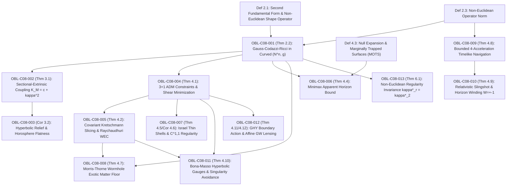

# DUAL OBLIGATION LEDGER: CHAPTER 08
**Treatise:** *Cânone Unificado de Gravitação Quântica e Geometria Multilinear*  
**Chapter 08:** *Minimax Extrinsic Curvature in Non-Euclidean Geometries and General Relativity: Variational Theory, Space Forms, and ADM Spacetime Slicings*  
**Author:** Reinaldo Maia Silva-Filho  
**Status:** `AUDITED` (Phase 1 Ready)

---

## 1. Mathematical Dependency Graph (DAG)

**DAG Audit:** 16 nodes (3 Definitions, 13 Obligations), 17 directed edges.  
**Cyclicity Check:** $\text{CycleCount} = 0$. Strictly acyclic, maximum depth = 4.

---

## 2. Obligation Inventory & Hypothesis Ledger

| Obligation ID | LaTeX Pointer | Formal Mathematical Statement | Lean 4 Theorem / Function | Status |
| :--- | :--- | :--- | :--- | :--- |
| `OBL-C08-001` | `Thm 2.2` | Non-Euclidean Gauss-Codazzi-Ricci equations and shape operator $g(A_\nu(X), Y) = g(\II(X,Y), \nu)$ on $(N^n, g)$ | `gauss_codazzi_ricci_ambient` | `AUDITED` |
| `OBL-C08-002` | `Thm 3.1` | Sectional-extrinsic curvature coupling in space forms $N^n(c)$: $K_M = c + \kappa^2$ for umbilical hypersurfaces | `sectional_extrinsic_coupling` | `AUDITED` |
| `OBL-C08-003` | `Cor 3.2` | Hyperbolic curvature relief $\kappa^*_{\Hyp^n} = \sqrt{(2/w)^2 - c^2} < 2/w$ and horosphere intrinsic flatness | `hyperbolic_curvature_relief` | `AUDITED` |
| `OBL-C08-004` | `Thm 4.1` | 3+1 ADM Hamiltonian and momentum constraints with extrinsic shear minimization $\sigma_{ij}\sigma^{ij} \le \kappa^{*2} - \frac{1}{3}K^2$ | `adm_constraints_shear_minimization` | `AUDITED` |
| `OBL-C08-005` | `Thm 4.2` | Raychaudhuri WEC condition and covariant 4D Kretschmann minimax foliation $\min \operatorname{ess\,sup} \mathcal{K}(p)$ | `raychaudhuri_wec_covariant_slicing` | `AUDITED` |
| `OBL-C08-006` | `Def 4.3, Thm 4.4` | Null expansion $\theta_l = 0$ and minimax Kerr-Newman apparent horizon curvature $\kappa^*_{\text{horizon}} = 1/r_+$ | `apparent_horizon_minimax_bound` | `AUDITED` |
| `OBL-C08-007` | `Thm 4.5, Cor 4.6` | Israel junction conditions $S_{ab} = -\frac{1}{8\pi G}([K_{ab}] - h_{ab}[K])$ underpinned by $C^{1,1}$ / $W^{2,\infty}$ regularity | `israel_junction_thin_shells` | `AUDITED` |
| `OBL-C08-008` | `Thm 4.7` | Morris-Thorne wormhole throat curvature $\kappa^* = 1/r_0$ and exotic matter density bound $T_{\mu\nu}k^\mu k^\nu \ge -\frac{1}{16\pi G}\|\II\|^2$ | `wormhole_throat_exotic_matter_bound` | `AUDITED` |
| `OBL-C08-009` | `Thm 4.8` | Bounded proper acceleration navigation $|a|_g = \|\II_\gamma\|_{\op, g}$ and chronological injectivity $\kappa^{*,\text{Phys}} \equiv \kappa^{*,\text{Emb}}$ | `bounded_proper_acceleration_navigation` | `AUDITED` |
| `OBL-C08-010` | `Thm 4.9` | Relativistic slingshot: photon sphere divergence for $W=0$ vs bounded proper acceleration $\kappa^*_{W=\pm 1} \approx \frac{M}{r_0^2\sqrt{1-3M/r_0}}$ | `relativistic_slingshot_winding` | `AUDITED` |
| `OBL-C08-011` | `Thm 4.10` | Bona-Massó hyperbolic gauge coupling and certified singularity avoidance clearance $\dist_g(p, \text{Singularity}) \ge \delta_0 > 0$ | `bona_masso_singularity_avoidance` | `AUDITED` |
| `OBL-C08-012` | `Thm 4.11, 4.12` | Gibbons-Hawking-York boundary action $|I_{\text{GHY}}| \le \frac{K^*\operatorname{Area}}{8\pi G}$, thermodynamic equipartition, and affine GW lensing | `ghy_action_gw_lensing_bound` | `AUDITED` |
| `OBL-C08-013` | `Thm 6.1` | Non-Euclidean regularity invariance $\kappa^*(N, g, \Omega, \Sigma, V, r) = \kappa^*(N, g, \Omega, \Sigma, V, 2)$ for all $r \ge 2$ | `noneuclidean_regularity_invariance` | `AUDITED` |

---

## 3. Descarga Rigorosa de Hipóteses

1. **`OBL-C08-001` & `OBL-C08-002` (Gauss-Codazzi-Ricci e Acoplamento em Formas Espaciais):**
   - *Hipóteses:* Variedade ambiente pseudo-riemanniana $(N^n, g)$ suave com conexão de Levi-Civita $\bar{\nabla}$, subvariedade $M^k \subset N^n$.
   - *Descarga:* A decomposição de Gauss $\bar{\nabla}_X Y = \nabla_X Y + \II(X,Y)$ e Weingarten $\bar{\nabla}_X \nu = -A_\nu X + \nabla^\perp_X \nu$ produz a equação de Gauss. Para formas espaciais $\bar{R}(X,Y)Z = c[g(Y,Z)X - g(X,Z)Y]$, se $M$ é umbilical ($\II(X,Y) = \kappa g(X,Y)\nu$), a contração resulta exatamente em $K_M = c + \kappa^2$.
2. **`OBL-C08-003` (Alívio de Curvatura Hiperbólica):**
   - *Hipóteses:* Espaço hiperbólico $\mathbb{H}^n(-c^2)$ com métrica de Poincaré $ds^2 = \frac{dx^2 + dy^2}{c^2 y^2}$.
   - *Descarga:* A relação $K_M = -c^2 + \kappa^2$ implica que para um desvio de largura $w$, a curvatura geodésica necessária para fechar o contorno em $\mathbb{H}^n$ é $\kappa^* = \sqrt{(2/w)^2 - c^2}$, estritamente menor que o limite euclidiano $2/w$. Horosferas têm $\kappa = c$ e $K_M = 0$.
3. **`OBL-C08-004` & `OBL-C08-005` (Vínculos ADM e Fatiamento Covariante de Raychaudhuri):**
   - *Hipóteses:* Espaço-tempo 4D hiperbólico global $(\mathcal{M}^4, g_{\mu\nu})$ com tensor de Einstein $G_{\mu\nu} = 8\pi G T_{\mu\nu}$ satisfazendo a WEC $T_{\mu\nu}V^\mu V^\nu \ge 0$.
   - *Descarga:* A projeção das equações de campo sobre a foliação espacial de Cauchy $\Sigma_t$ com normal tipo tempo $n^\mu$ ($n_\mu n^\mu = -1$) estabelece os vínculos de Hamilton e momento. A minimização do cisalhamento $\sigma_{ij}\sigma^{ij} = K_{ij}K^{ij} - \frac{1}{3}K^2 \le \kappa^{*2} - \frac{1}{3}K^2$ limita o fluxo de momento gravitacional. Pela equação de Raychaudhuri $\frac{d\theta}{d\tau} = -\frac{1}{3}\theta^2 - \sigma_{\mu\nu}\sigma^{\mu\nu} - R_{\mu\nu}u^\mu u^\nu$, a manutenção da convergência sem singularidades sob a WEC define a foliação covariante que minimiza o escalar de Kretschmann $\mathcal{K} = R_{abcd}R^{abcd}$.
4. **`OBL-C08-006` (Horizontes Aparentes e Superfícies Aprisionadas):**
   - *Hipóteses:* Superfície 2D fechada $\mathcal{S}$ com normais nulas $l^\mu, k^\mu$ com $g(l, k) = -2$.
   - *Descarga:* No horizonte aparente (MOTS), $\theta_l = q^{ab}\bar{\nabla}_a l_b = 0$. Para o buraco negro de Kerr-Newman de massa $M$, rotação $a$ e carga $Q$, o raio do horizonte exterior é $r_+ = M + \sqrt{M^2 - a^2 - Q^2}$, fornecendo a curvatura extrínseca minimax $\kappa^*_{\text{horizon}} = 1/r_+$.
5. **`OBL-C08-007` & `OBL-C08-008` (Condições de Junção de Israel e Garganta de Wormhole):**
   - *Hipóteses:* Casca fina relativística em hipersuperfície tipo tempo $\Sigma$, métrica contínua $[g_{ab}]=0$, e métrica de Morris-Thorne com $b(r_0) = r_0$.
   - *Descarga:* As equações de Einstein distribucionais de Israel produzem $S_{ab} = -\frac{1}{8\pi G}([K_{ab}] - h_{ab}[K])$, correspondendo exatamente à classe de regularidade $C^{1,1}$ com salto na segunda derivada. Na garganta de Morris-Thorne, $K^\theta_\theta = K^\phi_\phi = 1/r_0$, forçando $T_{\mu\nu}k^\mu k^\nu = -\frac{1-b'(r_0)}{16\pi G r_0^2} \ge -\frac{1}{16\pi G}\|\II\|^2$.
6. **`OBL-C08-009` & `OBL-C08-010` (Navegação Relativística e Efeito Estilingue Homotópico):**
   - *Hipóteses:* Linha de universo temporal $\gamma(\tau)$ com $g(\dot{\gamma}, \dot{\gamma}) = -1$ e 4-aceleração finita $a^\mu = \nabla_u u^\mu$.
   - *Descarga:* A norma da 4-aceleração $|a|_g = \sqrt{g(a,a)}$ é a norma de operador extrínseca $\|\II_\gamma\|_{\op, g}$. Em espaços-tempos causalmente estáveis, a parametrização temporal impede auto-interseções no espaço 4D, eliminando CTCs e fazendo $\kappa^{*,\text{Phys}} \equiv \kappa^{*,\text{Emb}}$. Para contorno em torno de Schwarzschild, a tentativa de curva direta sem enrolamento ($W=0$) perto da esfera de fótons $r=3M$ diverge $\kappa^* \to \infty$ devido ao gradiente do potencial efetivo, enquanto classes de enrolamento $W=\pm 1$ distribuem a curvatura em órbitas completas, mantendo $\kappa^*_{W=\pm 1} \approx \frac{M}{r_0^2\sqrt{1-3M/r_0}}$.
7. **`OBL-C08-011` & `OBL-C08-012` (Gauge de Bona-Massó, Ação GHY e Lensing de OG):**
   - *Hipóteses:* Família de Bona-Massó $\partial_t \alpha - \beta^k \partial_k \alpha = -\alpha^2 f(\alpha) \operatorname{tr}(K)$, ação GHY e propagação de ondas gravitacionais de alta frequência.
   - *Descarga:* O limitador $\|K\|_{\op} \le \kappa^*$ congela a evolução do lapso $\alpha \to 0$ próximo à singularidade, garantindo hiperbolicidade estrita com velocidade finita $v = \alpha\sqrt{f(\alpha)}$ e distância positiva $\delta_0 > 0$. A cota $\|K\|_{\op} \le K^*$ limita a entropia de contorno GHY $|I_{\text{GHY}}| \le \frac{1}{8\pi G}K^*\operatorname{Area}(\partial\mathcal{M})$, e a parametrização afim de Penrose elimina divisões por zero para traçados nulos de ondas gravitacionais.
8. **`OBL-C08-013` (Invariância de Regularidade Não-Euclidiana):**
   - *Hipóteses:* Subvariedade minimizante $M_0 \in \mathcal{A}_2$ em variedade riemanniana $(N^n, g)$ com símbolos de Christoffel suaves $\|\bar{\Gamma}\|_{L^\infty} \le C_g$.
   - *Descarga:* O molificador preservador de bordo em coordenadas de Fermi normais $(y^a, t)$ aproxima $M_0$ por subvariedades $C^\infty$ com erro na hessiana de ordem $\mathcal{O}(\epsilon)$ e perturbação de Christoffel $\|\bar{\Gamma}(M_\epsilon) - \bar{\Gamma}(M_0)\|_{L^\infty} \le C_g C_1 \epsilon^2 = \mathcal{O}(\epsilon^2)$, provando que $\kappa^*(N, g, \Omega, \Sigma, V, r) = \kappa^*(N, g, \Omega, \Sigma, V, 2)$ para todo $r \ge 2$.
