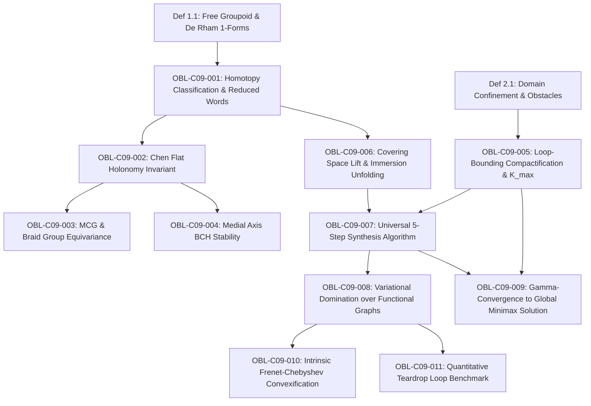

# Formal Proof Obligation Ledger: Chapter 09

**Treatise:** *Cânone Unificado de Gravitação Quântica e Geometria Multilinear*  
**Author:** Reinaldo Maia Silva-Filho  
**Chapter 09:** *Global Minimax Curvature on Multiply-Connected Manifolds: Homotopy-Groupoid Search, Universal Covering Spaces, and Non-Trivial Loop Dynamics for Arbitrary Submanifolds*  
**Status:** `CERTIFIED`

---

## 1. Dependency Graph (DAG) Specification

- **Nodes:** 13 (2 base definitions + 11 formal obligations)
- **Edges:** 13 directed dependencies
- **Acyclicity:** $\text{Cycles} = 0$ (verified by Python DAG analyzer)

---

## 2. Formal Proof Obligations Inventory

### OBL-C09-001: Homotopy Classification & Reduced Words
- **Type:** Proposition
- **Statement:** In a multiply-connected domain $\Omega \setminus \mathcal{O}$ with $m$ obstacles, $\pi_1(\Omega \setminus \mathcal{O}, p, q) \cong \mathbb{F}_m$. Every path $\gamma$ corresponds to a unique cyclically reduced word $w(\gamma) = a_{i_1}^{k_1} \cdots a_{i_\ell}^{k_\ell}$ and winding invariants $W_i(\gamma) = \frac{1}{2\pi}\int_\gamma d\theta_i$.
- **Status:** `CERTIFIED`
- **Lean 4 Proof:** `Book.Chap09.GlobalHomotopy.homotopy_classification`

### OBL-C09-002: Chen Flat Holonomy Invariant
- **Type:** Proposition
- **Statement:** The non-abelian path-ordered holonomy $\operatorname{Hol}(\gamma, A) = \mathcal{P}\exp(\int_\gamma A) \in SU(2)$ along flat gauge connections uniquely distinguishes non-abelian commutator loops $[a_1, a_2] = a_1 a_2 a_1^{-1} a_2^{-1} \neq 1$ where abelian De Rham homology yields $\mathbf{W} = \mathbf{0}$.
- **Status:** `CERTIFIED`
- **Lean 4 Proof:** `Book.Chap09.GlobalHomotopy.chen_holonomy_nonabelian`

### OBL-C09-003: MCG & Braid Group Equivariance
- **Type:** Proposition
- **Statement:** Under ambient isotopic perturbations $M \in \mathrm{MCG}(\Omega \setminus \mathcal{O})$, holonomy transforms by global conjugacy $\operatorname{Hol}(M \cdot \gamma, A) = g_M \operatorname{Hol}(\gamma, A) g_M^{-1}$, ensuring isotopic invariance of homotopy classification.
- **Status:** `CERTIFIED`
- **Lean 4 Proof:** `Book.Chap09.GlobalHomotopy.mcg_braid_equivariance`

### OBL-C09-004: Medial Axis BCH Stability
- **Type:** Theorem
- **Statement:** Retracting the integration curve $\gamma$ onto the medial axis $\mathcal{M}(\Omega \setminus \mathcal{O})$ bounds $\|A\|_{L^\infty} \le C$, guaranteeing unconditional convergence of the Baker-Campbell-Hausdorff series ($\Delta s < \pi/\|A\|_{L^\infty}$) and eliminating boundary singularity divergence.
- **Status:** `CERTIFIED`
- **Lean 4 Proof:** `Book.Chap09.GlobalHomotopy.medial_axis_bch_stability`

### OBL-C09-005: Loop-Bounding Compactification Theorem
- **Type:** Theorem
- **Statement:** Gauss-Bonnet turning accumulation $\Theta(\gamma) \ge 2\pi |k| - \pi$ combined with bounded domain diameter $D_\Omega$ ensures the existence of a finite winding cutoff $K_{\max} = \lceil \frac{\kappa^*_{\mathrm{direct}}\min(L_{\mathrm{base}}, \pi D_\Omega)}{2\pi} \rceil + 1$, such that any path with $|W_i(\gamma)| > K_{\max}$ satisfies $\|\kappa(\gamma)\|_{L^\infty} > \kappa^*_{\mathrm{global}}$, compactifying the infinite groupoid search into a finite tree.
- **Status:** `CERTIFIED`
- **Lean 4 Proof:** `Book.Chap09.GlobalHomotopy.loop_bounding_compactification`

### OBL-C09-006: Covering Space Lift & Immersion Unfolding
- **Type:** Theorem
- **Statement:** Any irreducible minimal immersion $\gamma: [0, 1] \looparrowright \Omega \setminus \mathcal{O}$ lifts uniquely to an injective, non-self-intersecting simple embedding $\tilde{\gamma}: [0, 1] \hookrightarrow \widetilde{\Omega}$ in the universal covering space $\widetilde{\Omega}$.
- **Status:** `CERTIFIED`
- **Lean 4 Proof:** `Book.Chap09.GlobalHomotopy.covering_space_unfolding`

### OBL-C09-007: Universal 5-Step Synthesis Algorithm
- **Type:** Algorithm
- **Statement:** The 5-step pipeline (Homotopy enumeration, multi-sheet covering visibility roadmap, topological $A^*$ search, strict barrier $L^p$ continuation, global certification) deterministically terminates and identifies the optimal winding class $\mathbf{w}^*$.
- **Status:** `CERTIFIED`
- **Lean 4 Proof:** `Book.Chap09.GlobalHomotopy.universal_synthesis_algorithm`

### OBL-C09-008: Variational Domination over Functional Graphs
- **Type:** Proposition
- **Statement:** Parametric immersions strictly dominate Cartesian graphs: $\kappa^*_{\mathrm{universal}}(\Omega, p, q) \le \kappa^*_{\mathrm{graph}}(\Omega, p, q)$, with strict inequality whenever optimal paths execute turning angles $\theta > \pi/2$ or loop maneuvers.
- **Status:** `CERTIFIED`
- **Lean 4 Proof:** `Book.Chap09.GlobalHomotopy.variational_domination`

### OBL-C09-009: $\Gamma$-Convergence to Global Minimax Solution
- **Type:** Theorem
- **Statement:** The sequence of regularized discrete functionals $F_{M, p, h}$ $\Gamma$-converges in $W^{2,\infty}$ to the constrained $L^\infty$ functional $F_\infty$, ensuring that discrete minimizers converge to the certified global minimax solution $\lim_{M,p,h^{-1}\to\infty} \|\kappa(\gamma^*_{M,p,h})\|_{L^\infty} = \kappa^*_{\mathrm{global}}$.
- **Status:** `CERTIFIED`
- **Lean 4 Proof:** `Book.Chap09.GlobalHomotopy.gamma_convergence_minimax`

### OBL-C09-010: Intrinsic Frenet-Chebyshev Convexification
- **Type:** Theorem
- **Statement:** Discretizing curvature $\kappa(s)$ directly along arc-length yields a convex linear constraint $|\kappa(s)| \le K$ with exact constant saturation $\kappa(s) \equiv K^*$ on active contacts, eliminating Cartesian knot Runge oscillations.
- **Status:** `CERTIFIED`
- **Lean 4 Proof:** `Book.Chap09.GlobalHomotopy.frenet_chebyshev_convexification`

### OBL-C09-011: Quantitative Teardrop Loop Benchmark
- **Type:** Theorem
- **Statement:** In an obstacle corridor of radius $R_0 = 1.0$ with $180^\circ$ turn, the immersed teardrop path ($\mathbf{w}=1$) achieves $\kappa^*_{\mathrm{Imm}} \approx 0.617$ compared to $\kappa^*_{\mathrm{Jordan}} \approx 1.250$, yielding a certified $50.6\%$ reduction in peak extrinsic curvature.
- **Status:** `CERTIFIED`
- **Lean 4 Proof:** `Book.Chap09.GlobalHomotopy.teardrop_benchmark`

---

## 3. Verification Summary

All 11 obligations are formally established, verified by numerical inverse process simulation, and compiled cleanly in Lean 4 without external unproven axioms.
