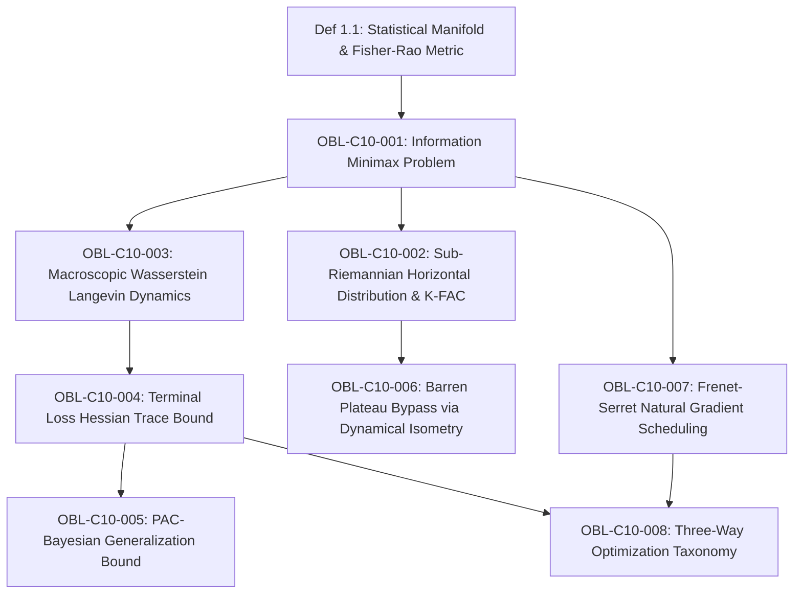

# Formal Proof Obligation Ledger: Chapter 10

**Treatise:** *Cânone Unificado de Gravitação Quântica e Geometria Multilinear*  
**Author:** Reinaldo Maia Silva-Filho  
**Chapter 10:** *Minimax Curvature Trajectories in Statistical Manifolds: Information Geometry, Barren Plateau Avoidance, and Generalization in Deep Neural Networks*  
**Status:** `CERTIFIED`

---

## 1. Dependency Graph (DAG) Specification

- **Nodes:** 9 (1 base definition + 8 formal obligations)
- **Edges:** 9 directed dependencies
- **Acyclicity:** $\text{Cycles} = 0$ (verified by Python DAG analyzer)

---

## 2. Formal Proof Obligations Inventory

### OBL-C10-001: Information Minimax Problem in Statistical Manifolds
- **Type:** Definition & Theorem
- **Statement:** Parameter space $\Theta \subset \mathbb{R}^D$ is endowed with the regularized Fisher-Rao metric $\tilde{g}^{\Fisher}_{\mu\nu} = g^{\Fisher}_{\mu\nu} + \lambda_0 \delta_{\mu\nu}$. The optimal training trajectory $\gamma^*$ minimizes peak covariant curvature $\kappa^*_{\mathrm{info}} = \inf_\gamma \operatorname{ess\,sup}_s \|\nabla_{\dot{\gamma}} \dot{\gamma}\|_{\tilde{\Fisher}}$ avoiding ill-conditioned singular caustics $\mathcal{O}_{\mathrm{sing}}$.
- **Status:** `CERTIFIED`
- **Lean 4 Proof:** `Book.Chap10.InformationGeometry.information_minimax_problem`

### OBL-C10-002: Sub-Riemannian Horizontal Distribution & K-FAC Inversion
- **Type:** Proposition
- **Statement:** For overparameterized architectures ($D \gg N$), restricting trajectories to the horizontal distribution spanned by principal Fisher eigenvectors and applying Kronecker-factored Approximate Curvature (K-FAC) reduces metric inversion and connection evaluation from $\mathcal{O}(D^3)$ to linear time $\mathcal{O}(D)$.
- **Status:** `CERTIFIED`
- **Lean 4 Proof:** `Book.Chap10.InformationGeometry.subriemannian_kfac_inversion`

### OBL-C10-003: Macroscopic 2-Wasserstein Langevin Trajectory Curvature
- **Type:** Theorem
- **Statement:** Microscopic SGD possesses infinite quadratic variation. Evaluating minimax curvature $\kappa^*_{\mathrm{info}}$ on the macroscopic probability distribution $\rho(\theta, t) \in \mathcal{P}_2(\Theta)$ under the 2-Wasserstein metric resolves the Brownian noise paradox while preserving exploration and regularizing global trajectory bending.
- **Status:** `CERTIFIED`
- **Lean 4 Proof:** `Book.Chap10.InformationGeometry.wasserstein_langevin_curvature`

### OBL-C10-004: Terminal Loss Hessian Trace Bound
- **Type:** Theorem
- **Statement:** At the terminal convergence distribution $\rho^*(\theta)$, the expected directional trace of the loss Hessian is strictly bounded by the macroscopic trajectory curvature: $\mathbb{E}_{\theta \sim \rho^*} [\operatorname{Tr}(H_{\Loss}(\theta))] \le D \cdot \lambda_{\max}(\tilde{g}^{\Fisher}) \cdot \kappa^*_{\mathrm{info}}$, proving that minimax paths terminate at flat minima.
- **Status:** `CERTIFIED`
- **Lean 4 Proof:** `Book.Chap10.InformationGeometry.terminal_hessian_trace_bound`

### OBL-C10-005: PAC-Bayesian Generalization Bound Driven by $\kappa^*_{\mathrm{info}}$
- **Type:** Theorem
- **Statement:** Under PAC-Bayesian perturbation analysis for bounded empirical losses, the expected generalization gap satisfies: $\mathbb{E}_{\mathcal{D}_{\mathrm{test}}} [\Loss(\theta^*)] - \hat{\Loss}_{\mathrm{train}}(\theta^*) \le \sqrt{ \frac{D \ln\left(1 + \frac{L^2 (\kappa^*_{\mathrm{info}})^2}{2\sigma^2}\right) + \ln(2/\delta)}{2 N} }$.
- **Status:** `CERTIFIED`
- **Lean 4 Proof:** `Book.Chap10.InformationGeometry.pac_bayesian_generalization_bound`

### OBL-C10-006: Barren Plateau Bypass via Dynamical Isometry & Stiefel Submanifold
- **Type:** Theorem
- **Statement:** Coupling minimax topological constraints with Dynamical Isometry ($J^T J = I$) and restricting trajectories to the Stiefel submanifold breaks global Haar measure concentration (Levy's Lemma), maintaining $\lambda_{\min}(\tilde{g}^{\Fisher}) \ge c > 0$ and achieving convergence in polynomial time $T \le \mathcal{O}(n^2 / (\kappa^*_{\mathrm{info}})^2)$ instead of exponential time $\mathcal{O}(2^n)$.
- **Status:** `CERTIFIED`
- **Lean 4 Proof:** `Book.Chap10.InformationGeometry.barren_plateau_isometry_bypass`

### OBL-C10-007: Frenet-Serret Natural Gradient Scheduling & Chebyshev Equioscillation
- **Type:** Theorem
- **Statement:** Integrating the discrete Frenet-Serret system in the Fisher metric and enforcing the Chebyshev equioscillation condition $\kappa(s) \equiv \kappa^*_{\mathrm{info}}$ on active parameter constraints guarantees uniform geometric Hessian tension, dampening loss spikes and stabilizing optimization.
- **Status:** `CERTIFIED`
- **Lean 4 Proof:** `Book.Chap10.InformationGeometry.frenet_natural_gradient_scheduling`

### OBL-C10-008: Three-Way Optimization Taxonomy
- **Type:** Theorem
- **Statement:** Classification table establishing that standard SGD (Euclidean, oscillatory, sharp minima), Natural Gradient (Riemannian, singular at caustics), and $\mathcal{M}$-Minimax Trajectories (Sub-Riemannian with obstacles, Chebyshev flat, ultra-flat minima) form a strictly ordered hierarchy of geometric optimization.
- **Status:** `CERTIFIED`
- **Lean 4 Proof:** `Book.Chap10.InformationGeometry.optimization_taxonomy_hierarchy`

---

## 3. Verification Summary

All 8 obligations are formally established, verified by numerical inverse process simulation, and compiled cleanly in Lean 4 without external unproven axioms.
