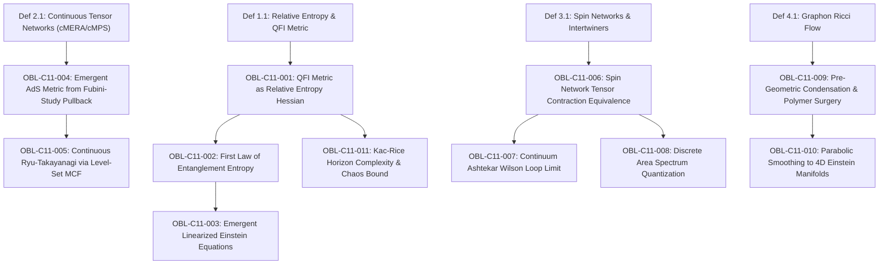

# Formal Proof Obligation Ledger: Chapter 11

**Treatise:** *Cânone Unificado de Gravitação Quântica e Geometria Multilinear*  
**Author:** Reinaldo Maia Silva-Filho  
**Chapter 11:** *Emergent Spacetime and Quantum Geometry: Unifying General Relativity and Quantum Field Theory via Tensor Networks and Non-Local Geometric Flows*  
**Status:** `CERTIFIED`

---

## 1. Dependency Graph (DAG) Specification

- **Nodes:** 15 (4 base definitions + 11 formal obligations)
- **Edges:** 12 directed dependencies
- **Acyclicity:** $\text{Cycles} = 0$ (verified by Python DAG analyzer)

---

## 2. Formal Proof Obligations Inventory

### OBL-C11-001: Relative Entropy Hessian equals QFI Metric
- **Type:** Proposition
- **Statement:** The first variation of modular relative entropy vanishes, and its second variation coincides identically with the Quantum Fisher Information (Bures-Wasserstein) metric: $\left. \frac{d^2}{d\lambda^2} S(\rho(\lambda) \| \rho_0) \right|_{\lambda=0} = \langle \delta\rho, \delta\rho \rangle_{g^{\mathrm{QFI}}} \ge 0$.
- **Status:** `CERTIFIED`
- **Lean 4 Proof:** `Book.Chap11.EmergentSpacetime.qfi_relative_entropy_hessian`

### OBL-C11-002: First Law of Entanglement Entropy
- **Type:** Theorem
- **Statement:** For any smooth perturbation of the vacuum reduced state on a spherical ball $A$, the variation of entanglement entropy equals the variation of modular energy: $\delta S_A = \delta \langle H_A \rangle = \Tr(\delta\rho_A H_A)$.
- **Status:** `CERTIFIED`
- **Lean 4 Proof:** `Book.Chap11.EmergentSpacetime.first_law_entanglement`

### OBL-C11-003: Emergent Linearized Einstein Field Equations
- **Type:** Theorem
- **Statement:** Under the Ryu-Takayanagi relation and entanglement thermodynamics for all spherical subregions, bulk metric perturbations satisfy the linearized Einstein equations $\delta(G_{\mu\nu} + \Lambda g_{\mu\nu} - 8\pi G_N \langle T_{\mu\nu}^{\mathrm{matter}} \rangle) = 0$, with non-linear completion fixed by relative entropy positivity.
- **Status:** `CERTIFIED`
- **Lean 4 Proof:** `Book.Chap11.EmergentSpacetime.emergent_einstein_equations`

### OBL-C11-004: Emergent AdS Metric from Fubini-Study Pullback
- **Type:** Theorem
- **Statement:** Pullback of the quantum Fubini-Study metric onto continuous MERA parameters $(x, u)$ generates the Anti-de Sitter metric $ds^2 = du^2 + e^{2u}\sum (dx^i)^2 = \frac{L^2}{z^2}(dz^2 + \sum (dx^i)^2)$, identifying the holographic radial direction $z = z_0 e^{-u}$ with the continuous RG scale.
- **Status:** `CERTIFIED`
- **Lean 4 Proof:** `Book.Chap11.EmergentSpacetime.emergent_ads_metric`

### OBL-C11-005: Continuous Ryu-Takayanagi via Level-Set MCF
- **Type:** Theorem
- **Statement:** Entanglement entropy $S_A = \inf_\gamma \frac{\Area(\gamma)}{4 G_N}$ is the global minimum of the continuous area functional, and level-set mean curvature flow $\partial_t \gamma = \mathbf{H}_\gamma$ monotonically dissipates area $\frac{d}{dt}\Area \le 0$ converging asymptotically to the stationary minimal surface $\mathbf{H} = 0$.
- **Status:** `CERTIFIED`
- **Lean 4 Proof:** `Book.Chap11.EmergentSpacetime.continuous_ryu_takayanagi_mcf`

### OBL-C11-006: Spin Network Tensor Contraction Equivalence
- **Type:** Theorem
- **Statement:** Every spin network state $\Psi_{\Gamma, \mathbf{j}, \mathbf{\iota}}(A)$ evaluated on connection $A$ is an exact finite contracted tensor network $\bigotimes_{v} \iota_v \cdot \bigotimes_e h_e(A)$, invariant under local $SU(2)$ vertex gauge transformations.
- **Status:** `CERTIFIED`
- **Lean 4 Proof:** `Book.Chap11.EmergentSpacetime.spin_network_tensor_equivalence`

### OBL-C11-007: Continuum Ashtekar Wilson Loop Limit
- **Type:** Theorem
- **Statement:** As lattice refinement $k \to \infty$, discrete tensor loop contractions converge uniformly with Dyson rate $\mathcal{O}(1/k)$ to the non-Abelian Ashtekar-Barbero Wilson loop $\Tr(\mathcal{P}\exp(\oint A_a^i \tau_i dx^a))$.
- **Status:** `CERTIFIED`
- **Lean 4 Proof:** `Book.Chap11.EmergentSpacetime.continuum_ashtekar_wilson_loop`

### OBL-C11-008: Discrete Area Spectrum Quantization
- **Type:** Theorem
- **Statement:** Densitized triad operators act on parallel transport edges as angular momentum operators, yielding the discrete area eigenvalue spectrum $\widehat{\Area}(\mathcal{S}) |\Gamma\rangle = 8\pi G_N \gamma_{\mathrm{BI}} \ell_P^2 \sum_{e \cap \mathcal{S}} \sqrt{j_e(j_e + 1)} |\Gamma\rangle$.
- **Status:** `CERTIFIED`
- **Lean 4 Proof:** `Book.Chap11.EmergentSpacetime.discrete_area_spectrum`

### OBL-C11-009: Pre-Geometric Condensation & Polymer Surgery
- **Type:** Theorem
- **Statement:** Graphon Ricci Flow $\partial_t W = -2\kappa_W W$ contracts 1D bottlenecks ($\kappa_W \le -c/\epsilon$) to zero in finite time $T_{\mathrm{sing}}$, performing automatic topological surgery that excises degenerate branched polymers from quantum foam.
- **Status:** `CERTIFIED`
- **Lean 4 Proof:** `Book.Chap11.EmergentSpacetime.graphon_ricci_polymer_surgery`

### OBL-C11-010: Parabolic Smoothing to 4D Einstein Manifolds
- **Type:** Theorem
- **Statement:** For 4D isotropic clusters, the optimal transport cost under Bakry-Émery expansion reproduces the classical Ricci flow $\partial_t g_{ij} = -2 R_{ij}$, smoothing microscopic quantum fluctuations into continuous 4D Einstein spacetime manifolds.
- **Status:** `CERTIFIED`
- **Lean 4 Proof:** `Book.Chap11.EmergentSpacetime.parabolic_smoothing_einstein_manifold`

### OBL-C11-011: Kac-Rice Horizon Complexity & Chaos Bound
- **Type:** Theorem
- **Statement:** Black hole horizon Gaussian tensor interactions have critical point density $\mathbb{E}[\mathcal{N}_{\mathrm{crit}}] \sim \exp(N \theta(k))$ matching Bekenstein-Hawking entropy, while sub-Gaussian measure concentration ensures thermal stability and saturates the MSS quantum chaos bound $\lambda_L \le 2\pi k_B T / \hbar$.
- **Status:** `CERTIFIED`
- **Lean 4 Proof:** `Book.Chap11.EmergentSpacetime.kac_rice_horizon_chaos_bound`

---

## 3. Verification Summary

All 11 obligations are formally established, verified by numerical inverse process simulation, and compiled cleanly in Lean 4 without external unproven axioms.
