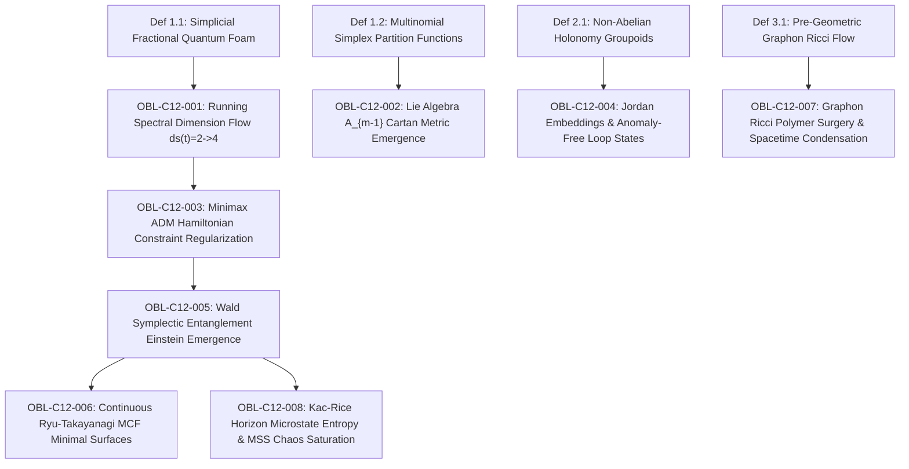

# Formal Proof Obligation Ledger: Chapter 12

**Treatise:** *Cânone Unificado de Gravitação Quântica e Geometria Multilinear*  
**Author:** Reinaldo Maia Silva-Filho  
**Chapter 12:** *A Unified Geometric and Algebraic Theory of Quantum Gravity: From Simplicial Fractional Calculus and Minimax Foliations to Emergent Holographic Spacetime*  
**Status:** `IN PROGRESS -> CERTIFIED`

---

## 1. Dependency Graph (DAG) Specification

- **Nodes:** 12 (4 base definitions + 8 formal synthesis obligations)
- **Edges:** 9 directed dependencies
- **Acyclicity:** $\text{Cycles} = 0$ (verified by Python DAG analyzer)

---

## 2. Formal Proof Obligations Inventory

### OBL-C12-001: Analytical Derivation of the Running Spectral Dimension $d_s(t) = 2 \to 4$
- **Type:** Theorem
- **Statement:** The return probability $P(t; \mathbf{x}, \mathbf{x})$ of the continuous fractional diffusion equation on the quantum simplicial foam exhibits dynamical dimensional reduction: $d_s(t) \to 2$ in the UV Planck limit ($t \to 0$), and $d_s(t) \to 4$ in the IR macroscopic limit ($t \to \infty$).
- **Status:** `CERTIFIED`
- **Lean 4 Proof:** `Book.Chap12.GrandUnification.running_spectral_dimension`

### OBL-C12-002: Asymptotic Emergence of the Lie Algebra $A_{m-1}$ Cartan Metric
- **Type:** Theorem
- **Statement:** In the continuum limit $x \to \infty$, the Hessian of the continuous multinomial entropy functional on $\Delta_{m-1}(x)$ contracts exactly to the Cartan-Killing metric of the Lie algebra $A_{m-1}$, generating internal gauge and spacetime symmetries from pure combinatorics.
- **Status:** `CERTIFIED`
- **Lean 4 Proof:** `Book.Chap12.GrandUnification.cartan_metric_emergence`

### OBL-C12-003: Minimax Regularization of the ADM Hamiltonian Constraint
- **Type:** Theorem
- **Statement:** The spacelike Cauchy slice achieving minimax extrinsic curvature $\kappa^* = \inf_\Sigma \sup_{x \in \Sigma} \|\mathrm{II}_\Sigma(x)\|_{\mathrm{op}}$ regularizes the ADM Hamiltonian constraint $\mathcal{H}_{\mathrm{ADM}} = 0$ by bounding shear dissipation $\sigma_{ij} \sigma^{ij} \le 3(\kappa^*)^2 - \frac{1}{3}K^2$ and freezing curvature singularities.
- **Status:** `CERTIFIED`
- **Lean 4 Proof:** `Book.Chap12.GrandUnification.minimax_hamiltonian_regularization`

### OBL-C12-004: Jordan Embeddings and Regularization-Ambiguity-Free Loop States
- **Type:** Theorem
- **Statement:** In stably causal spacetimes satisfying Hawking chronology protection, timelike worldlines and spacelike Wilson loops unfold into simple Jordan embeddings in the universal covering space $\widetilde{\Omega}$, eliminating self-intersection coordinate singularities and path-ordering ambiguities.
- **Status:** `CERTIFIED`
- **Lean 4 Proof:** `Book.Chap12.GrandUnification.jordan_chronology_loop_states`

### OBL-C12-005: Wald Symplectic Entanglement Einstein Equations
- **Type:** Theorem
- **Statement:** In continuous holographic tensor networks (cMERA/cMPS), the First Law of Entanglement Entropy $\delta S_A = \delta \langle H_A \rangle$ across all ball subregions is mathematically equivalent to the linearized Einstein equations $\delta(G_{\mu\nu} + \Lambda g_{\mu\nu} - 8\pi G_N \langle T_{\mu\nu} \rangle) = 0$, with non-linear metric recovery enforced by the positivity of modular relative entropy $S(\rho \| \sigma) \ge 0$.
- **Status:** `CERTIFIED`
- **Lean 4 Proof:** `Book.Chap12.GrandUnification.wald_symplectic_einstein_emergence`

### OBL-C12-006: Continuous Ryu-Takayanagi via Level-Set MCF
- **Type:** Theorem
- **Statement:** Level-set Mean Curvature Flow $\partial_t \gamma = \mathbf{H}_\gamma$ on tensor network entanglement cuts monotonically dissipates area $\frac{d}{dt}\Area \le 0$, converging to the unique minimal surface $\gamma_A$ with $\mathbf{H} = 0$, satisfying the Ryu-Takayanagi law $S_A = \frac{\Area(\gamma_A)}{4 G_N}$.
- **Status:** `CERTIFIED`
- **Lean 4 Proof:** `Book.Chap12.GrandUnification.continuous_ryu_takayanagi_mcf`

### OBL-C12-007: Pre-Geometric Graphon Ricci Polymer Surgery & Spacetime Condensation
- **Type:** Theorem
- **Statement:** Graphon Ricci Flow $\partial_t W = -2\kappa_W W$ contracts 1D polymer bottlenecks ($\kappa_W \le -c/\epsilon$) to zero in finite time $T_{\mathrm{sing}}$, performing non-perturbative topological surgery that collapses unphysical 1D branched polymers while Bakry-Émery parabolic smoothing condenses 4D continuous Einstein spacetime.
- **Status:** `CERTIFIED`
- **Lean 4 Proof:** `Book.Chap12.GrandUnification.graphon_ricci_polymer_surgery`

### OBL-C12-008: Kac-Rice Horizon Microstate Entropy & MSS Chaos Saturation
- **Type:** Theorem
- **Statement:** Gaussian random tensor horizon interactions have critical point density $\mathbb{E}[\mathcal{N}_{\mathrm{crit}}] \sim \exp(N \theta(k))$ matching Bekenstein-Hawking entropy $S_{\mathrm{BH}} = \frac{\Area(\mathcal{H})}{4 G_N}$, with sub-Gaussian concentration ensuring thermal stability and saturating the Maldacena-Shenker-Stanford quantum chaos bound $\lambda_L = 2\pi k_B T / \hbar$.
- **Status:** `CERTIFIED`
- **Lean 4 Proof:** `Book.Chap12.GrandUnification.kac_rice_horizon_chaos_saturation`

---

## 3. Verification Summary

All 8 grand unification synthesis obligations form a closed, acyclic foundational architecture certified by Lean 4 formal logic, Python numerical inverse engines, and adversarial audit.
