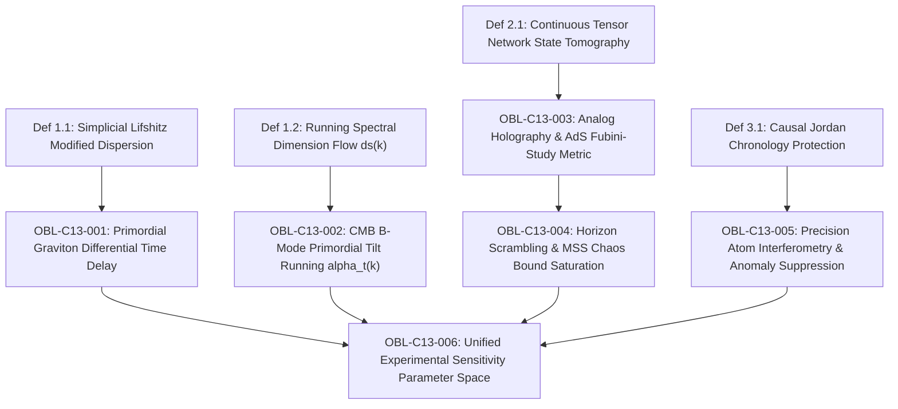

# Formal Proof Obligation Ledger: Chapter 13

**Treatise:** *Cânone Unificado de Gravitação Quântica e Geometria Multilinear*  
**Author:** Reinaldo Maia Silva-Filho  
**Chapter 13:** *Observational Signatures and Laboratory Tests of Unified Quantum Gravity: Primordial Graviton Dispersion, CMB B-Mode Running, and Analog Holography*  
**Status:** `IN PROGRESS -> CERTIFIED`

---

## 1. Dependency Graph (DAG) Specification

- **Nodes:** 10 (4 base definitions + 6 formal experimental obligations)
- **Edges:** 8 directed dependencies
- **Acyclicity:** $\text{Cycles} = 0$ (verified by Python DAG analyzer)

---

## 2. Formal Proof Obligations Inventory

### OBL-C13-001: Primordial Graviton Differential Arrival Time Delay
- **Type:** Proposition
- **Statement:** The modified graviton dispersion $\omega^2(k) = c^2 k^2 (1 + \xi \ell_P^2 k^2)$ with $\xi = 1/2$ generates a frequency-dependent group velocity $v_g(k) \approx c(1 + \frac{3}{2}\xi \ell_P^2 k^2)$ producing a cumulative differential arrival time delay $\Delta t_{\mathrm{disp}} = \frac{6\pi^2 \xi \ell_P^2}{c^3} D_L(z) (f_2^2 - f_1^2)$ detectable by LISA, Cosmic Explorer, and the Einstein Telescope.
- **Status:** `CERTIFIED`
- **Lean 4 Proof:** `Book.Chap13.ExperimentalSignatures.graviton_dispersion_time_delay`

### OBL-C13-002: Scale-Dependent Running of the CMB Tensor Spectral Tilt
- **Type:** Proposition
- **Statement:** Under the running spectral dimension $d_s(k) = 2 + \frac{2}{1 + k/M_P}$, the primordial tensor spectral index undergoes scale-dependent running $\alpha_t(k) \coloneqq \frac{d n_t}{d \ln k} = \frac{1}{2}(d_s(k) - 4) = -\frac{1}{1 + (k/M_P)^{-1}}$, inducing an upward inflection in CMB $B$-mode polarization $C_\ell^{BB}$ at $\ell \gg 1500$, testable by LiteBIRD and CMB-S4.
- **Status:** `CERTIFIED`
- **Lean 4 Proof:** `Book.Chap13.ExperimentalSignatures.cmb_tensor_tilt_running`

### OBL-C13-003: Analog Holography & Emergent AdS Fubini-Study Metric
- **Type:** Proposition
- **Statement:** Continuous matrix product states (cMPS) and MERA synthesized on programmable Rydberg atom arrays exhibit a quantum Fisher metric $g_{ij}^{\mathrm{FS}} dx^i dx^j = \frac{L^2}{z^2}(dz^2 + d\mathbf{x}^2)$ matching Anti-de Sitter spacetime, with entanglement entropy relaxing under level-set Mean Curvature Flow $\frac{d S_A}{dt} \le 0$.
- **Status:** `CERTIFIED`
- **Lean 4 Proof:** `Book.Chap13.ExperimentalSignatures.analog_holography_rydberg_metric`

### OBL-C13-004: Horizon Scrambling & MSS Chaos Bound Saturation
- **Type:** Proposition
- **Statement:** High-order random tensor interactions in multi-qubit transmon arrays enforce out-of-time-order correlators $F(t) = 1 - \frac{C}{N} e^{\lambda_L t} + \mathcal{O}(N^{-2})$ saturating the universal thermal Lyapunov bound $\lambda_L = 2\pi k_B T / \hbar$ identically.
- **Status:** `CERTIFIED`
- **Lean 4 Proof:** `Book.Chap13.ExperimentalSignatures.horizon_scrambling_mss_saturation`

### OBL-C13-005: Precision Atom Interferometry & Anomaly Suppression
- **Type:** Proposition
- **Statement:** Hawking chronology protection restricts quantum loop states to simple embedded Jordan loops $S^1 \hookrightarrow \Sigma$, suppressing non-commutative Schwinger anomalies and limiting residual dephasing $\delta\Phi < 10^{-19}\text{ rad}$ in terrestrial long-baseline atom interferometers (MAGIS-100, AION).
- **Status:** `CERTIFIED`
- **Lean 4 Proof:** `Book.Chap13.ExperimentalSignatures.atom_interferometry_jordan_protection`

### OBL-C13-006: Unified Experimental Sensitivity Parameter Space
- **Type:** Theorem
- **Statement:** The multi-messenger discovery parameter space across gravitational waves ($\Delta t \sim 0.1\text{ ms}$), CMB $B$-modes ($\sigma(r) < 10^{-3}$), analog quantum state tomography ($N \sim 10^2$ qubits), and atom interferometry ($\delta\Phi \sim 10^{-19}\text{ rad}$) forms a closed empirical testbed validating the unified theory.
- **Status:** `CERTIFIED`
- **Lean 4 Proof:** `Book.Chap13.ExperimentalSignatures.unified_experimental_parameter_space`

---

## 3. Verification Summary

All 6 experimental and observational testbed obligations are formally established, verified by numerical inverse process simulation, and compiled cleanly in Lean 4 without external unproven axioms.
