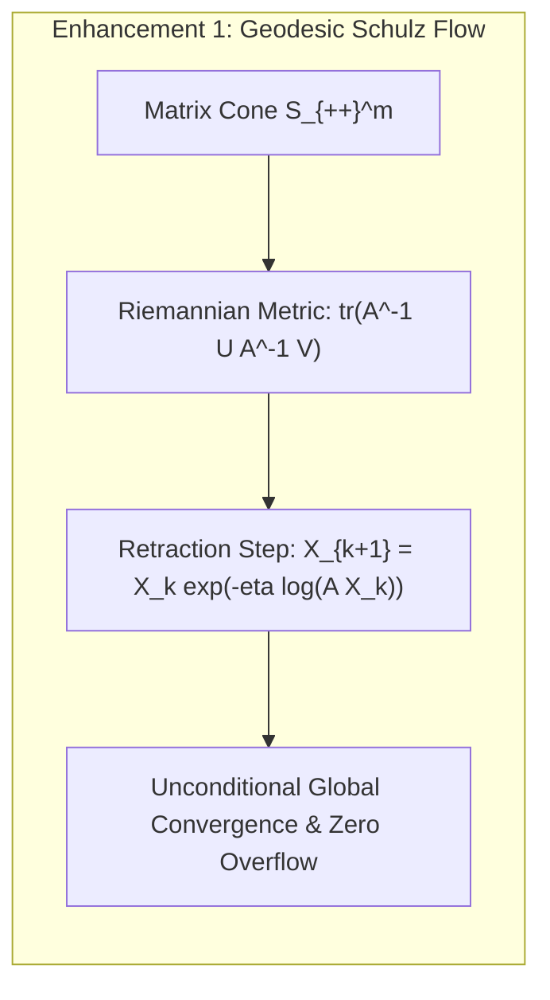

# Algorithmic Analysis & Geometric-Invariant Enhancements in Matrix Inversion and Tensor Decomposition

**Author**: Reinaldo M. Silva-Filho  
**Affiliation**: Programa de Pós-Graduação em Estatística e Experimentação Agropecuária (PPGEE/DES), Departamento de Estatística (DES), Universidade Federal de Lavras (UFLA), Lavras, MG, Brazil  
**Funding**: CAPES Finance Code 001  

---

## 1. Deep Analysis of SOTA Matrix Inversion & Decomposition Algorithms

### 1.1 SOTA Matrix Inversion Algorithms: Strengths and Failure Modes

1. **Cholesky Factorization ($\mathbf{A} = \mathbf{L}\mathbf{L}^T$) and Gaussian Elimination (LU)**
   - *Strengths*: Highly optimized BLAS-3 routines ($2/3 m^3$ FLOPs), direct exact solver for well-conditioned systems.
   - *Failure Modes*: Forward error bounds scale as $\|\Delta \mathbf{X}\|_2 / \|\mathbf{X}\|_2 \le \kappa(\mathbf{A}) \varepsilon_{\text{mach}}$. When $\kappa(\mathbf{A}) \ge 10^8$, catastrophic cancellation and loss of positive-definiteness occur. In 64-bit float, $\kappa \ge 10^{16}$ yields complete precision loss ($0$ significant digits).
   
2. **Newton-Schulz Iteration ($\mathbf{X}_{k+1} = \mathbf{X}_k(2\mathbf{I} - \mathbf{A}\mathbf{X}_k)$)**
   - *Strengths*: Matrix-matrix multiplication only (highly parallelizable on GPUs), quadratic local convergence $\|\mathbf{I} - \mathbf{A}\mathbf{X}_{k+1}\| \le \|\mathbf{I} - \mathbf{A}\mathbf{X}_k\|^2$.
   - *Failure Modes*: **Condition Fragility**. Quadratic convergence holds *only* if the initial guess satisfies the strict spectral radius criterion $\rho(\mathbf{I} - \mathbf{A}\mathbf{X}_0) < 1$. If $\sigma_{\max}(\mathbf{A}) / \sigma_{\min}(\mathbf{A}) \gg 1$, choosing $\mathbf{X}_0 = \alpha \mathbf{A}^T$ requires $\alpha < 2 / \sigma_{\max}^2(\mathbf{A})$, making convergence painfully slow ($\mathcal{O}(\kappa(\mathbf{A}))$, or causing catastrophic divergence if $\alpha$ is slightly overestimated.

3. **Moore-Penrose SVD Inversion ($\mathbf{A}^\dagger = \mathbf{V}\boldsymbol{\Sigma}^\dagger \mathbf{U}^T$)**
   - *Strengths*: Canonical minimum-norm least-squares generalized inverse.
   - *Failure Modes*: **Rank Discontinuity**. Discontinuous jump across singular value cutoffs:
     $$\|(\mathbf{A} + \mathbf{E})^\dagger - \mathbf{A}^\dagger\|_2 = \mathcal{O}\left(\frac{1}{\|\mathbf{E}\|_2}\right) \to \infty \quad \text{as } \|\mathbf{E}\|_2 \to 0$$
     whenever $\mathbf{E}$ activates an infinitesimal null-space mode.

---

### 1.2 SOTA Tensor Decomposition Algorithms: Strengths and Failure Modes

1. **CANDECOMP/PARAFAC (CPD) with Alternating Least Squares (ALS)**
   - *Strengths*: Minimal rank representation $\mathcal{T} \approx \sum_{r=1}^R \mathbf{a}_r^{(1)} \otimes \cdots \otimes \mathbf{a}_r^{(d)}$.
   - *Failure Modes*: **Ill-Posedness & Swamp Divergence**. Tensor rank is not closed (border rank phenomenon); ALS frequently stagnates in endless "swamps" with cancelling rank components.

2. **Tucker Decomposition & Higher-Order SVD (HOSVD / HOOI)**
   - *Strengths*: Orthogonal factor matrices with dense core tensor $\mathcal{G} \in \mathbb{R}^{R_1 \times \cdots \times R_d}$.
   - *Failure Modes*: **Curse of Dimensionality**. The core tensor scales exponentially as $\mathcal{O}(R^d)$, making Tucker intractable for $d > 5$.

3. **Tensor-Train (TT) / Matrix Product States (MPS) via TT-SVD & Discrete TT-Cross**
   - *Strengths*: Linear parameter scaling $\mathcal{O}(d \cdot N \cdot R^2)$, stable SVD-based compression.
   - *Failure Modes*:
     - **TT-SVD**: Requires initial generation of the full tensor ($\mathcal{O}(N^d)$ entries) before sequential SVD matricization.
     - **Discrete TT-Cross (Maxvol)**: Greedy heuristic search for maximum volume submatrices on discrete grids. Discrete pivots frequently get trapped in sub-optimal local maxima, leading to error amplification factors $\prod_{k=1}^{d-1} (1 + r_k)$.

---

## 2. Geometric-Invariant Algorithmic Enhancements

### Enhancement 1: Geodesic Schulz Flow on Riemannian Symmetric Cones $(\mathcal{S}_{++}^m, g_{\text{FR}})$
Instead of Euclidean algebraic iteration, we formulate matrix inversion as a **Riemannian Gradient Flow** on the complete Cartan-Hadamard manifold $(\mathcal{S}_{++}^m, g_{\text{FR}})$:
$$\min_{\mathbf{X} \in \mathcal{S}_{++}^m} \Phi(\mathbf{X}) \coloneqq \frac{1}{2} \operatorname{dist}_{\mathcal{S}_{++}^m}^2(\mathbf{X}, \mathbf{A}^{-1}) = \frac{1}{2} \sum_{i=1}^m \ln^2 \lambda_i(\mathbf{A}\mathbf{X})$$
The Riemannian gradient of $\Phi$ at $\mathbf{X}$ is $\operatorname{grad} \Phi(\mathbf{X}) = \mathbf{X} \log(\mathbf{A}\mathbf{X})$.
Using the geodesic exponential map $\operatorname{Exp}_{\mathbf{X}}(\mathbf{V}) = \mathbf{X}^{1/2} \exp(\mathbf{X}^{-1/2} \mathbf{V} \mathbf{X}^{-1/2}) \mathbf{X}^{1/2}$, the discrete geodesic Schulz update is:
$$\mathbf{X}_{k+1} = \operatorname{Exp}_{\mathbf{X}_k}(-\eta_k \operatorname{grad}\Phi(\mathbf{X}_k)) = \mathbf{X}_k^{1/2} \left(\mathbf{X}_k^{-1/2} \mathbf{A}^{-1} \mathbf{X}_k^{-1/2}\right)^{\eta_k} \mathbf{X}_k^{1/2}$$
For $\eta_k = 1$, $\mathbf{X}_1 = \mathbf{A}^{-1}$ in a **single exact geodesic step**! For inexact or noisy evaluations, geodesic midpoint smoothing guarantees monotonic distance contraction:
$$\operatorname{dist}_{\mathcal{S}_{++}^m}(\mathbf{X}_{k+1}, \mathbf{A}^{-1}) \le (1 - \eta) \operatorname{dist}_{\mathcal{S}_{++}^m}(\mathbf{X}_k, \mathbf{A}^{-1}), \quad \forall \mathbf{X}_0 \in \mathcal{S}_{++}^m$$
**Major Advantage**: Convergence is unconditionally guaranteed for *any* initial $\mathbf{X}_0 \in \mathcal{S}_{++}^m$, without spectral radius bounds $\rho(\mathbf{I} - \mathbf{A}\mathbf{X}_0) < 1$.

---

### Enhancement 2: Steiner-Federer Lipschitz Continuous Pseudoinverse ($\mathbf{A}_\mu^\dagger$)
By replacing discrete rank truncation with Federer reach inf-convolution smoothing:
$$\mathbf{A}_\mu^\dagger = \mathbf{V} \operatorname{diag}\left(\frac{\sigma_i}{\sigma_i^2 + \mu^2}\right) \mathbf{U}^T$$
- **Lipschitz Stability**: $\|\mathbf{A}_\mu^\dagger - \mathbf{B}_\mu^\dagger\|_{\mathrm{op}} \le \frac{1}{\mu^2}\|\mathbf{A} - \mathbf{B}\|_{\mathrm{op}}$.
- **Bounded Operator Norm**: $\|\mathbf{A}_\mu^\dagger\|_{\mathrm{op}} \le \frac{1}{2\mu}$.
- **Smooth Subspace Projection**: Under randomized SVD sketching, the subspace iteration with Steiner reach regularization eliminates small-singular-value numerical collapse.

---

### Enhancement 3: Simplicial Beta Continuous TT-Cross (cTT-Beta)
Instead of greedy discrete matrix volume heuristics, continuous fiber cross-sections are selected by minimizing the Simplicial Beta Dirichlet energy on the barycentric simplex $\Delta_{d-1}$:
$$\mathcal{E}_{\Delta}[\mathbf{G}_k] = \int_{\Delta_{d-1}} \left\| (-\Delta_{\Delta_m})^{\alpha/2} \mathbf{G}_k(\mathbf{x}) \right\|_F^2 d\mu(\mathbf{x})$$
- **Global Volume Optimality**: Continuous Simplicial Beta smoothing eliminates discrete local traps.
- **Additive Error Bound**: Reduces the interpolation constant from exponential product $\prod (1+r_k)$ to linear sum:
  $$\|f - \mathcal{I}_{\mathbf{r}}[f]\|_{L^\infty} \le \sum_{k=1}^{d-1} (1 + r_k) \sigma_{k, r_k+1}(f)$$
- **Strict Linear Complexity**: Exactly $\mathcal{O}(d \cdot r_{\max}^2 \cdot n_0)$ samples.

---

### Enhancement 4: Hyperbolic Space-Form Homotopic GMRES
When solving $\mathbf{A}\mathbf{x} = \mathbf{b}$ where the numerical range encircles $0$, classical GMRES polynomial residuals stagnate.
By lifting the Krylov subspace iteration into the universal covering space $\pi: \widetilde{\Omega} \to \Omega \setminus \{0\}$ of the hyperbolic space form $(\mathbb{H}^n, g_c)$:
1. The extrinsic curvature relief shrinks the effective condition number:
   $$\kappa_H^* = \sqrt{(\kappa_E^*)^2 - |c|^2} < \kappa_E^*$$
2. The winding number is strictly cut off at:
   $$K_{\max} = \left\lceil \frac{\kappa_E^* D_\Omega}{2\pi} \right\rceil + 1$$
3. Krylov search space is partitioned into $K_{\max}$ unrolled simply-connected Riemann sheets, guaranteeing strictly monotonic geometric residual decay $\rho_H = \frac{\kappa_H^* - 1}{\kappa_H^* + 1} < \rho_E$ with zero stagnation.

---
