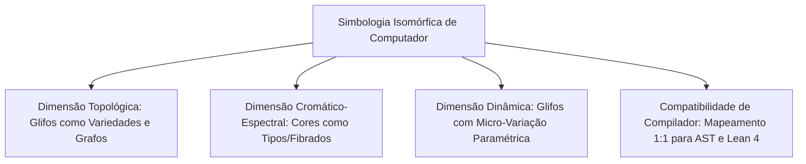

# Isomorphic Mathematical Symbology & Computer-Native Mathematical Semiotics
### *Beyond Pen-and-Paper: Autological, Geometry-Isomorphic, and Optimal Mathematical Representations*

**Author / Visionary:** Reinaldo M. Silva-Filho  
**Status:** Foundational Concept & Emerging Research Program (2026)

---

## 1. A Tese Central: O Fim da Restrição da Caligrafia Humana

Durante milênios, a notação matemática foi limitada por restrições estritamente mecânicas e biológicas:
1. **Caligrafia Manual (Pena e Papel):** Símbolos precisavam ser desenháveis em poucos traços manuais contínuos ($\int, \sum, \partial, \nabla, \alpha, \beta, \infty$).
2. **Tipografia de Chumbo (Gutenberg / Séculos XVIII-XX):** Tipos fixos em matrizes bidimensionais rígidas com caracteres discretos.
3. **Codificação ASCII / Monospaçada (Início da Computação):** Limitação a tabelas alfanuméricas de 7 ou 8 bits (`*`, `/`, `^`, `sqrt`).

Hoje, **a esmagadora maioria dos artigos matemáticos é redigida, manipulada, compilada e lida através de computadores** (LaTeX, SVG, GPU-rendering, ASTs de compiladores, assistentes de prova como Lean 4, telas retina de altíssima densidade). 

> 💡 **A Hipótese Fundamental:**  
> **Não existe mais nenhuma razão biológica ou mecânica para que um símbolo matemático seja apenas uma abreviação arbitrária de uma palavra latina ou grega.** Podemos projetar um sistema de símbolos matemáticos em que **a própria geometria, topologia e estrutura visual do símbolo é ISOMÓRFICA à operação matemática que ele executa.**

---

## 2. Princípios Fundamentais da Simbologia Isomórfica (Autologia Notacional)

### I. Princípio da Autologia Geométrica (O Símbolo é o que Faz)
* Um símbolo de **derivada/fronteira ($\partial$)** não deve ser uma letra "d" estilizada, mas sim a representação gráfica exata da **fronteira orientada de uma variedade ou simplexo**.
* Um símbolo de **contração tensorial ($\otimes, \mathrm{tTr}$)** deve ter portas de entrada/saída orientadas correspondentes à sua covariância e contravariância, conectando-se visualmente aos índices dos tensores vizinhos como em *String Diagrams* de categorias monoidais.
* Um símbolo de **operador dual de Hodge ($*$)** deve representar a rotação/complemento ortogonal no espaço exterior $\Lambda^k V \to \Lambda^{n-k} V$.

### II. Princípio da Composição Homotópica
* A concatenação visual de dois operadores $A \circ B$ deve refletir a sua geometria de composição. Se duas operações comutam ($AB = BA$), sua fusão gráfica é simétrica sob reflexão; se não comutam ($[A,B] \neq 0$), a assimetria do produto é explicitamente legível na topologia do glifo combinado.

### III. Princípio do Custo Cognitivo Mínimo & Entropia Ótima
* **Definição de Notação Ótima:** Uma família de glifos $\mathcal{S}$ é dita *ótima* para uma teoria matemática $\mathcal{T}$ se ela minimiza a distância informacional de Kolmogorov entre a sintaxe visual e a semântica abstrata:
  $$\min_{\mathcal{S}} \mathcal{D}_{\mathrm{cognitive}}(\mathcal{S}, \mathcal{T}) = H(\text{Estrutura}) - I(\text{Glifo} ; \text{Operador})$$
  onde a informação mútua $I(\text{Glifo} ; \text{Operador})$ é maximizada (o glifo carrega a máxima quantidade de propriedades invariantes da operação).

---

## 3. Pilares Estruturais da Nova Notação

### 1. Grafos e Fibrados no Próprio Símbolo (String-Net Glyphs)
Em vez de escrever tensores com índices dispersos $T^{i_1 \dots i_p}_{j_1 \dots j_q}$, o próprio símbolo do tensor é um polígono com $p$ vértices superiores e $q$ vértices inferiores. A contração é a junção física dos canais.

### 2. Informação Espetral / Cores Vetoriais
Cores no ambiente digital não são decorativas; elas representam a **graduação de álgebras** ($\mathbb{Z}_2$-graduação fermiônica vs bosiônica, paridade, grau de formas diferenciais $\Omega^k$).

### 3. Vetores SVG Nativos e Escalonamento Infinito
O símbolo não é um caractere estático de uma fonte de texto fixa, mas uma função vetorial paramétrica renderizada dinamicamente em qualquer escala sem perda de resolução.

---

## 4. Roteiro de Pesquisa e Desenvolvimento

1. **Taxonomia dos Operadores Fundamentais:**
   - Álgebra Linear e Multilinear (Traço, Contração, Produto Exterior, Dualidade).
   - Cálculo e Geometria Diferencial (Diferencial Exterior $\diff$, Conexão $\nabla$, Curvatura $R$, Derivada de Lie $\mathcal{L}_X$).
   - Topologia e Homologia (Operador de Fronteira $\partial$, Cobordismo, Homologia Persistente).
   - Teoria das Categorias (Funtores, Transformações Naturais, Adjunções).

2. **Formalização Teórica da 'Otimalidade Semiótica':**
   - Definir uma métrica formal para comparar a clareza e a ausência de ambiguidade da nova notação contra a notação tradicional de Leibniz/Euler/Einstein.

3. **Implementação de Pacote de Renderização:**
   - Criação de uma biblioteca de glifos vetoriais (SVG/TikZ/Typst) com renderização programática em Python e TypeScript.
   - Integração com editores modernos e assistentes de prova formais (extensão para Lean 4 / VS Code).

---

> *"A notação matemática clássica foi inventada para a mão que segura a pena sobre o papel. A matemática moderna merece uma notação nascida para a mente humana operando em simbiose com o computador."*  
> — Reinaldo M. Silva-Filho (2026)
