# PROOF OBLIGATION LEDGER: Beyond the Spectrum II
**Target:** `paper_geometric_measures_functional_tensors/paper_geometric_measures_functional_tensors.tex`  
**Author:** Reinaldo M. Silva-Filho (PPGEEAA/DES, UFLA)  
**Date:** 2026-09-07  
**Status:** Pre-Audit Ledger (Phase 0.5)

---

## 1. Dependency DAG

```mermaid
graph TD
    Def2_1["Def 2.1: Density Realization Φ(A)"] --> Def2_2["Def 2.2: W_2 Matrix Distance"]
    Def2_2 --> Thm2_1["Thm 2.1: Metric Properties of W_2"]
    Def2_1 --> Def2_3["Def 2.3: Bakry-Émery Curvature κ_BE"]
    Def2_3 --> Thm2_2["Thm 2.2: Displacement Convexity & LSI"]

    Def3_1["Def 3.1: Super-Level Filtration X_t(A)"] --> Thm3_1["Thm 3.1: Bottleneck Stability d_B ≤ L ||A-B||"]
    Def3_1 --> Def3_2["Def 3.2: Persistent Entropy E_pers"]
    Def3_2 --> Thm3_2["Thm 3.2: Isospectral Separation Theorem"]

    Def4_1["Def 4.1: Level-Set Mean Curvature H_t"] --> Def4_2["Def 4.2: Integrated Willmore Energy W"]
    Def4_2 --> Thm4_1["Thm 4.1: Conformal Invariance & Bending Growth"]
    Def4_1 --> Def4_3["Def 4.3: Isoperimetric Profile I_A(v)"]

    Def5_1["Def 5.1: Gabor Wavepacket Transform"] --> Def5_2["Def 5.2: Matrix Wavefront Set WF"]
    Def5_2 --> Thm5_1["Thm 5.1: Conormal Interface Detection"]
    Def5_1 --> Def5_3["Def 5.3: Critical Besov Exponent s*"]

    Def6_1["Def 6.1: Non-Commutative Dixmier Trace"] --> Thm6_1["Thm 6.1: Non-Commutative Volume Formula"]
    Def6_2["Def 6.2: Integrated QFI Volume"] --> Thm6_2["Thm 6.2: Positivity & Entanglement Faithfulness"]
    Def6_2 --> Def6_3["Def 6.3: Entanglement Contour & Centroid"]
```

*Cycle Detection:* No cycles detected. All results flow strictly from the definitions of the continuous functional realization operators and classical mathematical infrastructure (Villani OT, Chazal TDA, Willmore GMT, Hörmander Microlocal, Connes NCG, Bures QFI).

---

## 2. Assumption Ledger

| Result | Stated Hypotheses | Location Discharged / Status |
| :--- | :--- | :--- |
| **Thm 2.1 (Wasserstein Metric)** | $A \in \mathcal{S}_+^n$, $B \in \mathcal{S}_+^m$, $\Tr(A)=\Tr(B)=1$, $\Phi(A) \ge 0$, $\int \Phi = 1$ | Line 159-196 (Discharged by Definition 2.1) |
| **Thm 2.2 (Bakry-Émery & LSI)** | $\Phi(A) \in C^2(\Omega)$, $\Phi(A)(x) > 0$, $\kappa_{\mathrm{BE}}(A) \ge K > 0$ | Line 235-245 (Explicit spectral lower bound hypothesis) |
| **Thm 3.1 (Bottleneck Stability)** | $\Phi$ is $L^\infty$-Lipschitz: $\|\Phi(A)-\Phi(B)\|_\infty \le L_\Phi \|A-B\|_F$ | Line 303-306 (Hypothesis stated in theorem) |
| **Thm 3.2 (Isospectral Separation)**| $A, B \in \mathcal{S}^4$, $\sigma(A)=\sigma(B)$, $B = P A P^T$ | Line 340-377 (Explicit $4\times 4$ constructive matrices) |
| **Thm 4.1 (Willmore Invariance)** | $d=3$, $\Omega \subset \R^3$, $\psi$ conformal diffeomorphism | Line 407-420 (Explicit hypothesis) |
| **Thm 5.1 (Wavefront Conormal)** | $\Phi(A)$ piecewise constant with jump across smooth interface $\Gamma$ | Line 490-496 (Explicit Heaviside jump profile hypothesis) |
| **Thm 6.1 (Dixmier Volume)** | $\Phi(A) \in C^\infty(\Omega)$, $\mathcal{D}$ Atiyah-Singer Dirac operator on spin manifold | Line 548-552 (Standard compact spin manifold assumptions) |
| **Thm 6.2 (QFI Faithfulness)** | $\mathcal{T}$ continuous MPS, $\rho(x) \in \mathcal{S}_+(\mathbb{C}^\chi)$ smooth, normalized | Line 606-616 (Standard cMPS Cauchy data assumptions) |

---

## 3. Typed Symbol Table

| Symbol | Space / Domain | Dependencies | Type Consistency |
| :--- | :--- | :--- | :--- |
| $A, B$ | $\R^{n \times n}$ or $\mathcal{S}_+^n$ | Dimension $n$ | Consistent across all sections |
| $\Phi(A)$ | $\mathcal{F}(\Omega)$ ($L^1, C^2, \BV, H^s$) | $A \in \mathcal{T}^k(V), x \in \Omega$ | Consistent |
| $\dif\mu_A$ | $\mathcal{P}_{\mathrm{ac}}(\Omega)$ | Probability measure $\Phi(A)(x)\dif x$ | Consistent |
| $\mathcal{W}_2$ | Metric space $(\mathcal{P}_2(\Omega), \mathcal{W}_2)$ | Quadratic optimal transport cost | Consistent |
| $\Ric_\infty$ | Symmetric 2-tensor on $\Omega$ | $-\nabla^2 \log \Phi(A)$ | Consistent |
| $\kappa_{\mathrm{BE}}$ | Scalar $\in \R$ | Infimum eigenvalue of $\Ric_\infty$ | Consistent |
| $X_t(A)$ | Closed subset of $\Omega$ | Threshold $t \in [m_A, M_A]$ | Consistent |
| $\mathrm{Dgm}_k$ | Multiset in $\R^2 \cup \Delta$ | Degree $k$ persistent homology | Consistent |
| $E_{\mathrm{pers}}^{(k)}$ | Scalar $\ge 0$ | Persistent entropy of $\mathrm{Dgm}_k$ | Consistent |
| $H_t(x)$ | Scalar field on $\Sigma_t$ | Tangential divergence $-\nabla \cdot (\nabla \Phi / \|\nabla \Phi\|)$ | Consistent |
| $\mathcal{W}(\Phi(A))$ | Scalar $\ge 0$ | Total integrated Willmore bending | Consistent |
| $\mathcal{I}_A(v)$ | Function $(0, 1) \to \R_+$ | Isoperimetric profile of $\mu_A$ | Consistent |
| $\mathcal{V}_{\Phi(A)}$ | Function $T^*\Omega \to \C$ | Gabor wavepacket transform | Consistent |
| $\WF(\Phi(A))$ | Conic subset of $T^*\Omega \setminus \{0\}$ | Singular directions in phase space | Consistent |
| $s^*(A)$ | Scalar $\in (0, 1]$ | Critical Besov regularity index | Consistent |
| $\mathcal{D}$ | Unbounded operator on $L^2(\Omega, \mathbb{S})$ | Atiyah-Singer Dirac operator | Consistent |
| $\Tr_\omega$ | Linear functional on $\mathcal{L}^{1,\infty}$ | Dixmier trace | Consistent |
| $g^{\QFI}_{\mu\nu}$ | Metric tensor field on $\Omega$ | Symmetric logarithmic derivative metric | Consistent |
| $\mathrm{Vol}_{\QFI}$ | Scalar $\ge 0$ | Integrated QFI volume | Consistent |
| $\mathcal{S}_{\mathrm{cont}}$ | Scalar density on $\Omega$ | $- \Tr(\rho \log \rho) \sqrt{\det g^{\QFI}}$ | Consistent |
| $\bar{x}_{\mathrm{ent}}$ | Vector $\in \Omega$ | Entanglement spatial center of mass | Consistent |

---

## 4. Canonical Quantified Statements

- **Theorem 2.1 (Wasserstein Metric Continuity):**  
  $\forall n, m \in \mathbb{N}, \; \forall A \in \mathcal{S}_+^n, B \in \mathcal{S}_+^m$ with $\Tr(A)=\Tr(B)=1$:  
  $\mathcal{W}_2(A, B) \le \sqrt{\diam(\Omega)} \|\Phi(A) - \Phi(B)\|_{L^1(\Omega)}^{1/2}$.

- **Theorem 2.2 (Log-Sobolev Inequality):**  
  $\forall A \in \mathcal{S}_+^n$ with $\Phi(A) \in C^2(\Omega), \Phi(A) > 0$:  
  $(\kappa_{\mathrm{BE}}(A) \ge K > 0) \implies \left(\forall f \in C^\infty(\Omega), \; \operatorname{Ent}_{\mu_A}(f^2) \le \frac{2}{K} \int_\Omega \|\nabla f\|^2 \dif\mu_A\right)$.

- **Theorem 3.1 (Bottleneck Stability):**  
  $\forall A, B \in \R^{n \times n}, \; \forall k \in \{0, \dots, d-1\}$:  
  $d_B(\mathrm{Dgm}_k(\Phi(A)), \mathrm{Dgm}_k(\Phi(B))) \le \|\Phi(A) - \Phi(B)\|_{L^\infty(\Omega)} \le L_\Phi \|A - B\|_F$.

- **Theorem 3.2 (Isospectral Topological Separation):**  
  $\exists A, B \in \mathcal{S}^4$ such that $\sigma(A) = \sigma(B)$ and $\mathrm{Dgm}_1(\Phi(A)) = \emptyset \ne \mathrm{Dgm}_1(\Phi(B)) \implies E_{\mathrm{pers}}^{(1)}(A) = 0 < E_{\mathrm{pers}}^{(1)}(B)$.

- **Theorem 4.1 (Conformal Invariance of Willmore Energy):**  
  $\forall \psi \in \operatorname{Conf}(\R^3), \; \int_{\psi(\Sigma_t)} (H^2 - K) \dif \mathcal{H}^2 = \int_{\Sigma_t} (H^2 - K) \dif \mathcal{H}^2$.

- **Theorem 5.1 (Conormal Wavefront Interface):**  
  For $\Phi(A)$ with step jump across smooth $\Gamma \subset \Omega$:  
  $\WF(\Phi(A)) = N^*(\Gamma) = \{(x, \xi) \in \Gamma \times (\R^d \setminus \{0\}) \mid \xi = \lambda \mathbf{n}_\Gamma(x), \lambda \ne 0\}$.

- **Theorem 6.1 (Dixmier Trace Integration):**  
  $\forall \Phi(A) \in C^\infty(\Omega), \; \Tr_\omega(\Phi(A) |\mathcal{D}|^{-d}) = \frac{2^{\lfloor d/2 \rfloor} \Omega_d}{d (2\pi)^d} \int_\Omega \Phi(A)(x) \dif\mathrm{vol}_g(x)$.

- **Theorem 6.2 (QFI Entanglement Faithfulness):**  
  $\forall \text{ cMPS } \mathcal{T}, \; \mathrm{Vol}_{\mathrm{QFI}}(\mathcal{T}) \ge 0$, and $\mathrm{Vol}_{\mathrm{QFI}}(\mathcal{T}) = 0 \iff \nabla \rho(x) = 0 \text{ a.e. modulo } U(\chi)$.

---

## 5. Micro-Claim Inventory

- **MC-1 (Metric triangle inequality for $\mathcal{W}_2$):** Context: [Def 2.2, Borel measures $\mu_A, \mu_B, \mu_C$] $\vdash$ $\mathcal{W}_2(A, C) \le \mathcal{W}_2(A, B) + \mathcal{W}_2(B, C)$. Rule: Gluing lemma for optimal transport couplings (Villani 2009).
- **MC-2 ($\Gamma_2$ Ricci lower bound):** Context: [$\Delta_A = \Delta - \langle \nabla V, \nabla \cdot \rangle$, $\Ric_\infty \ge K \cdot \mathrm{Id}$] $\vdash$ $\Gamma_2(f, f) \ge K \|\nabla f\|^2$. Rule: Bochner formula on weighted manifolds.
- **MC-3 ($\epsilon$-interleaving of homology modules):** Context: [$\|f - g\|_\infty \le \epsilon$] $\vdash$ $X_{t+\epsilon}(f) \subseteq X_t(g) \subseteq X_{t-\epsilon}(f) \implies \mathcal{H}_k(f) \sim_\epsilon \mathcal{H}_k(g)$. Rule: Functoriality of singular homology under inclusion.
- **MC-4 (Coarea transformation of Willmore energy):** Context: [$\dif t \dif \mathcal{H}^{d-1} = \|\nabla \Phi\| \dif x$] $\vdash$ $\int_\R \int_{\Sigma_t} H^2 \dif \mathcal{H}^{d-1} \dif t = \int_\Omega H^2 \|\nabla \Phi\| \dif x$. Rule: Federer-Fleming Coarea theorem.
- **MC-5 (Rapid decay off the interface):** Context: [$x \notin \Gamma$, $\Phi(A)$ locally constant] $\vdash$ $\mathcal{V}_{\Phi(A)}(x, \xi) = O(\|\xi\|^{-N}) \; \forall N$. Rule: Integration by parts against smooth compact Gaussian.
- **MC-6 (Conormal slow decay):** Context: [1D Heaviside jump across $\Gamma$] $\vdash$ $\widehat{H}(\xi_1) = \frac{1}{i\xi_1} + \pi \delta(\xi_1) \implies \text{decay is only } O(\|\xi_1\|^{-1})$. Rule: Distributional Fourier transform of step function.
- **MC-7 (Wodzicki residue of order $-d$ pseudo-differential operator):** Context: [$T = \Phi(A) |\mathcal{D}|^{-d}$] $\vdash$ $\Tr_\omega(T) = \frac{1}{d(2\pi)^d} \int_{S^*\Omega} \Tr_{\mathbb{S}}(\sigma_{-d}(T)) \dif S$. Rule: Connes-Wodzicki non-commutative residue theorem.
- **MC-8 (Bures metric degenerate kernel):** Context: [$g^{\QFI}_{\mu\mu}(x) = 0$] $\vdash$ $\partial_\mu \rho(x) = 0$. Rule: Faithfulness of quantum Bures/Fisher distance.
